# OpenUxAS 초보자를 위한 완벽 가이드

**Complete Guide for Beginners**

다수 무인 비행체 자율 시스템 프레임워크
Multi-Vehicle Autonomous Systems Framework

이론 | 설치 | 아키텍처 | 예제 실습 | 결과 분석

Air Force Research Laboratory (AFRL)
Aerospace Systems Directorate

---

## 목차 (Table of Contents)

- [제1장 무인 자율 시스템과 OpenUxAS 소개](#제1장-무인-자율-시스템과-openuxas-소개)
- [제2장 이론적 배경](#제2장-이론적-배경)
- [제3장 OpenUxAS 아키텍처](#제3장-openuxas-아키텍처)
- [제4장 설치 및 빌드](#제4장-설치-및-빌드)
- [제5장 태스크 유형 상세](#제5장-태스크-유형-상세)
- [제6장 XML 설정 상세](#제6장-xml-설정-상세)
- [제7장 예제 실습](#제7장-예제-실습)
- [제8장 다중 비행체 운용](#제8장-다중-비행체-운용)
- [제9장 결과 분석](#제9장-결과-분석)
- [제10장 고급 주제](#제10장-고급-주제)

---

# 제1장 무인 자율 시스템과 OpenUxAS 소개

*Introduction to Unmanned Autonomous Systems and OpenUxAS*

## 1.1 OpenUxAS란 무엇인가?

OpenUxAS(Open Unmanned Systems Autonomy Services)는 미국 공군 연구소(AFRL, Air Force Research Laboratory)의 항공우주 시스템 부서에서 개발한 오픈소스 소프트웨어 프레임워크입니다.

이 시스템은 다수의 무인 비행체(UAV, Unmanned Aerial Vehicle)를 조정하여 협동 임무를 수행하는 것을 목적으로 합니다. 예를 들어, 여러 대의 UAV가 협력하여 넓은 영역을 감시하거나, 수로를 탐색하거나, 특정 목표를 추적하는 임무를 자동으로 계획하고 실행할 수 있습니다.

OpenUxAS는 Robot Operating System(ROS)과 유사한 메시지 패싱 아키텍처를 사용합니다. 각 서비스는 독립적으로 실행되며, LMCP(Lightweight Message Control Protocol)라는 표준화된 메시지 형식을 통해 서로 통신합니다. ZeroMQ 라이브러리를 사용하여 모든 서비스를 연결합니다.

## 1.2 OpenUxAS의 핵심 기능

- **자동 임무 할당**: 여러 대의 UAV에 최적의 임무를 자동으로 배분합니다.
- **경로 계획**: 장애물을 회피하면서 최단 경로를 계산합니다.
- **영역 탐색**: 카메라 센서를 기반으로 탐색 패턴을 자동 생성합니다.
- **다중 차량 협동**: 여러 대의 UAV가 협력하여 복잡한 임무를 수행합니다.
- **시뮬레이션 지원**: OpenAMASE 시뮬레이터와 연동하여 실제 비행 없이 테스트 가능합니다.
- **모듈식 설계**: 약 30개의 독립적인 서비스로 구성되어 확장이 용이합니다.

## 1.3 OpenUxAS의 주요 사용 사례

| 시나리오 | 설명 | 관련 태스크 |
|---------|------|----------|
| 수로 탐색 | 강/해안선을 따라 카메라 감시 | LineSearchTask |
| 영역 감시 | 다각형/원형 영역 카메라 스캔 | AreaSearchTask |
| 목표 추적 | 특정 지점 주변 감시 | WatchTask |
| 봉쇄 임무 | 영역 차단/봉쇄 | BlockadeTask |
| 호위 임무 | 다른 차량 호위 | EscortTask |
| 통신 중계 | UAV 간 통신 연결 | CommRelayTask |

## 1.4 OpenUxAS 생태계

| 구성요소 | 역할 |
|---------|------|
| OpenUxAS | 핵심 자율 서비스 엔진 (C++) |
| OpenAMASE | UAV 시뮬레이터 (Java) |
| LmcpGen | LMCP 메시지 코드 자동 생성기 |
| ZeroMQ | 메시지 통신 라이브러리 |
| MDMs | 메시지 정의 모델 (XML) |

## 1.5 OpenUxAS의 역사와 배경

OpenUxAS는 미 공군 연구소(AFRL)의 Power and Control Division에서 개발되었습니다. 무인 시스템의 자율성을 향상시키기 위한 연구 프로젝트로 시작되었으며, Air Force Open Source Agreement Version 1.0에 따라 오픈소스로 공개되었습니다.

기존의 무인 시스템은 단일 차량을 원격으로 조종하는 방식이었습니다. 하지만 임무의 복잡성이 증가하면서 여러 대의 UAV가 자율적으로 협력하는 시스템이 필요해졌고, 이러한 필요를 충족하기 위해 OpenUxAS가 탄생했습니다.

> **핵심 개념**
> 자율 시스템(Autonomous System)이란 인간의 직접적인 조종 없이 스스로 판단하고 행동할 수 있는 시스템입니다. OpenUxAS는 임무 할당, 경로 계획, 센서 제어 등을 자동화합니다.

---

# 제2장 이론적 배경

*Theoretical Background*

## 2.1 다중 에이전트 시스템 (Multi-Agent Systems)

다중 에이전트 시스템(MAS)은 여러 개의 자율적인 에이전트가 협력하여 공통의 목표를 달성하는 시스템입니다. OpenUxAS에서 각 UAV는 하나의 에이전트로, 중앙 조정자(coordinator)가 임무를 배분하는 방식으로 동작합니다.

MAS의 핵심 과제는 "누가 무엇을 해야 하는가?"입니다. 이를 임무 할당 문제(Task Assignment Problem)라 하며, OpenUxAS는 이를 Branch and Bound 알고리즘을 사용하여 해결합니다.

### 2.1.1 임무 할당 문제 (Task Assignment Problem)

N대의 차량과 M개의 임무가 있을 때, 최소 비용으로 모든 임무를 완료하는 할당을 찾는 문제입니다. 이는 NP-hard 문제로, 완전 탐색 시 조합의 수가 기하급수적으로 증가합니다.

OpenUxAS는 Branch and Bound 알고리즘을 사용합니다. 이 알고리즘은 탐색 트리를 구성하되, 현재까지 발견된 최선의 해보다 나쁜 경로는 가지치기(pruning)하여 탐색 공간을 줄입니다.

```
임무 할당 트리 예시 (Branch and Bound)

[Root]
    /         \
UAV1->Task1    UAV1->Task2
  /     \         |
UAV2->Task2  UAV2->Task3  UAV2->Task1
  |         |         |
Cost=3200  Cost=2800  Cost=4100 <-- pruned!
            (Best)

MINMAX: 각 차량의 최대 비용을 최소화
CUMULATIVE: 전체 비용의 합을 최소화
```

### 2.1.2 비용 함수 (Cost Functions)

OpenUxAS는 두 가지 비용 함수를 지원합니다:

- **MINMAX**: 각 차량의 최대 비용을 최소화합니다. 모든 차량이 비슷한 시간에 임무를 완료하게 됩니다. (부하 균형)
- **CUMULATIVE**: 전체 비용의 합을 최소화합니다. 전체 임무 완료 시간이 최소화됩니다. (효율 우선)

## 2.2 경로 계획 (Path Planning)

경로 계획은 출발지에서 목적지까지 장애물을 회피하면서 최적의 경로를 찾는 문제입니다.

### 2.2.1 Visibility Graph 기반 경로 계획

OpenUxAS의 RoutePlannerVisibilityService는 가시성 그래프(Visibility Graph)를 사용합니다. 비행 금지 구역(KeepOutZone)의 꼭지점들을 노드로 사용하여, 서로 보이는 노드 쌍을 에지로 연결합니다. 이 그래프에서 최단 경로를 탐색하면 장애물을 회피하는 최적 경로가 됩니다.

```
Visibility Graph 개념도

S(Start) -------> G(Goal)    직선 경로는 장애물에 막힘
S ----+        +---- G
|     +------+ |
+-->|KeepOut|-->+    장애물 꼭지점을 경유하여
    |Zone   |        최단 경로 탐색
    +------+

1. 출발지/목적지 + 장애물 꼭지점 = 노드
2. 서로 보이는 노드 쌍 = 에지 (가시선)
3. Dijkstra/A* 로 최단 경로 탐색
```

### 2.2.2 Dubins 경로

UAV는 자동차처럼 제자리에서 방향을 바꿀 수 없습니다. 최소 회전 반경이 있기 때문입니다. Dubins 경로는 이러한 제약을 고려한 최단 경로로, 원호-직선-원호 조합으로 구성됩니다. OpenUxAS의 RoutePlannerService는 DubLib 라이브러리를 사용하여 Dubins 경로를 계산합니다.

## 2.3 센서 커버리지 이론 (Sensor Coverage Theory)

카메라를 탑재한 UAV로 지상을 촬영할 때, 카메라의 시야각(FOV)과 UAV의 고도에 따라 지상에서 촬영되는 영역(센서 풋프린트)이 결정됩니다.

### 2.3.1 센서 풋프린트 (Sensor Footprint)

센서 풋프린트는 카메라가 지상에서 실제로 촬영하는 영역입니다. 다음 요소에 의해 결정됩니다:

- **UAV 고도 (Altitude)**: 높을수록 넓은 영역을 촬영하지만 해상도가 낮아짐
- **카메라 시야각 (FOV)**: 넓을수록 더 넓은 영역 촬영
- **카메라 조사각 (Elevation Angle)**: 카메라의 하향 각도
- **GSD (Ground Sample Distance)**: 지상의 1픽셀이 나타내는 실제 거리

```
카메라 센서 풋프린트 계산

UAV (고도 h)
     /\
    / | \
   / | \    FOV (Field of View)
  /  |  \
 / el|   \  el = elevation angle
/____|____\
|<-- w/2 -->|  w = widthCenter (센서 풋프린트 폭)
|           |
Ground Footprint

풋프린트 폭 (w) = 2 * h * tan(FOV/2)
레인 간격 = w * 0.9  (10% 오버랩)
GSD = h * pixel_size / focal_length
```

### 2.3.2 래스터 스캔 패턴 (Raster Scan Pattern)

영역 탐색 시, UAV는 카메라 풋프린트 폭에 맞춰 평행한 레인(lane)을 왕복하며 비행합니다. 이를 래스터 스캔 또는 Lawnmower 패턴이라 합니다.

```
래스터 스캔 패턴

탐색 영역:
+---------------------------+
|--> --> --> --> -->| Lane 1 (상향)
|                           |
|<-- <-- <-- <-- <--|  Lane 2 (하향)
|                           |
|--> --> --> --> -->| Lane 3 (상향)
|                           |
|<-- <-- <-- <-- <--|  Lane 4 (하향)
+---------------------------+
|<- 레인간격 ->|
= 센서폭 * 0.9

레인 수 = ceil(영역폭 / 레인간격)
총 비행 거리 = 레인수 * 영역길이 + 회전거리
```

## 2.4 좌표계 변환 (Coordinate Systems)

OpenUxAS는 두 가지 좌표계를 사용합니다:

- **WGS84 지리 좌표 (Latitude, Longitude, Altitude)**: 전체 임무 정의에 사용
- **Flat Earth 평면 좌표 (North, East in meters)**: 내부 계산에 사용

FlatEarth 케래스는 기준점(origin)을 중심으로 위도/경도를 미터 단위의 남북/동서 좌표로 변환합니다. 영역이 좌은 경우(수십 km 이내) 지구 곡률을 무시할 수 있어 계산이 훨씬 간단해집니다.

## 2.5 메시지 패싱 아키텍처 (Message-Passing Architecture)

OpenUxAS의 핵심 설계 철학은 "메시지 패싱"입니다. 각 서비스는 독립적인 프로세스로 실행되며, 다른 서비스와 직접 함수를 호출하지 않습니다. 대신 표준화된 LMCP 메시지를 ZeroMQ 버스를 통해 발행/구독(Pub/Sub) 합니다.

이 설계의 장점:

- **모듈성**: 서비스를 독립적으로 개발/테스트/교체 가능
- **확장성**: 새 서비스를 추가하기만 하면 기능 확장 가능
- **투명성**: 메시지 트래픽을 모니터링하면 시스템 동작 파악 가능
- **덮커플링**: 서비스 간 의존성이 낮아 변경 영향 최소화

---

# 제3장 OpenUxAS 아키텍처

*System Architecture*

## 3.1 전체 시스템 구조

OpenUxAS는 크게 4계층으로 구성됩니다:

```
OpenUxAS 시스템 계층 구조

+==============================================+
|      응용 계층 (Application Layer)             |
| Task Services: AreaSearch, LineSearch, Watch..|
+==============================================+
|      플래닝 계층 (Planning Layer)               |
| RouteAggregator, BranchBound, PlanBuilder    |
+==============================================+
|      통신 계층 (Communication Layer)            |
| LMCP Messages, ZeroMQ Bus, Bridges           |
+==============================================+
|      인프라 계층 (Infrastructure Layer)          |
| ServiceManager, Utilities, FlatEarth         |
+==============================================+
```

## 3.2 핵심 서비스 상세

OpenUxAS는 약 30개의 서비스로 구성되어 있습니다. 핵심 서비스들을 살펴보겠습니다.

### 3.2.1 AutomationRequestValidatorService

자동화 요청의 유효성을 검증하는 서비스입니다. 사용자가 AutomationRequest를 보내면, 이 서비스는:

- 요청된 모든 임무(Task)가 시스템에 존재하는지 확인
- 요청된 모든 차량(Vehicle)이 등록되어 있는지 확인
- 운용 영역(OperatingRegion)과 영역 제한(Zones)이 유효한지 확인
- 모든 검증이 통과하면 UniqueAutomationRequest를 생성하여 내부 파이프라인에 전달

### 3.2.2 RouteAggregatorService

라우트 집계 서비스로, 비용 행렬(Cost Matrix)을 만들어 임무 할당에 필요한 정보를 준비합니다.

- UniqueAutomationRequest를 수신하면 모든 차량-임무 조합의 경로를 요청
- 각 경로의 비용(거리, 시간)을 수집하여 AssignmentCostMatrix 생성
- 이 비용 행렬을 Branch & Bound 서비스에 전달

### 3.2.3 AssignmentTreeBranchBoundService

Branch and Bound 알고리즘을 사용하여 최적의 차량-임무 할당을 계산하는 서비스입니다.

- AssignmentCostMatrix와 TaskPlanOptions를 입력으로 받음
- 탐색 트리를 구성하고 가지치기로 최적 해를 탐색
- 결과로 TaskAssignmentSummary를 출력
- NumberNodesMaximum 설정으로 탐색 범위 제한 가능 (0=무제한)

### 3.2.4 PlanBuilderService

임무 할당 결과를 실제 비행 계획(웨이포인트 시퀀스)으로 변환하는 서비스입니다.

- TaskAssignmentSummary를 받아 각 임무에 TaskImplementationRequest 전달
- 각 Task 서비스가 웨이포인트 + 짐벌 명령을 생성하여 응답
- 모든 임무의 응답을 조합하여 UniqueAutomationResponse 생성
- 최종적으로 MissionCommand를 각 차량에 전달

### 3.2.5 RoutePlannerVisibilityService

Visibility Graph를 사용하여 장애물을 회피하는 최단 경로를 계산하는 서비스입니다.

- KeepInZone(비행 허용 영역)과 KeepOutZone(비행 금지 영역)을 반영
- visilibity 라이브러리를 사용하여 유클리드 경로 계획
- RoutePlanRequest에 대해 RoutePlanResponse(웨이포인트 + 비용) 응답

### 3.2.6 WaypointPlanManagerService

비행 중 차량에게 웨이포인트를 점진적으로 전달하는 서비스입니다.

- 전체 임무를 세그먼트로 나누어 순차적으로 전달
- NumberWaypointsToServe: 한 번에 전달할 웨이포인트 수
- NumberWaypointsOverlap: 세그먼트 간 오버랩
- TurnType: 회전 방식 (TurnShort, TurnLong)

### 3.2.7 SensorManagerService

센서 풋프린트를 계산하는 서비스입니다. UAV 고도, 카메라 FOV, 조사각 등을 입력으로 받아 지상에서의 촬영 영역 크기를 계산합니다. GSD(Ground Sample Distance) 요구사항도 고려합니다.

## 3.3 임무 처리 파이프라인

사용자가 임무를 요청하면 다음과 같은 순서로 처리됩니다:

```
임무 처리 파이프라인 (전체 흐름)

1. AutomationRequest (사용자 요청)
   |
2. AutomationRequestValidatorService (유효성 검증)
   |
3. UniqueAutomationRequest (내부 요청)
   |
   +---> Task Services (TaskPlanOptions 생성)
   |       각 Task가 가능한 옵션들을 생성
   |
4. RouteAggregatorService (AssignmentCostMatrix 생성)
   |       모든 차량-임무 조합의 비용 계산
   |
5. AssignmentTreeBranchBoundService (최적 할당 계산)
   |       Branch & Bound로 해 탐색
   |
6. TaskAssignmentSummary (할당 결과)
   |
7. PlanBuilderService (비행 계획 생성)
   |       각 Task에 TaskImplementationRequest
   |       웨이포인트 + 짐벌 명령 생성
   |
8. MissionCommand (비행 명령)
   |
9. WaypointPlanManager -> Vehicle (실행)
```

### 3.3.1 전체 시스템 시퀀스 플로우 (신규 추가)

> 아래는 사용자의 임무 요청부터 UAV 비행까지의 **전체 시퀀스 플로우**입니다.

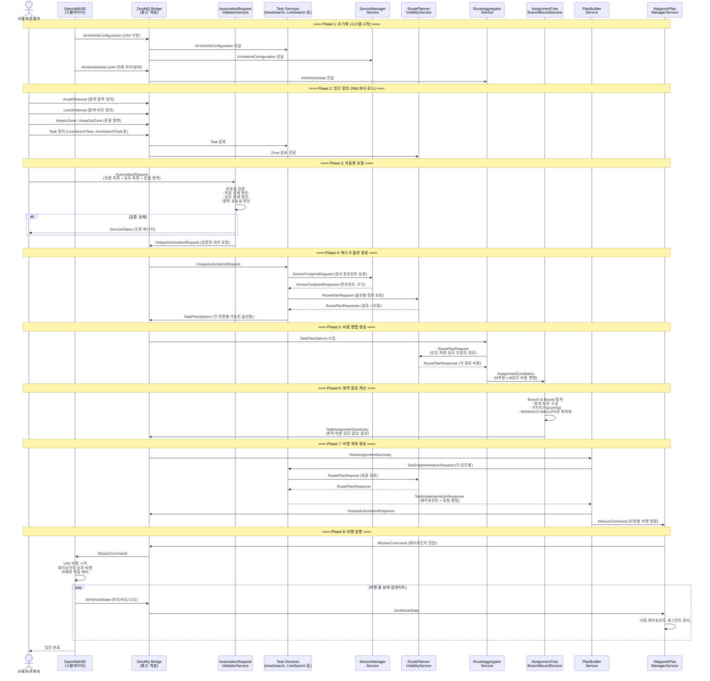
```mermaid
sequenceDiagram
    actor User as 사용자/운용자
    participant AMASE as OpenAMASE<br/>(시뮬레이터)
    participant Bridge as ZeroMQ Bridge<br/>(통신 계층)
    participant Validator as AutomationRequest<br/>ValidatorService
    participant TaskSvc as Task Services<br/>(AreaSearch, LineSearch 등)
    participant Sensor as SensorManager<br/>Service
    participant RoutePlanner as RoutePlanner<br/>VisibilityService
    participant Aggregator as RouteAggregator<br/>Service
    participant BnB as AssignmentTree<br/>BranchBoundService
    participant Builder as PlanBuilder<br/>Service
    participant WPM as WaypointPlan<br/>ManagerService

    Note over User, WPM: ═══ Phase 1: 초기화 (시스템 시작) ═══

    AMASE->>Bridge: AirVehicleConfiguration (UAV 사양)
    Bridge->>TaskSvc: AirVehicleConfiguration 전달
    Bridge->>Sensor: AirVehicleConfiguration 전달
    AMASE->>Bridge: AirVehicleState (UAV 현재 위치/상태)
    Bridge->>Aggregator: AirVehicleState 전달

    Note over User, WPM: ═══ Phase 2: 임무 정의 (XML에서 로드) ═══

    User->>Bridge: AreaOfInterest (탐색 영역 정의)
    User->>Bridge: LineOfInterest (탐색 라인 정의)
    User->>Bridge: KeepInZone / KeepOutZone (운용 영역)
    User->>Bridge: Task 정의 (LineSearchTask, AreaSearchTask 등)
    Bridge->>TaskSvc: Task 등록
    Bridge->>RoutePlanner: Zone 정보 전달

    Note over User, WPM: ═══ Phase 3: 자동화 요청 ═══

    User->>Validator: AutomationRequest<br/>(차량 목록 + 임무 목록 + 운용 영역)

    Validator->>Validator: 유효성 검증<br/>- 차량 존재 확인<br/>- 임무 존재 확인<br/>- 영역 유효성 확인

    alt 검증 실패
        Validator-->>User: ServiceStatus (오류 메시지)
    end

    Validator->>Bridge: UniqueAutomationRequest (검증된 내부 요청)

    Note over User, WPM: ═══ Phase 4: 태스크 옵션 생성 ═══

    Bridge->>TaskSvc: UniqueAutomationRequest
    TaskSvc->>Sensor: SensorFootprintRequest (센서 풋프린트 요청)
    Sensor-->>TaskSvc: SensorFootprintResponse (풋프린트 크기)
    TaskSvc->>RoutePlanner: RoutePlanRequest (옵션별 경로 요청)
    RoutePlanner-->>TaskSvc: RoutePlanResponse (경로 + 비용)
    TaskSvc->>Bridge: TaskPlanOptions (각 차량별 가능한 옵션들)

    Note over User, WPM: ═══ Phase 5: 비용 행렬 생성 ═══

    Bridge->>Aggregator: TaskPlanOptions 수집
    Aggregator->>RoutePlanner: RoutePlanRequest<br/>(모든 차량-임무 조합의 경로)
    RoutePlanner-->>Aggregator: RoutePlanResponse (각 경로 비용)
    Aggregator->>BnB: AssignmentCostMatrix<br/>(N차량 x M임무 비용 행렬)

    Note over User, WPM: ═══ Phase 6: 최적 할당 계산 ═══

    BnB->>BnB: Branch & Bound 탐색<br/>- 탐색 트리 구성<br/>- 가지치기(pruning)<br/>- MINMAX/CUMULATIVE 최적화
    BnB->>Bridge: TaskAssignmentSummary<br/>(최적 차량-임무 할당 결과)

    Note over User, WPM: ═══ Phase 7: 비행 계획 생성 ═══

    Bridge->>Builder: TaskAssignmentSummary
    Builder->>TaskSvc: TaskImplementationRequest (각 임무별)
    TaskSvc->>RoutePlanner: RoutePlanRequest (최종 경로)
    RoutePlanner-->>TaskSvc: RoutePlanResponse
    TaskSvc-->>Builder: TaskImplementationResponse<br/>(웨이포인트 + 짐벌 명령)
    Builder->>Bridge: UniqueAutomationResponse
    Builder->>WPM: MissionCommand (차량별 비행 명령)

    Note over User, WPM: ═══ Phase 8: 비행 실행 ═══

    WPM->>Bridge: MissionCommand (웨이포인트 전달)
    Bridge->>AMASE: MissionCommand
    AMASE->>AMASE: UAV 비행 시작<br/>웨이포인트 순차 비행<br/>카메라 자동 제어

    loop 비행 중 상태 업데이트
        AMASE->>Bridge: AirVehicleState (위치/속도/고도)
        Bridge->>WPM: AirVehicleState
        WPM->>WPM: 다음 웨이포인트 세그먼트 준비
    end

    AMASE-->>User: 임무 완료
```

### 3.3.2 핵심 서비스 간 세부 메시지 흐름 (신규 추가)

> 아래는 핵심 7개 서비스 간의 **메시지 교환 세부 시퀀스**입니다.

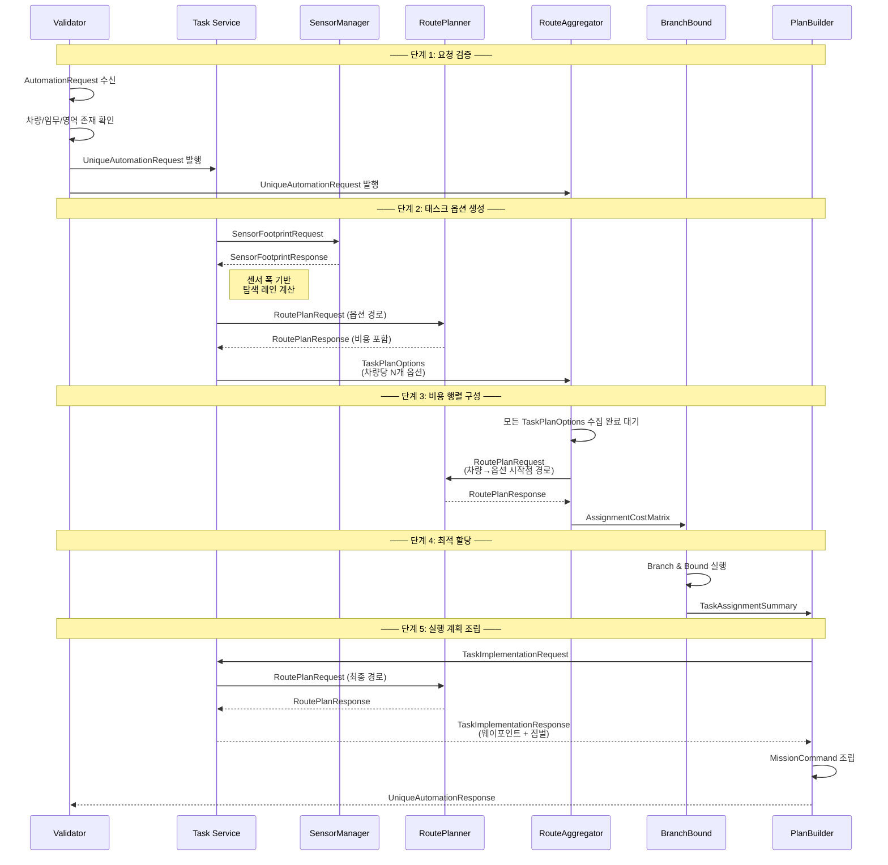
```mermaid
sequenceDiagram
    participant V as Validator
    participant T as Task Service
    participant S as SensorManager
    participant RP as RoutePlanner
    participant RA as RouteAggregator
    participant BB as BranchBound
    participant PB as PlanBuilder

    Note over V, PB: ─── 단계 1: 요청 검증 ───
    V->>V: AutomationRequest 수신
    V->>V: 차량/임무/영역 존재 확인
    V->>T: UniqueAutomationRequest 발행
    V->>RA: UniqueAutomationRequest 발행

    Note over V, PB: ─── 단계 2: 태스크 옵션 생성 ───
    T->>S: SensorFootprintRequest
    S-->>T: SensorFootprintResponse
    Note right of T: 센서 폭 기반<br/>탐색 레인 계산
    T->>RP: RoutePlanRequest (옵션 경로)
    RP-->>T: RoutePlanResponse (비용 포함)
    T->>RA: TaskPlanOptions<br/>(차량당 N개 옵션)

    Note over V, PB: ─── 단계 3: 비용 행렬 구성 ───
    RA->>RA: 모든 TaskPlanOptions 수집 완료 대기
    RA->>RP: RoutePlanRequest<br/>(차량→옵션 시작점 경로)
    RP-->>RA: RoutePlanResponse
    RA->>BB: AssignmentCostMatrix

    Note over V, PB: ─── 단계 4: 최적 할당 ───
    BB->>BB: Branch & Bound 실행
    BB->>PB: TaskAssignmentSummary

    Note over V, PB: ─── 단계 5: 실행 계획 조립 ───
    PB->>T: TaskImplementationRequest
    T->>RP: RoutePlanRequest (최종 경로)
    RP-->>T: RoutePlanResponse
    T-->>PB: TaskImplementationResponse<br/>(웨이포인트 + 짐벌)
    PB->>PB: MissionCommand 조립
    PB-->>V: UniqueAutomationResponse
```

## 3.4 LMCP 메시지 시스템

LMCP(Lightweight Message Control Protocol)는 OpenUxAS의 모든 통신의 기반입니다. MDM(Message Definition Model) XML 파일에서 메시지 구조를 정의하면, LmcpGen이 자동으로 C++/Java/Python 코드를 생성합니다.

주요 LMCP 메시지 유형:

| 카테고리 | 메시지 | 설명 |
|--------|-------|------|
| 차량 | AirVehicleConfiguration | UAV 사양 정의 |
| 차량 | AirVehicleState | UAV 현재 상태 |
| 임무 | AreaSearchTask | 영역 탐색 임무 |
| 임무 | LineSearchTask | 라인 탐색 임무 |
| 요청 | AutomationRequest | 자동화 요청 |
| 응답 | AutomationResponse | 자동화 응답 |
| 경로 | RoutePlanRequest | 경로 계획 요청 |
| 경로 | RoutePlanResponse | 경로 계획 응답 |
| 할당 | TaskAssignmentSummary | 임무 할당 결과 |
| 실행 | MissionCommand | 비행 명령 |
| 영역 | KeepInZone | 비행 허용 영역 |
| 영역 | KeepOutZone | 비행 금지 영역 |

## 3.5 입출력 변수 총정리 (Input/Output Variables)

OpenUxAS에 **무엇을 입력하면, 무엇이 출력되는지** 체계적으로 정리합니다.

### 3.5.1 전체 입출력 흐름

```
입력 변수:                                    출력 변수:
+----------------------------------+         +----------------------------------+
| 1. UAV 설정                       |         | 1. MissionCommand                |
|    (속도, 고도, 카메라 사양)        |         |    (차량별 웨이포인트 시퀀스)       |
| 2. UAV 초기 상태                   |         | 2. GimbalAngleAction             |
|    (위치, 방향, 속도)              |         |    (각 WP에서 카메라 방향)         |
| 3. 임무 정의                       | ──→    | 3. TaskAssignmentSummary         |
|    (영역/라인/지점 탐색)           | OpenUxAS |    (어떤 UAV가 어떤 임무를)        |
| 4. 운용 영역                       |         | 4. AutomationResponse            |
|    (비행 허용/금지 구역)           |         |    (전체 계획 결과)               |
| 5. 자동화 요청                     |         | 5. AirVehicleState (연속)        |
|    (차량 목록 + 임무 목록)         |         |    (비행 중 위치/속도/고도)        |
+----------------------------------+         +----------------------------------+
```

### 3.5.2 입력 변수 상세 (Input Variables)

#### (A) UAV 설정 - AirVehicleConfiguration

UAV의 물리적/센서적 사양을 정의합니다. **한 번만 설정하면 시스템 전체에서 사용됩니다.**

| 변수명 | 타입 | 단위 | 예시값 | 설명 | 영향 |
|--------|------|------|--------|------|------|
| ID | int64 | - | 400 | UAV 고유 식별자 | 모든 메시지에서 이 ID로 참조 |
| Label | string | - | "UAV_400" | 표시 이름 | AMASE 화면 표시용 |
| NominalSpeed | float | m/s | 22.0 | 기본 비행 속도 | 비용(시간) 계산의 기준 |
| MinimumSpeed | float | m/s | 15.0 | 최소 비행 속도 | 속도 제한 검증 |
| MaximumSpeed | float | m/s | 35.0 | 최대 비행 속도 | 속도 제한 검증 |
| NominalAltitude | float | m (MSL) | 700.0 | 기본 비행 고도 | 센서 풋프린트 크기 결정 |
| MinimumAltitude | float | m | 50.0 | 최저 비행 고도 | 고도 제한 검증 |
| MaximumAltitude | float | m | 1500.0 | 최고 비행 고도 | 고도 제한 검증 |
| NominalAltitudeType | enum | - | MSL | 고도 기준 (MSL/AGL) | 고도 해석 방식 |

#### (A-1) 카메라 센서 설정 - CameraConfiguration

UAV에 탑재된 카메라의 사양입니다. **탐색 레인 간격과 GSD에 직접 영향합니다.**

| 변수명 | 타입 | 단위 | 예시값 | 설명 | 영향 |
|--------|------|------|--------|------|------|
| PayloadID | int64 | - | 1 | 센서 고유 ID | 센서 선택 시 참조 |
| SupportedWavelengthBand | enum | - | EO | 센서 종류 (EO/IR/LWIR) | 임무-센서 매칭에 사용 |
| MaxHorizontalFieldOfView | float | degree | 45.0 | 최대 수평 시야각 | 센서 풋프린트 폭 결정 |
| MinHorizontalFieldOfView | float | degree | 2.0 | 최소 수평 시야각 | 줌 인 시 최소 FOV |
| VideoStreamHorizontalResolution | int32 | pixel | 1920 | 카메라 수평 해상도 | GSD 계산에 사용 |
| VideoStreamVerticalResolution | int32 | pixel | 1080 | 카메라 수직 해상도 | GSD 계산에 사용 |

```
센서 풋프린트 계산 공식:

풋프린트 폭 = 2 * 고도(NominalAltitude) * tan(FOV/2)
           = 2 * 700m * tan(45/2)
           = 2 * 700 * 0.414
           = ~580m

탐색 레인 간격 = 풋프린트 폭 * 0.9 (10% 오버랩)
              = 580 * 0.9 = ~522m

GSD = 고도 * 센서크기 / 초점거리
    또는 = 풋프린트 폭 / 수평해상도
    = 580m / 1920pixel = 0.30 m/pixel
```

#### (B) UAV 초기 상태 - AirVehicleState

시뮬레이션 시작 시 UAV의 초기 위치와 상태입니다. **경로 비용 계산의 출발점이 됩니다.**

| 변수명 | 타입 | 단위 | 예시값 | 설명 |
|--------|------|------|--------|------|
| ID | int64 | - | 400 | AirVehicleConfiguration의 ID와 일치 |
| Latitude | float | degree | 45.3171 | 초기 위도 (WGS84) |
| Longitude | float | degree | -120.9139 | 초기 경도 (WGS84) |
| Altitude | float | m | 700.0 | 초기 고도 |
| AltitudeType | enum | - | MSL | 고도 기준 |
| Airspeed | float | m/s | 22.0 | 초기 비행 속도 |
| Heading | float | degree | 0.0 | 초기 방향 (0=북, 90=동) |
| EnergyAvailable | float | % | 100.0 | 잔여 에너지 |

#### (C) 임무 정의 - Task

수행할 임무를 정의합니다. **임무 유형에 따라 입력 변수가 다릅니다.**

**(C-1) 영역 탐색 - AngledAreaSearchTask**

| 변수명 | 타입 | 단위 | 예시값 | 설명 | 영향 |
|--------|------|------|--------|------|------|
| TaskID | int64 | - | 1000 | 임무 고유 ID | AutomationRequest에서 참조 |
| Label | string | - | "AreaSearch" | 표시 이름 | 로그/디버깅용 |
| SearchAreaID | int64 | - | 1 | 탐색할 AreaOfInterest의 ID | 탐색 영역 지정 |
| SweepAngle | float | degree | 45 | 탐색 방향 (0=북, 90=동) | 레인 방향 결정 |
| GroundSampleDistance | float | m/pixel | 0.5 | 요구 지상 해상도 | 비행 고도 조정 가능 |
| DesiredWavelengthBands | enum | - | EO | 사용할 센서 종류 | 센서-임무 매칭 |

**(C-2) 라인 탐색 - LineSearchTask**

| 변수명 | 타입 | 단위 | 예시값 | 설명 | 영향 |
|--------|------|------|--------|------|------|
| TaskID | int64 | - | 1000 | 임무 고유 ID | |
| PointList | Location3D[] | lat/lon | 좌표 리스트 | 라인 경로 좌표들 | 비행 경로 결정 |
| ViewAngleList | Wedge[] | degree | Azimuth=0, Vertical=-60 | 카메라 조사각 | 오프셋 거리 결정 |
| UseInertialViewAngles | bool | - | false | 관성/상대 각도 | 짐벌 제어 방식 |

**(C-3) 지점 탐색 - PointSearchTask**

| 변수명 | 타입 | 단위 | 예시값 | 설명 | 영향 |
|--------|------|------|--------|------|------|
| TaskID | int64 | - | 1000 | 임무 고유 ID | |
| SearchLocation | Location3D | lat/lon | 좌표 | 감시할 지점 | 로이터 중심점 |
| StandoffDistance | float | m | 500.0 | 감시 거리 | 로이터 반경 결정 |

**(C-4) 패턴 탐색 - PatternSearchTask**

| 변수명 | 타입 | 단위 | 예시값 | 설명 | 영향 |
|--------|------|------|--------|------|------|
| TaskID | int64 | - | 1000 | 임무 고유 ID | |
| SearchLocation | Location3D | lat/lon | 좌표 | 패턴 중심점 | |
| Pattern | enum | - | Spiral | 패턴 종류 (Spiral/Sector/Sweep) | 비행 패턴 형태 |
| Extent | float | m | 2000.0 | 탐색 범위 | 패턴 크기 |

#### (D) 영역 정의 - AreaOfInterest / LineOfInterest

| 변수명 | 타입 | 단위 | 예시값 | 설명 |
|--------|------|------|--------|------|
| AreaID / LineID | int64 | - | 1 | 영역/라인 고유 ID |
| BoundaryPoints (Area) | Location3D[] | lat/lon | 다각형 꼭지점 | 탐색 영역 경계 |
| Circle.CenterPoint (Area) | Location3D | lat/lon | 좌표 | 원형 영역 중심 |
| Circle.Radius (Area) | float | m | 2000.0 | 원형 영역 반경 |
| PointList (Line) | Location3D[] | lat/lon | 좌표 리스트 | 라인 경로 |

#### (E) 운용 영역 제한

| 변수명 | 타입 | 설명 | 영향 |
|--------|------|------|------|
| KeepInZone.ZoneID | int64 | 비행 허용 영역 ID | 영역 밖 비행 불가 |
| KeepInZone.Boundary | Polygon | 허용 영역 경계 | 경로 계획 제약 |
| KeepInZone.MinAltitude | float (m) | 최소 허용 고도 | 고도 제한 |
| KeepInZone.MaxAltitude | float (m) | 최대 허용 고도 | 고도 제한 |
| KeepOutZone.ZoneID | int64 | 비행 금지 영역 ID | 경로가 이 영역을 회피 |
| KeepOutZone.Boundary | Polygon | 금지 영역 경계 | Visibility Graph에서 장애물 |
| OperatingRegion.ID | int64 | 운용 영역 ID | KeepIn + KeepOut 조합 |
| OperatingRegion.KeepInAreas | int64[] | 허용 영역 ID 목록 | |
| OperatingRegion.KeepOutAreas | int64[] | 금지 영역 ID 목록 | |

#### (F) 자동화 요청 - AutomationRequest

**시스템에 임무 실행을 요청하는 트리거 메시지입니다.**

| 변수명 | 타입 | 예시값 | 설명 | 영향 |
|--------|------|--------|------|------|
| EntityList | int64[] | [400, 500] | 사용할 UAV ID 목록 | 할당 대상 차량 |
| TaskList | int64[] | [1000, 1001] | 수행할 임무 ID 목록 | 할당 대상 임무 |
| OperatingRegion | int64 | 100 | 운용 영역 ID | 경로 계획 제약 |
| RedoAllTasks | bool | false | 전체 재계획 여부 | true 시 모든 임무 재할당 |

#### (G) 서비스 설정 파라미터

| 서비스 | 변수명 | 타입 | 기본값 | 설명 |
|--------|--------|------|--------|------|
| UxAS (전역) | EntityID | int64 | 100 | 이 UxAS 인스턴스 ID |
| UxAS (전역) | EntityType | string | "Aircraft" | 엔티티 유형 |
| Bridge | TcpAddress | string | "tcp://127.0.0.1:5555" | AMASE 통신 주소 |
| Bridge | Server | bool | TRUE | 서버/클라이언트 모드 |
| BranchBound | NumberNodesMaximum | int32 | 0 | B&B 탐색 노드 제한 (0=무제한) |
| BranchBound | CostFunction | enum | MINMAX | MINMAX 또는 CUMULATIVE |
| WaypointPlanMgr | NumberWaypointsToServe | int32 | 0 | 한번에 전달할 WP 수 (0=전체) |
| WaypointPlanMgr | NumberWaypointsOverlap | int32 | 0 | 세그먼트 간 WP 오버랩 수 |
| WaypointPlanMgr | TurnType | enum | TurnShort | 회전 방식 |
| Validator | MaxResponseTime_ms | int32 | 10000 | 응답 타임아웃 (ms) |

### 3.5.3 출력 변수 상세 (Output Variables)

#### (H) 임무 할당 결과 - TaskAssignmentSummary

| 변수명 | 타입 | 설명 |
|--------|------|------|
| CorrespondingAutomationRequestID | int64 | 원본 요청 ID |
| TaskList | TaskAssignment[] | 할당 결과 목록 |
| TaskAssignment.TaskID | int64 | 할당된 임무 ID |
| TaskAssignment.AssignedVehicle | int64 | 할당된 UAV ID |
| TaskAssignment.OptionID | int64 | 선택된 옵션 ID |
| TaskAssignment.TimeThreshold | int64 | 예상 도착 시간 (ms) |

#### (I) 비행 명령 - MissionCommand

| 변수명 | 타입 | 단위 | 설명 |
|--------|------|------|------|
| VehicleID | int64 | - | 대상 UAV ID |
| CommandID | int64 | - | 명령 고유 ID |
| WaypointList | Waypoint[] | - | 웨이포인트 시퀀스 |
| FirstWaypoint | int64 | - | 첫 번째 WP 번호 |
| Status | enum | - | Pending/Approved/InProcess/Executed |

#### (I-1) 각 웨이포인트 - Waypoint

| 변수명 | 타입 | 단위 | 설명 |
|--------|------|------|------|
| Number | int64 | - | 웨이포인트 번호 |
| Latitude | float | degree | 목표 위도 |
| Longitude | float | degree | 목표 경도 |
| Altitude | float | m | 목표 고도 |
| AltitudeType | enum | - | MSL/AGL |
| Speed | float | m/s | 비행 속도 |
| SpeedType | enum | - | Airspeed/Groundspeed |
| NextWaypoint | int64 | - | 다음 WP 번호 |
| TurnType | enum | - | TurnShort/FlyOver |
| VehicleActionList | Action[] | - | 이 WP에서 실행할 액션들 |

#### (I-2) 짐벌(카메라) 명령 - GimbalAngleAction

| 변수명 | 타입 | 단위 | 설명 |
|--------|------|------|------|
| PayloadID | int64 | - | 카메라 센서 ID |
| Azimuth | float | degree | 카메라 수평 방향 |
| Elevation | float | degree | 카메라 수직 각도 (하향 음수) |
| Rotation | float | degree | 카메라 회전 각도 |

#### (J) 경로 비용 - AssignmentCostMatrix

| 변수명 | 타입 | 설명 |
|--------|------|------|
| CorrespondingAutomationRequestID | int64 | 원본 요청 ID |
| TaskLevelRelationship | TaskOptionCost[] | 비용 행렬 항목들 |
| TaskOptionCost.VehicleID | int64 | UAV ID |
| TaskOptionCost.InitialTaskID | int64 | 출발 임무 ID (0=현재 위치) |
| TaskOptionCost.DestinationTaskID | int64 | 목적 임무 ID |
| TaskOptionCost.TimeToGo | int64 | 이동 비용 (시간, ms) |

#### (K) 비행 중 상태 - AirVehicleState (출력)

비행 중 AMASE가 연속적으로 발송하는 UAV 상태 메시지입니다.

| 변수명 | 타입 | 단위 | 설명 |
|--------|------|------|------|
| ID | int64 | - | UAV ID |
| Latitude | float | degree | 현재 위도 |
| Longitude | float | degree | 현재 경도 |
| Altitude | float | m | 현재 고도 |
| Airspeed | float | m/s | 현재 속도 |
| Heading | float | degree | 현재 방향 |
| Groundspeed | float | m/s | 지상 속도 |
| EnergyAvailable | float | % | 잔여 에너지 |
| ActualEnergyRate | float | %/s | 에너지 소모율 |
| CurrentWaypoint | int64 | - | 현재 추적 중인 WP 번호 |
| CurrentCommand | int64 | - | 현재 실행 중인 명령 ID |
| PayloadStateList | PayloadState[] | - | 센서 상태 |

### 3.5.4 입력-출력 변환 시퀀스 플로우 (신규 추가)

> 입력 변수가 어떤 단계에서 어떤 출력 변수로 변환되는지 보여줍니다.

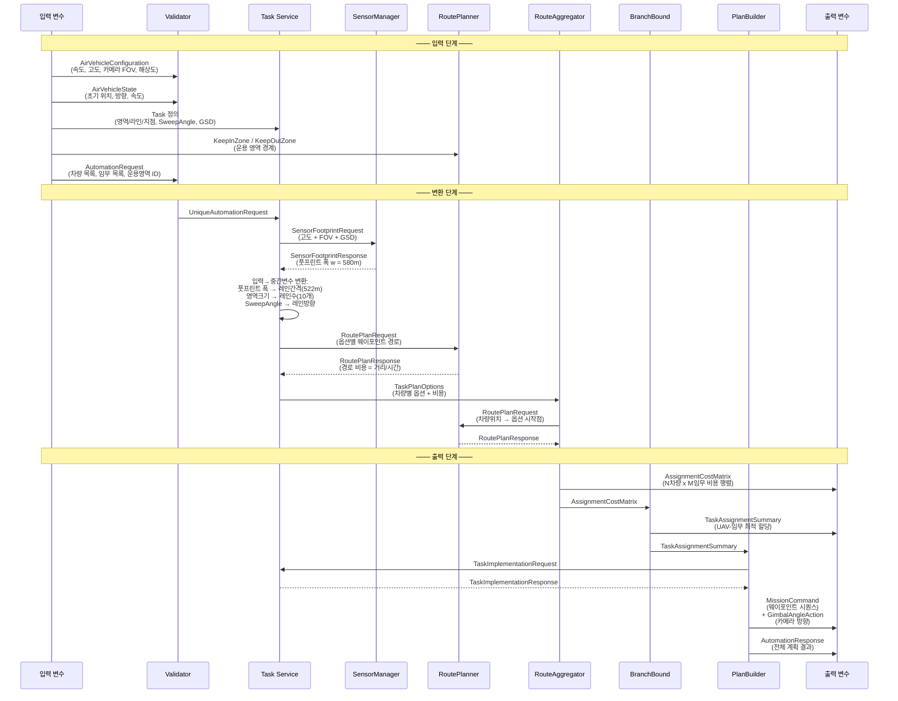
```mermaid
sequenceDiagram
    participant Input as 입력 변수
    participant Validator as Validator
    participant Task as Task Service
    participant Sensor as SensorManager
    participant RP as RoutePlanner
    participant RA as RouteAggregator
    participant BnB as BranchBound
    participant PB as PlanBuilder
    participant Output as 출력 변수

    Note over Input, Output: ─── 입력 단계 ───

    Input->>Validator: AirVehicleConfiguration<br/>(속도, 고도, 카메라 FOV, 해상도)
    Input->>Validator: AirVehicleState<br/>(초기 위치, 방향, 속도)
    Input->>Task: Task 정의<br/>(영역/라인/지점, SweepAngle, GSD)
    Input->>RP: KeepInZone / KeepOutZone<br/>(운용 영역 경계)
    Input->>Validator: AutomationRequest<br/>(차량 목록, 임무 목록, 운용영역 ID)

    Note over Input, Output: ─── 변환 단계 ───

    Validator->>Task: UniqueAutomationRequest

    Task->>Sensor: SensorFootprintRequest<br/>(고도 + FOV + GSD)
    Sensor-->>Task: SensorFootprintResponse<br/>(풋프린트 폭 w = 580m)

    Task->>Task: 입력→중간변수 변환:<br/>풋프린트 폭 → 레인간격(522m)<br/>영역크기 → 레인수(10개)<br/>SweepAngle → 레인방향

    Task->>RP: RoutePlanRequest<br/>(옵션별 웨이포인트 경로)
    RP-->>Task: RoutePlanResponse<br/>(경로 비용 = 거리/시간)

    Task->>RA: TaskPlanOptions<br/>(차량별 옵션 + 비용)

    RA->>RP: RoutePlanRequest<br/>(차량위치 → 옵션 시작점)
    RP-->>RA: RoutePlanResponse

    Note over Input, Output: ─── 출력 단계 ───

    RA->>Output: AssignmentCostMatrix<br/>(N차량 x M임무 비용 행렬)

    RA->>BnB: AssignmentCostMatrix
    BnB->>Output: TaskAssignmentSummary<br/>(UAV-임무 최적 할당)

    BnB->>PB: TaskAssignmentSummary
    PB->>Task: TaskImplementationRequest
    Task-->>PB: TaskImplementationResponse

    PB->>Output: MissionCommand<br/>(웨이포인트 시퀀스)<br/>+ GimbalAngleAction<br/>(카메라 방향)
    PB->>Output: AutomationResponse<br/>(전체 계획 결과)
```

### 3.5.5 입력 변수 민감도 분석

각 입력 변수가 결과에 미치는 영향도입니다.

| 입력 변수 | 영향받는 출력 | 민감도 | 설명 |
|----------|-------------|--------|------|
| NominalSpeed | 비용행렬, 할당결과 | 높음 | 빠른 UAV에 먼 임무 할당 가능 |
| NominalAltitude | 레인간격, 레인수, GSD | 높음 | 고도 2배 → 풋프린트 2배 → 레인 절반 |
| MaxHorizontalFOV | 풋프린트 폭, 레인수 | 높음 | FOV 넓을수록 적은 레인으로 커버 |
| SweepAngle | 레인 방향, 비행거리 | 중간 | 최적 각도 시 비행거리 최소화 |
| GroundSampleDistance | 비행 고도 | 중간 | 높은 GSD 요구 → 저고도 비행 필요 |
| UAV 초기 위치 | 비용행렬, 할당결과 | 높음 | 가까운 UAV에 우선 할당 |
| KeepOutZone 크기 | 경로길이, 비용 | 중간 | 금지구역 클수록 우회 경로 증가 |
| NumberNodesMaximum | 할당 최적성, 계산시간 | 높음 | 0=최적해, 값 제한→근사해(빠름) |
| CostFunction | 할당 결과 | 높음 | MINMAX=부하균형, CUMULATIVE=효율 |
| EntityList 크기 | 조합 수, 계산시간 | 높음 | N대 M임무 → N!/(N-M)! 조합 |

---

# 제4장 설치 및 빌드

*Installation and Build*

## 4.1 시스템 요구사항

| 항목 | 요구사항 | 비고 |
|------|---------|------|
| 운영체제 | Ubuntu 22.04 / 20.04 | Linux 권장 |
| 버전 관리 | git | 소스 코드 클론 |
| 빌드 도구 | 자동 설치 (anod) | Meson + Ninja |
| Java | JDK 8+ | OpenAMASE 실행용 |
| 디스크 | 최소 10GB | 의존성 포함 |

## 4.2 설치 절차

### 4.2.1 Step 1: 소스 코드 클론

```bash
$ git clone https://github.com/afrl-rq/OpenUxAS
$ cd OpenUxAS
```

GitHub에서 OpenUxAS 저장소를 클론합니다. 모든 소스 코드와 예제가 포함되어 있습니다.

### 4.2.2 Step 2: OpenUxAS 빌드

```bash
$ ./anod build uxas
```

anod 명령은 모든 의존성(ZeroMQ, Boost, 등)을 자동으로 다운로드하고 빌드합니다. 첫 빌드는 상당한 시간이 소요될 수 있습니다.

### 4.2.3 Step 3: OpenAMASE 빌드

```bash
$ ./anod build amase
```

OpenAMASE는 UAV 시뮬레이터로, 실제 비행체 없이 OpenUxAS를 테스트할 수 있게 해줍니다.

### 4.2.4 Step 4: 예제 실행 확인

```bash
$ ./run-example 01_HelloWorld
```

Hello World 예제가 정상적으로 실행되면 설치가 완료된 것입니다.

## 4.3 증분 빌드 (Incremental Build)

anod로 첫 빌드 후, 코드를 수정하면 make로 빠르게 재빌드할 수 있습니다:

```bash
$ make -j all
```

run-example과 tests/run-tests 스크립트는 make로 빌드된 바이너리를 자동으로 사용합니다.

## 4.4 테스트 실행

```bash
$ cd tests/cpp
$ ./run-tests
```

C++ 단위 테스트를 실행하여 빌드가 정상적인지 확인합니다.

## 4.5 디렉토리 구조

```
OpenUxAS/
├── src/cpp/
│   ├── Services/       # 핵심 서비스 (약 30개)
│   ├── Tasks/          # 태스크 서비스 (약 15개)
│   ├── Communications/ # 통신 계층 (LMCP, ZeroMQ)
│   ├── Utilities/      # 유틸리티 (FlatEarth, UnitConversion)
│   └── DPSS/           # 동적 둘레 감시 시스템
├── examples/
│   ├── 01_HelloWorld/      # 기본 예제
│   ├── 02_Example_Waterway/ # 수로 탐색
│   ├── 03_DistributedCoop/  # 분산 협동
│   ├── 05_AssignTasks/      # 임무 할당
│   └── 99_Tasks/            # 개별 태스크 예제
├── mdms/               # LMCP 메시지 정의 (XML)
├── tests/              # 테스트
└── resources/          # 문서 빌드 도구
```

---

# 제5장 태스크 유형 상세

*Task Types in Detail*

## 5.1 영역 탐색 태스크 (Area Search Tasks)

### 5.1.1 AngledAreaSearchTask

지정된 각도로 다각형 영역을 탐색하는 태스크입니다. 가장 많이 사용되는 영역 탐색 방식입니다.

주요 파라미터:

- **SearchAreaID**: 탐색할 영역의 ID (AreaOfInterest 참조)
- **SweepAngle**: 탐색 방향 각도 (0=북쪽, 90=동쪽)
- **GroundSampleDistance**: 요구되는 지상 해상도 (m/pixel)

```xml
<AngledAreaSearchTask Series="uxas.messages.task">
  <TaskID>100</TaskID>
  <Label>AreaSearch_Task</Label>
  <SearchAreaID>1</SearchAreaID>
  <SweepAngle>45</SweepAngle>
  <DesiredWavelengthBands>
    <WavelengthBand>EO</WavelengthBand>
  </DesiredWavelengthBands>
  <GroundSampleDistance>0.5</GroundSampleDistance>
</AngledAreaSearchTask>
```

동작 방식:

1) 영역 경계를 SweepAngle 방향으로 회전하여 정렬합니다.
2) 센서 풋프린트 폭 × 0.9 간격으로 평행 레인을 생성합니다.
3) 각 레인과 영역 경계의 교차점을 계산하여 웨이포인트를 생성합니다.
4) 4개 코너에서 시작하는 옵션을 생성하여 최적의 시작 위치를 선택합니다.

#### AngledAreaSearchTask 시퀀스 플로우 (신규 추가)

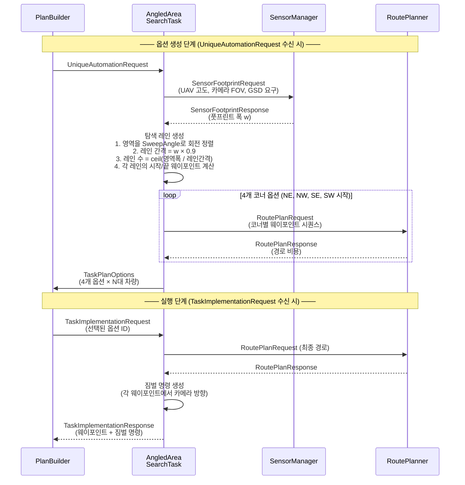
```mermaid
sequenceDiagram
    participant PB as PlanBuilder
    participant AAST as AngledArea<br/>SearchTask
    participant SM as SensorManager
    participant RP as RoutePlanner

    Note over PB, RP: ─── 옵션 생성 단계 (UniqueAutomationRequest 수신 시) ───

    PB->>AAST: UniqueAutomationRequest
    AAST->>SM: SensorFootprintRequest<br/>(UAV 고도, 카메라 FOV, GSD 요구)
    SM-->>AAST: SensorFootprintResponse<br/>(풋프린트 폭 w)

    AAST->>AAST: 탐색 레인 생성<br/>1. 영역을 SweepAngle로 회전 정렬<br/>2. 레인 간격 = w × 0.9<br/>3. 레인 수 = ceil(영역폭 / 레인간격)<br/>4. 각 레인의 시작/끝 웨이포인트 계산

    loop 4개 코너 옵션 (NE, NW, SE, SW 시작)
        AAST->>RP: RoutePlanRequest<br/>(코너별 웨이포인트 시퀀스)
        RP-->>AAST: RoutePlanResponse<br/>(경로 비용)
    end

    AAST->>PB: TaskPlanOptions<br/>(4개 옵션 × N대 차량)

    Note over PB, RP: ─── 실행 단계 (TaskImplementationRequest 수신 시) ───

    PB->>AAST: TaskImplementationRequest<br/>(선택된 옵션 ID)
    AAST->>RP: RoutePlanRequest (최종 경로)
    RP-->>AAST: RoutePlanResponse
    AAST->>AAST: 짐벌 명령 생성<br/>(각 웨이포인트에서 카메라 방향)
    AAST-->>PB: TaskImplementationResponse<br/>(웨이포인트 + 짐벌 명령)
```

### 5.1.2 CmasiAreaSearchTask

CMASI(Common Mission Automation Services Interface) 표준 영역 탐색 태스크입니다. 다양한 영역 형태(다각형, 원형, 사각형)를 지원하며, 복수의 시야각(ViewAngle) 조합으로 탐색 옵션을 생성합니다.

```xml
<AreaSearchTask Series="CMASI">
  <TaskID>100</TaskID>
  <Label>Circular_Search</Label>
  <SearchArea>
    <Circle>
      <CenterPoint>
        <Location3D Latitude="45.317" Longitude="-120.913"
                    Altitude="0" AltitudeType="MSL"/>
      </CenterPoint>
      <Radius>2000.0</Radius>
    </Circle>
  </SearchArea>
  <ViewAngleList>
    <Wedge AzimuthCenterline="0" VerticalCenterline="-60"
           AzimuthExtent="360" VerticalExtent="30"/>
  </ViewAngleList>
  <DesiredWavelengthBands>EO</DesiredWavelengthBands>
</AreaSearchTask>
```

#### CmasiAreaSearchTask 시퀀스 플로우 (신규 추가)

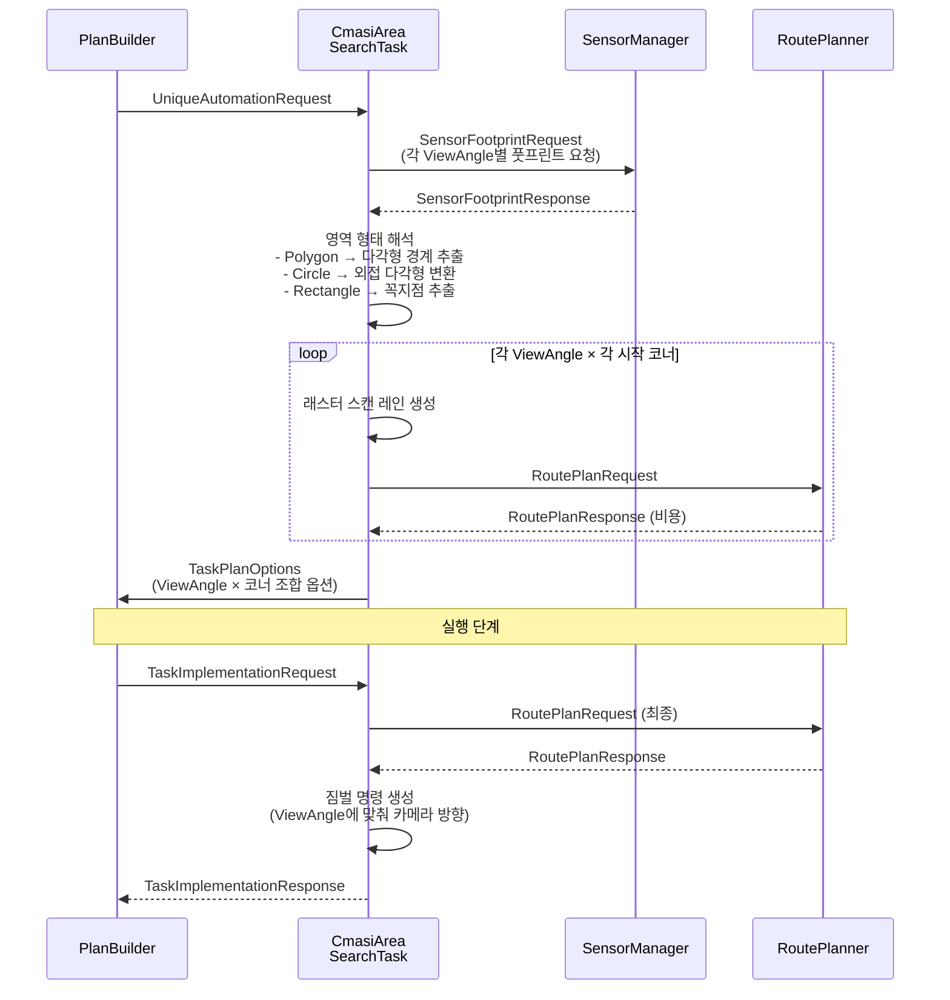
```mermaid
sequenceDiagram
    participant PB as PlanBuilder
    participant CAST as CmasiArea<br/>SearchTask
    participant SM as SensorManager
    participant RP as RoutePlanner

    PB->>CAST: UniqueAutomationRequest

    CAST->>SM: SensorFootprintRequest<br/>(각 ViewAngle별 풋프린트 요청)
    SM-->>CAST: SensorFootprintResponse

    CAST->>CAST: 영역 형태 해석<br/>- Polygon → 다각형 경계 추출<br/>- Circle → 외접 다각형 변환<br/>- Rectangle → 꼭지점 추출

    loop 각 ViewAngle × 각 시작 코너
        CAST->>CAST: 래스터 스캔 레인 생성
        CAST->>RP: RoutePlanRequest
        RP-->>CAST: RoutePlanResponse (비용)
    end

    CAST->>PB: TaskPlanOptions<br/>(ViewAngle × 코너 조합 옵션)

    Note over PB, RP: 실행 단계

    PB->>CAST: TaskImplementationRequest
    CAST->>RP: RoutePlanRequest (최종)
    RP-->>CAST: RoutePlanResponse
    CAST->>CAST: 짐벌 명령 생성<br/>(ViewAngle에 맞춰 카메라 방향)
    CAST-->>PB: TaskImplementationResponse
```

### 5.1.3 PatternSearchTask

특정 지점 중심으로 패턴 탐색을 수행합니다. 3가지 패턴을 지원:

- **Spiral**: 나선형으로 중심에서 확장하며 탐색
- **Sector**: 부채꼴 형태로 구역을 나누어 탐색
- **Sweep**: 단순 스위핑 탐색

#### PatternSearchTask 시퀀스 플로우 (신규 추가)

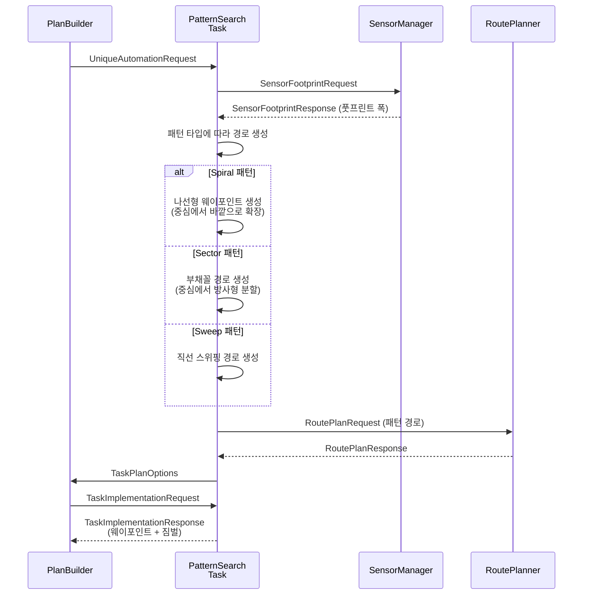
```mermaid
sequenceDiagram
    participant PB as PlanBuilder
    participant PST as PatternSearch<br/>Task
    participant SM as SensorManager
    participant RP as RoutePlanner

    PB->>PST: UniqueAutomationRequest

    PST->>SM: SensorFootprintRequest
    SM-->>PST: SensorFootprintResponse (풋프린트 폭)

    PST->>PST: 패턴 타입에 따라 경로 생성

    alt Spiral 패턴
        PST->>PST: 나선형 웨이포인트 생성<br/>(중심에서 바깥으로 확장)
    else Sector 패턴
        PST->>PST: 부채꼴 경로 생성<br/>(중심에서 방사형 분할)
    else Sweep 패턴
        PST->>PST: 직선 스위핑 경로 생성
    end

    PST->>RP: RoutePlanRequest (패턴 경로)
    RP-->>PST: RoutePlanResponse
    PST->>PB: TaskPlanOptions

    PB->>PST: TaskImplementationRequest
    PST-->>PB: TaskImplementationResponse<br/>(웨이포인트 + 짐벌)
```

## 5.2 라인 탐색 태스크 (Line Search Tasks)

### 5.2.1 CmasiLineSearchTask

도로, 해안선, 강 등의 라인을 따라 카메라로 탐색하는 태스크입니다. 지정된 각도에서 라인을 촬영하는 웨이포인트를 자동 생성합니다.

예를 들어 수로 탐색(Waterway Search) 예제에서 활용됩니다. UAV가 수로 옆을 비행하면서 카메라를 수로 방향으로 향하여 연속 촬영합니다.

#### CmasiLineSearchTask 시퀀스 플로우 (신규 추가)

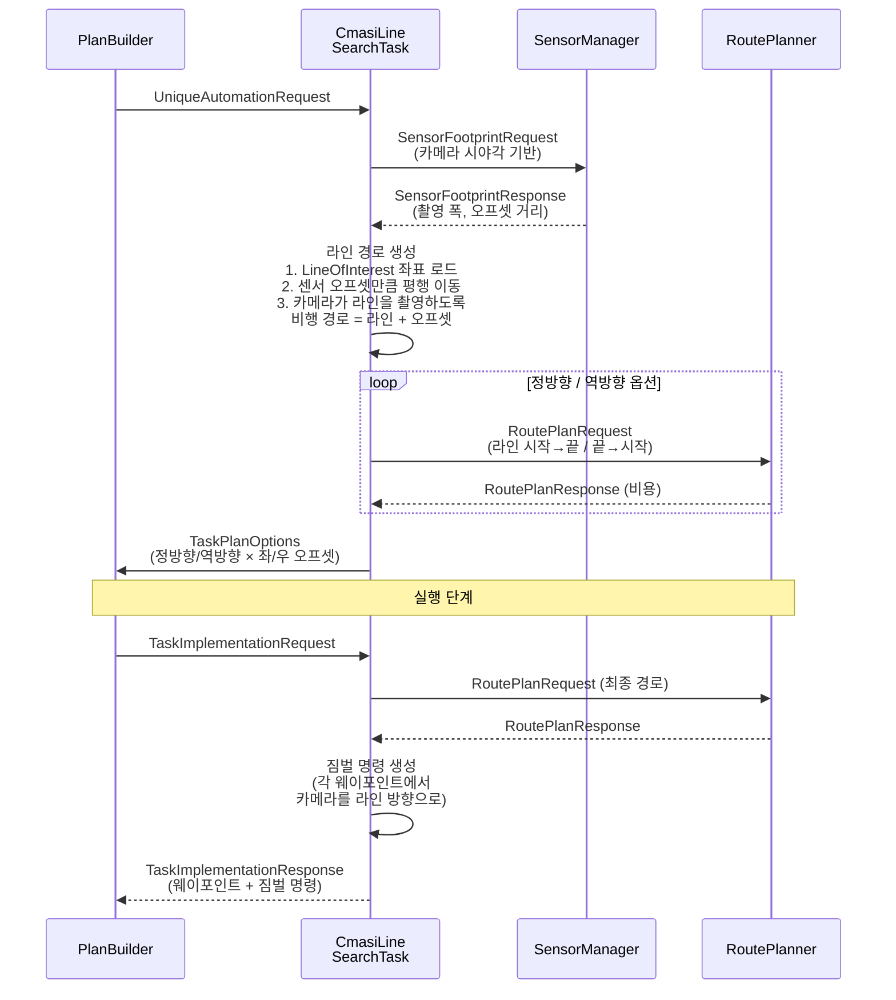
```mermaid
sequenceDiagram
    participant PB as PlanBuilder
    participant LST as CmasiLine<br/>SearchTask
    participant SM as SensorManager
    participant RP as RoutePlanner

    PB->>LST: UniqueAutomationRequest

    LST->>SM: SensorFootprintRequest<br/>(카메라 시야각 기반)
    SM-->>LST: SensorFootprintResponse<br/>(촬영 폭, 오프셋 거리)

    LST->>LST: 라인 경로 생성<br/>1. LineOfInterest 좌표 로드<br/>2. 센서 오프셋만큼 평행 이동<br/>3. 카메라가 라인을 촬영하도록<br/>   비행 경로 = 라인 + 오프셋

    loop 정방향 / 역방향 옵션
        LST->>RP: RoutePlanRequest<br/>(라인 시작→끝 / 끝→시작)
        RP-->>LST: RoutePlanResponse (비용)
    end

    LST->>PB: TaskPlanOptions<br/>(정방향/역방향 × 좌/우 오프셋)

    Note over PB, RP: 실행 단계

    PB->>LST: TaskImplementationRequest
    LST->>RP: RoutePlanRequest (최종 경로)
    RP-->>LST: RoutePlanResponse
    LST->>LST: 짐벌 명령 생성<br/>(각 웨이포인트에서<br/>카메라를 라인 방향으로)
    LST-->>PB: TaskImplementationResponse<br/>(웨이포인트 + 짐벌 명령)
```

## 5.3 지점 탐색 태스크 (Point Search Tasks)

### 5.3.1 CmasiPointSearchTask

특정 지점을 감시하는 태스크입니다. UAV가 해당 지점 주위를 로이터(Loiter)하면서 카메라로 감시합니다.

#### CmasiPointSearchTask 시퀀스 플로우 (신규 추가)

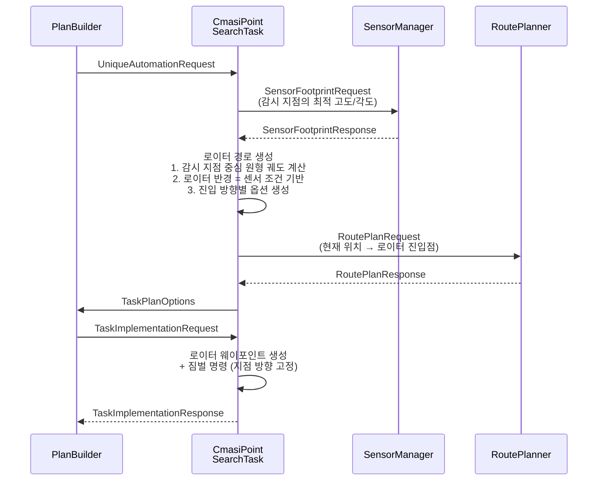
```mermaid
sequenceDiagram
    participant PB as PlanBuilder
    participant CPST as CmasiPoint<br/>SearchTask
    participant SM as SensorManager
    participant RP as RoutePlanner

    PB->>CPST: UniqueAutomationRequest

    CPST->>SM: SensorFootprintRequest<br/>(감시 지점의 최적 고도/각도)
    SM-->>CPST: SensorFootprintResponse

    CPST->>CPST: 로이터 경로 생성<br/>1. 감시 지점 중심 원형 궤도 계산<br/>2. 로이터 반경 = 센서 조건 기반<br/>3. 진입 방향별 옵션 생성

    CPST->>RP: RoutePlanRequest<br/>(현재 위치 → 로이터 진입점)
    RP-->>CPST: RoutePlanResponse

    CPST->>PB: TaskPlanOptions

    PB->>CPST: TaskImplementationRequest
    CPST->>CPST: 로이터 웨이포인트 생성<br/>+ 짐벌 명령 (지점 방향 고정)
    CPST-->>PB: TaskImplementationResponse
```

## 5.4 협동 임무 태스크 (Cooperative Tasks)

| 태스크 | 설명 | 차량 수 |
|--------|------|---------|
| WatchTask | 특정 지점 지속 감시 | 1대 |
| MultiVehicleWatchTask | 다수 UAV가 교대로 감시 | 2대+ |
| BlockadeTask | 영역 진입 차단 | 1대+ |
| CordonTask | 둘레 봉쇄/감시 | 1대+ |
| EscortTask | 다른 차량 호위 | 1대 |
| CommRelayTask | UAV간 통신 중계 | 1대 |
| RendezvousTask | 지정 지점에서 합류 | 2대+ |
| LoiterTask | 지점 주위 순회 비행 | 1대 |
| OverwatchTask | 높은 위치에서 감시 | 1대 |

#### 협동 임무 태스크 통합 시퀀스 플로우 (신규 추가)

> BlockadeTask, EscortTask, CommRelayTask의 공통 흐름과 개별 특성을 보여줍니다.

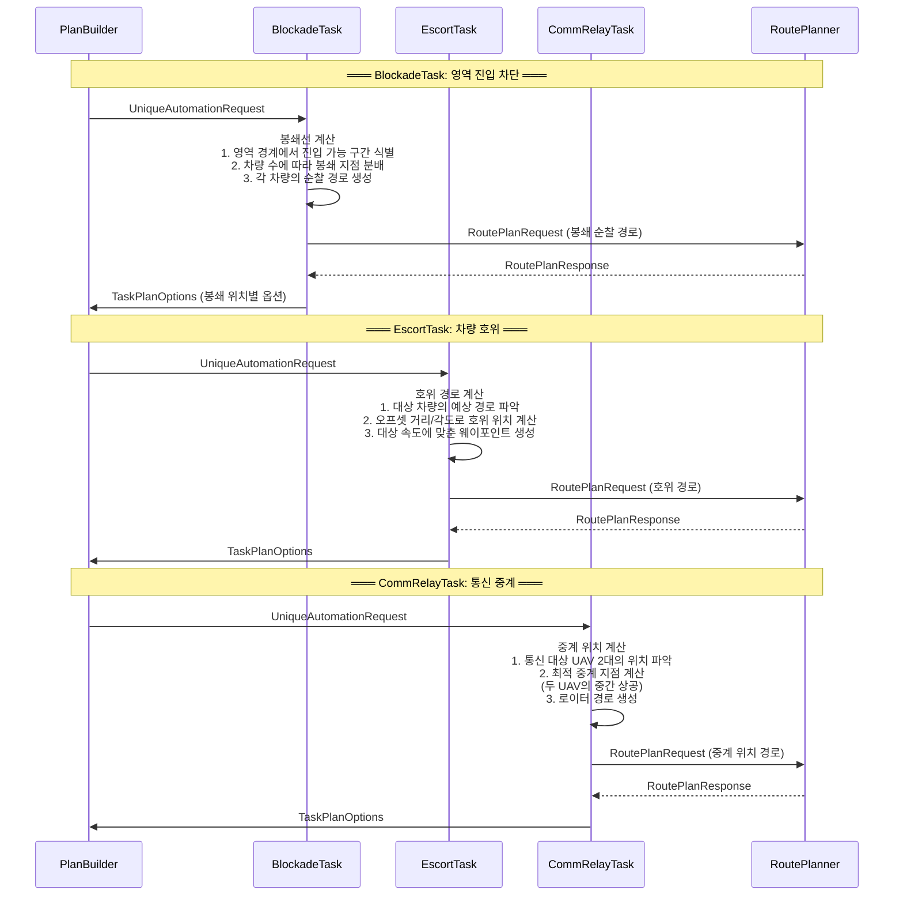
```mermaid
sequenceDiagram
    participant PB as PlanBuilder
    participant BT as BlockadeTask
    participant ET as EscortTask
    participant CRT as CommRelayTask
    participant RP as RoutePlanner

    Note over PB, RP: ═══ BlockadeTask: 영역 진입 차단 ═══

    PB->>BT: UniqueAutomationRequest
    BT->>BT: 봉쇄선 계산<br/>1. 영역 경계에서 진입 가능 구간 식별<br/>2. 차량 수에 따라 봉쇄 지점 분배<br/>3. 각 차량의 순찰 경로 생성
    BT->>RP: RoutePlanRequest (봉쇄 순찰 경로)
    RP-->>BT: RoutePlanResponse
    BT->>PB: TaskPlanOptions (봉쇄 위치별 옵션)

    Note over PB, RP: ═══ EscortTask: 차량 호위 ═══

    PB->>ET: UniqueAutomationRequest
    ET->>ET: 호위 경로 계산<br/>1. 대상 차량의 예상 경로 파악<br/>2. 오프셋 거리/각도로 호위 위치 계산<br/>3. 대상 속도에 맞춘 웨이포인트 생성
    ET->>RP: RoutePlanRequest (호위 경로)
    RP-->>ET: RoutePlanResponse
    ET->>PB: TaskPlanOptions

    Note over PB, RP: ═══ CommRelayTask: 통신 중계 ═══

    PB->>CRT: UniqueAutomationRequest
    CRT->>CRT: 중계 위치 계산<br/>1. 통신 대상 UAV 2대의 위치 파악<br/>2. 최적 중계 지점 계산<br/>   (두 UAV의 중간 상공)<br/>3. 로이터 경로 생성
    CRT->>RP: RoutePlanRequest (중계 위치 경로)
    RP-->>CRT: RoutePlanResponse
    CRT->>PB: TaskPlanOptions
```

## 5.5 태스크 상태 머신 (Task State Machine)

공식 문서(CoreServices.md)에 따르면, 모든 Task는 9개의 상태를 가집니다. 이 상태 머신을 이해하면 태스크의 동작을 완전히 파악할 수 있습니다.

| 상태 | 설명 |
|------|------|
| Init | 태스크 생성 직후. 내부 초기화 수행 (지형 로드 등) |
| Idle | 초기화 완료. 요청 대기 중 |
| SensorRequest | UAV 센서 풋프린트 계산 요청 후 응답 대기 |
| OptionRoutes | 태스크 옵션별 경로 요청 후 응답 대기 |
| OptionsPublished | TaskPlanOptions 발송 후 할당 결과 대기 |
| FinalRoutes | 선택된 옵션으로 최종 경로 요청 |
| OptionSelected | 최종 웨이포인트 응답 완료. 실행 대기 |
| Active | UAV가 태스크 수행 중. 웨이포인트/센서 제어 |
| Completed | 태스크 완료. TaskComplete 발송 후 Idle로 |

#### 태스크 상태 머신 시퀀스 플로우 (신규 추가)

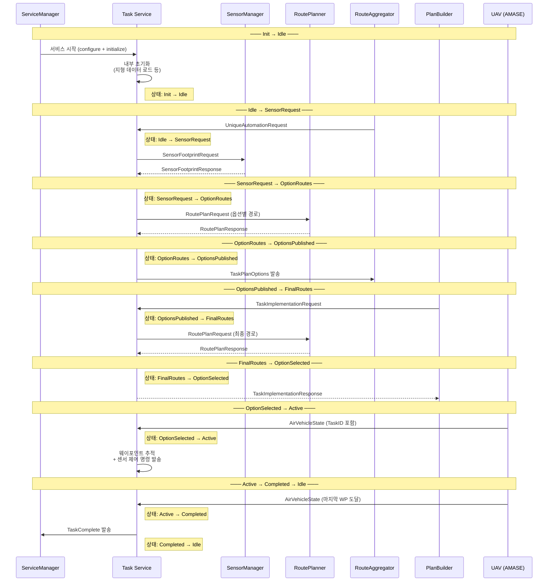
```mermaid
sequenceDiagram
    participant SM as ServiceManager
    participant Task as Task Service
    participant Sensor as SensorManager
    participant RP as RoutePlanner
    participant RA as RouteAggregator
    participant PB as PlanBuilder
    participant Vehicle as UAV (AMASE)

    Note over SM, Vehicle: ─── Init → Idle ───
    SM->>Task: 서비스 시작 (configure + initialize)
    Task->>Task: 내부 초기화<br/>(지형 데이터 로드 등)
    Note right of Task: 상태: Init → Idle

    Note over SM, Vehicle: ─── Idle → SensorRequest ───
    RA->>Task: UniqueAutomationRequest
    Note right of Task: 상태: Idle → SensorRequest
    Task->>Sensor: SensorFootprintRequest
    Sensor-->>Task: SensorFootprintResponse

    Note over SM, Vehicle: ─── SensorRequest → OptionRoutes ───
    Note right of Task: 상태: SensorRequest → OptionRoutes
    Task->>RP: RoutePlanRequest (옵션별 경로)
    RP-->>Task: RoutePlanResponse

    Note over SM, Vehicle: ─── OptionRoutes → OptionsPublished ───
    Note right of Task: 상태: OptionRoutes → OptionsPublished
    Task->>RA: TaskPlanOptions 발송

    Note over SM, Vehicle: ─── OptionsPublished → FinalRoutes ───
    PB->>Task: TaskImplementationRequest
    Note right of Task: 상태: OptionsPublished → FinalRoutes
    Task->>RP: RoutePlanRequest (최종 경로)
    RP-->>Task: RoutePlanResponse

    Note over SM, Vehicle: ─── FinalRoutes → OptionSelected ───
    Note right of Task: 상태: FinalRoutes → OptionSelected
    Task-->>PB: TaskImplementationResponse

    Note over SM, Vehicle: ─── OptionSelected → Active ───
    Vehicle->>Task: AirVehicleState (TaskID 포함)
    Note right of Task: 상태: OptionSelected → Active
    Task->>Task: 웨이포인트 추적<br/>+ 센서 제어 명령 발송

    Note over SM, Vehicle: ─── Active → Completed → Idle ───
    Vehicle->>Task: AirVehicleState (마지막 WP 도달)
    Note right of Task: 상태: Active → Completed
    Task->>SM: TaskComplete 발송
    Note right of Task: 상태: Completed → Idle
```

## 5.6 서비스 개발 가이드 (Step-by-Step)

공식 문서(Services.md)에 따른 새 서비스 개발 절차:

- Step 1: 00_ServiceTemplate.cpp/.h 파일 복사
- Step 2: 파일명을 새 서비스명으로 변경
- Step 3: "c00_ServiceTemplate" 문자열을 새 서비스명으로 대체
- Step 4: 헤더 파일의 include guard 변경
- Step 5: 00_ServiceList.h에 새 서비스 등록
- Step 6: meson.build의 srcs_services 배열에 파일 추가
- Step 7: 재컴파일 (make -j all)

## 5.7 Validator 서비스 상태 머신

AutomationRequestValidatorService는 2개 상태(idle/busy)로 동작합니다:

```
Validator 상태 머신

[idle] ------(AutomationRequest 수신)------> [busy]
  ^                                            |
  | (큐 비었으면)                                |
  +<--(UniqueAutomationResponse 수신)---+      |
  |                                     |      |
  |   [busy] 상태에서:                    |      |
  |   - 새 요청은 큐에 추가               |      |
  |   - 응답 수신시 다음 요청 처리         |      |
  |   - 타임아웃시 오류 처리 후 다음       |      |
  +<--(큐이 비었을 때)--------+           |      |
                              v           |
          검증 통과: UniqueAutomationRequest 발송
          검증 실패: ServiceStatus(오류) 발송
```

---

# 제6장 XML 설정 상세

*XML Configuration in Detail*

## 6.1 설정 파일 구조

OpenUxAS는 XML 파일로 시스템을 설정합니다. 두 종류의 설정 파일이 있습니다:

- **config.yaml**: 예제 실행 설정 (어떤 시나리오와 UxAS 설정을 사용할지)
- **cfg_*.xml**: UxAS 서비스 설정 (어떤 서비스를 실행하고 어떤 메시지를 전송할지)

### 6.1.1 config.yaml 형식

```yaml
amase:
  scenario: Scenario_WaterwaySearch.xml    # AMASE 시나리오 파일

uxas:
  config: cfg_WaterwaySearch.xml           # UxAS 설정 파일
  rundir: RUNDIR_WaterwaySearch            # 실행 결과 디렉토리
```

### 6.1.2 cfg_*.xml 기본 구조

```xml
<?xml version="1.0" encoding="UTF-8"?>
<UxAS FormatVersion="1.0" EntityID="100"
      EntityType="Aircraft">

<!-- 통신 브리지 설정 -->
<Bridge Type="LmcpObjectNetworkTcpBridge"
        TcpAddress="tcp://127.0.0.1:5555" Server="TRUE"/>

<!-- 서비스 설정 -->
<Service Type="AutomationRequestValidatorService"/>
<Service Type="RouteAggregatorService"/>
<Service Type="RoutePlannerVisibilityService"/>
<Service Type="AssignmentTreeBranchBoundService"/>
<Service Type="PlanBuilderService"/>
<Service Type="TaskManagerService"/>
<Service Type="WaypointPlanManagerService"/>
<Service Type="SensorManagerService"/>

<!-- 초기 메시지 (차량, 임무, 영역 정의) -->
<SendMessagesService>
  <!-- 여기에 LMCP 메시지 XML이 들어감 -->
</SendMessagesService>

</UxAS>
```

## 6.2 UAV 설정 (AirVehicleConfiguration)

```xml
<AirVehicleConfiguration Series="CMASI">
  <ID>400</ID>
  <Label>UAV_400</Label>
  <MinimumSpeed>15.0</MinimumSpeed>
  <MaximumSpeed>35.0</MaximumSpeed>
  <NominalSpeed>22.0</NominalSpeed>
  <NominalAltitude>700.0</NominalAltitude>
  <NominalAltitudeType>MSL</NominalAltitudeType>
  <MinimumAltitude>50.0</MinimumAltitude>
  <MaximumAltitude>1500.0</MaximumAltitude>
  <PayloadConfigurationList>
    <CameraConfiguration>
      <PayloadID>1</PayloadID>
      <SupportedWavelengthBand>EO</SupportedWavelengthBand>
      <MaxHorizontalFieldOfView>45.0</MaxHorizontalFieldOfView>
      <MinHorizontalFieldOfView>2.0</MinHorizontalFieldOfView>
      <VideoStreamHorizontalResolution>1920</VideoStreamHorizontalResolution>
      <VideoStreamVerticalResolution>1080</VideoStreamVerticalResolution>
    </CameraConfiguration>
  </PayloadConfigurationList>
  <NominalFlightProfile>
    <FlightProfile Name="Nominal" Airspeed="22.0"
                   EnergyRate="0.005"/>
  </NominalFlightProfile>
</AirVehicleConfiguration>
```

주요 파라미터 설명:

| 파라미터 | 단위 | 설명 |
|---------|------|------|
| NominalSpeed | m/s | 기본 비행 속도 |
| NominalAltitude | m | 기본 비행 고도 |
| MaxHorizontalFOV | degree | 카메라 최대 수평 시야각 |
| MinHorizontalFOV | degree | 카메라 최소 수평 시야각 |
| Resolution | pixel | 카메라 해상도 (H x V) |

## 6.3 영역 정의 (AreaOfInterest)

```xml
<AreaOfInterest Series="CMASI">
  <AreaID>1</AreaID>
  <Area>
    <Polygon>
      <BoundaryPoints>
        <Location3D Latitude="45.3171" Longitude="-120.9139"
                    Altitude="0" AltitudeType="MSL"/>
        <Location3D Latitude="45.3171" Longitude="-120.8000"
                    Altitude="0" AltitudeType="MSL"/>
        <Location3D Latitude="45.2500" Longitude="-120.8000"
                    Altitude="0" AltitudeType="MSL"/>
        <Location3D Latitude="45.2500" Longitude="-120.9139"
                    Altitude="0" AltitudeType="MSL"/>
      </BoundaryPoints>
    </Polygon>
  </Area>
</AreaOfInterest>
```

## 6.4 운용 영역 설정

KeepInZone(비행 허용)과 KeepOutZone(비행 금지)으로 운용 영역을 정의합니다:

```xml
<!-- 비행 허용 영역 -->
<KeepInZone Series="CMASI">
  <ZoneID>1</ZoneID>
  <Boundary>
    <Polygon>
      <BoundaryPoints>
        <!-- 허용 영역 경계점 -->
      </BoundaryPoints>
    </Polygon>
  </Boundary>
  <MinAltitude>0</MinAltitude>
  <MaxAltitude>10000</MaxAltitude>
</KeepInZone>

<!-- 비행 금지 영역 -->
<KeepOutZone Series="CMASI">
  <ZoneID>10</ZoneID>
  <Boundary>
    <Polygon>
      <BoundaryPoints>
        <!-- 금지 영역 경계점 -->
      </BoundaryPoints>
    </Polygon>
  </Boundary>
</KeepOutZone>

<!-- 운용 영역 = 허용 - 금지 -->
<OperatingRegion Series="CMASI">
  <ID>100</ID>
  <KeepInAreaList><uint64>1</uint64></KeepInAreaList>
  <KeepOutAreaList><uint64>10</uint64></KeepOutAreaList>
</OperatingRegion>
```

---

# 제7장 예제 실습

*Hands-on Examples*

## 7.1 예제 목록

| 예제 | 설명 | 난이도 |
|------|------|---------|
| 01_HelloWorld | 기본 실행 테스트 | ★ |
| 02_WaterwaySearch | 수로 탐색 (1대) | ★★ |
| 02b_Double_Waterway | 수로 탐색 (2대) | ★★★ |
| 03_DistributedCoop | 분산 협동 | ★★★ |
| 05_AssignTasks | 임무 할당 | ★★ |
| 99_Tasks/* | 개별 태스크 예제 | ★★ |

## 7.2 예제 1: HelloWorld

가장 기본적인 예제로, OpenUxAS가 정상적으로 빌드되었는지 확인합니다.

```bash
$ ./run-example 01_HelloWorld
```

UxAS 프로세스가 시작되고 기본 서비스가 초기화되는 것을 확인할 수 있습니다.

#### HelloWorld 예제 시퀀스 플로우 (신규 추가)

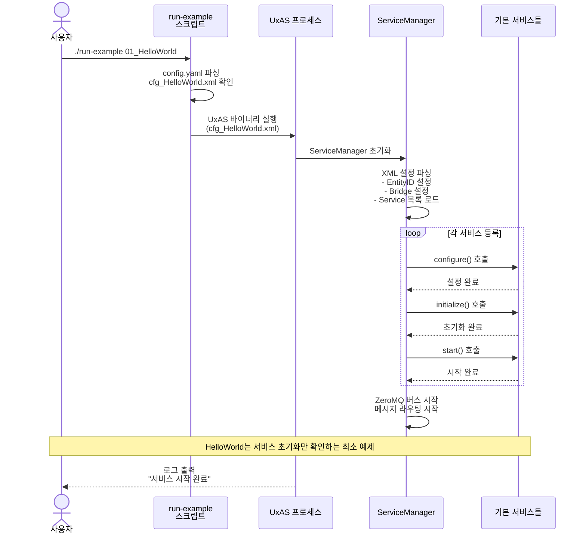
```mermaid
sequenceDiagram
    actor User as 사용자
    participant Script as run-example<br/>스크립트
    participant UxAS as UxAS 프로세스
    participant SM as ServiceManager
    participant Services as 기본 서비스들

    User->>Script: ./run-example 01_HelloWorld
    Script->>Script: config.yaml 파싱<br/>cfg_HelloWorld.xml 확인

    Script->>UxAS: UxAS 바이너리 실행<br/>(cfg_HelloWorld.xml)

    UxAS->>SM: ServiceManager 초기화
    SM->>SM: XML 설정 파싱<br/>- EntityID 설정<br/>- Bridge 설정<br/>- Service 목록 로드

    loop 각 서비스 등록
        SM->>Services: configure() 호출
        Services-->>SM: 설정 완료
        SM->>Services: initialize() 호출
        Services-->>SM: 초기화 완료
        SM->>Services: start() 호출
        Services-->>SM: 시작 완료
    end

    SM->>SM: ZeroMQ 버스 시작<br/>메시지 라우팅 시작

    Note over User, Services: HelloWorld는 서비스 초기화만 확인하는 최소 예제

    UxAS-->>User: 로그 출력<br/>"서비스 시작 완료"
```

## 7.3 예제 2: 수로 탐색 (Waterway Search)

가장 대표적인 예제로, 1대의 UAV가 수로를 따라 카메라 감시를 수행합니다.

```bash
$ ./run-example 02_Example_WaterwaySearch
```

### 7.3.1 시나리오 설명

이 예제에서는:

- UAV 1대 (ID: 400)가 초기 위치에서 시작
- 수로를 따라서 라인 탐색 임무 수행
- OpenAMASE 시뮬레이터에서 UAV 비행 시각화
- 카메라 짐벌이 자동으로 수로 방향을 향함

### 7.3.2 동작 흐름 상세

#### WaterwaySearch 예제 전체 시퀀스 플로우 (신규 추가)

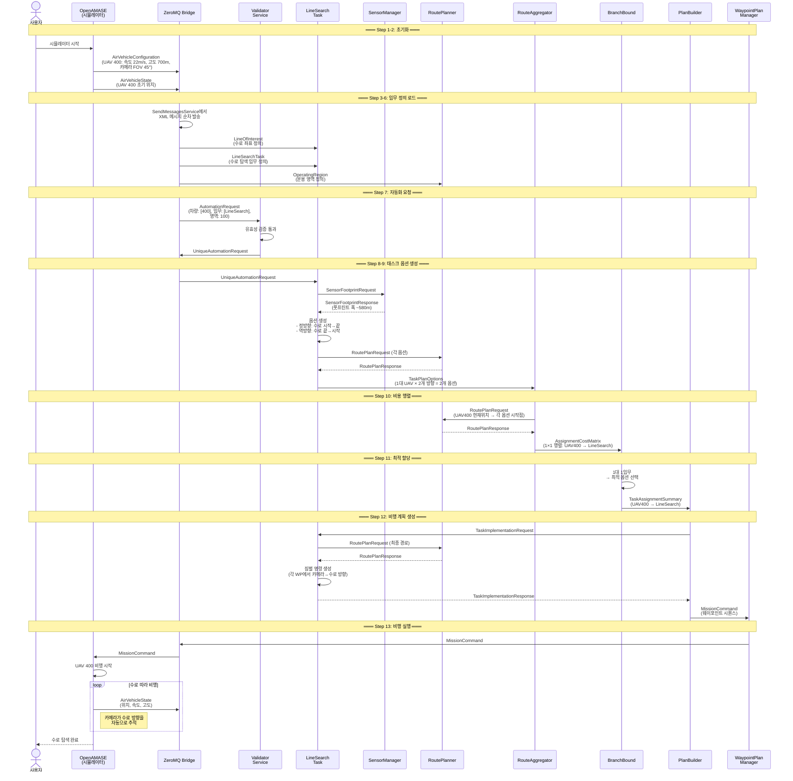
```mermaid
sequenceDiagram
    actor User as 사용자
    participant AMASE as OpenAMASE<br/>(시뮬레이터)
    participant Bridge as ZeroMQ Bridge
    participant Validator as Validator<br/>Service
    participant LST as LineSearch<br/>Task
    participant Sensor as SensorManager
    participant RP as RoutePlanner
    participant RA as RouteAggregator
    participant BnB as BranchBound
    participant PB as PlanBuilder
    participant WPM as WaypointPlan<br/>Manager

    Note over User, WPM: ═══ Step 1-2: 초기화 ═══

    User->>AMASE: 시뮬레이터 시작
    AMASE->>Bridge: AirVehicleConfiguration<br/>(UAV 400: 속도 22m/s, 고도 700m,<br/>카메라 FOV 45°)
    AMASE->>Bridge: AirVehicleState<br/>(UAV 400 초기 위치)

    Note over User, WPM: ═══ Step 3-6: 임무 정의 로드 ═══

    Bridge->>Bridge: SendMessagesService에서<br/>XML 메시지 순차 발송
    Bridge->>LST: LineOfInterest<br/>(수로 좌표 정의)
    Bridge->>LST: LineSearchTask<br/>(수로 탐색 임무 정의)
    Bridge->>RP: OperatingRegion<br/>(운용 영역 정의)

    Note over User, WPM: ═══ Step 7: 자동화 요청 ═══

    Bridge->>Validator: AutomationRequest<br/>(차량: [400], 임무: [LineSearch],<br/>영역: 100)
    Validator->>Validator: 유효성 검증 통과
    Validator->>Bridge: UniqueAutomationRequest

    Note over User, WPM: ═══ Step 8-9: 태스크 옵션 생성 ═══

    Bridge->>LST: UniqueAutomationRequest
    LST->>Sensor: SensorFootprintRequest
    Sensor-->>LST: SensorFootprintResponse<br/>(풋프린트 폭 ~580m)

    LST->>LST: 옵션 생성<br/>- 정방향: 수로 시작→끝<br/>- 역방향: 수로 끝→시작

    LST->>RP: RoutePlanRequest (각 옵션)
    RP-->>LST: RoutePlanResponse

    LST->>RA: TaskPlanOptions<br/>(1대 UAV × 2개 방향 = 2개 옵션)

    Note over User, WPM: ═══ Step 10: 비용 행렬 ═══

    RA->>RP: RoutePlanRequest<br/>(UAV400 현재위치 → 각 옵션 시작점)
    RP-->>RA: RoutePlanResponse
    RA->>BnB: AssignmentCostMatrix<br/>(1×1 행렬: UAV400 → LineSearch)

    Note over User, WPM: ═══ Step 11: 최적 할당 ═══

    BnB->>BnB: 1대 1임무<br/>→ 최적 옵션 선택
    BnB->>PB: TaskAssignmentSummary<br/>(UAV400 → LineSearch)

    Note over User, WPM: ═══ Step 12: 비행 계획 생성 ═══

    PB->>LST: TaskImplementationRequest
    LST->>RP: RoutePlanRequest (최종 경로)
    RP-->>LST: RoutePlanResponse
    LST->>LST: 짐벌 명령 생성<br/>(각 WP에서 카메라→수로 방향)
    LST-->>PB: TaskImplementationResponse
    PB->>WPM: MissionCommand<br/>(웨이포인트 시퀀스)

    Note over User, WPM: ═══ Step 13: 비행 실행 ═══

    WPM->>Bridge: MissionCommand
    Bridge->>AMASE: MissionCommand
    AMASE->>AMASE: UAV 400 비행 시작

    loop 수로 따라 비행
        AMASE->>Bridge: AirVehicleState<br/>(위치, 속도, 고도)
        Note right of AMASE: 카메라가 수로 방향을<br/>자동으로 추적
    end

    AMASE-->>User: 수로 탐색 완료
```

## 7.4 예제 3: 다중 UAV 수로 탐색

```bash
$ ./run-example 02b_Double_WaterwaySearch
```

2대의 UAV가 수로 탐색 임무를 분담합니다. Branch & Bound 알고리즘이 각 UAV에 어떤 영역을 할당할지 최적으로 결정합니다.

#### 다중 UAV 수로 탐색 시퀀스 플로우 (신규 추가)

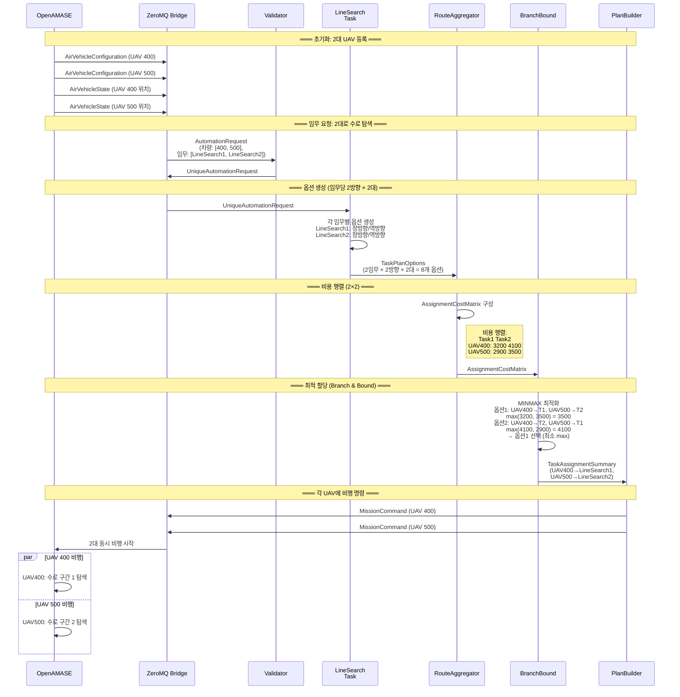
```mermaid
sequenceDiagram
    participant AMASE as OpenAMASE
    participant Bridge as ZeroMQ Bridge
    participant Validator as Validator
    participant LST as LineSearch<br/>Task
    participant RA as RouteAggregator
    participant BnB as BranchBound
    participant PB as PlanBuilder

    Note over AMASE, PB: ═══ 초기화: 2대 UAV 등록 ═══

    AMASE->>Bridge: AirVehicleConfiguration (UAV 400)
    AMASE->>Bridge: AirVehicleConfiguration (UAV 500)
    AMASE->>Bridge: AirVehicleState (UAV 400 위치)
    AMASE->>Bridge: AirVehicleState (UAV 500 위치)

    Note over AMASE, PB: ═══ 임무 요청: 2대로 수로 탐색 ═══

    Bridge->>Validator: AutomationRequest<br/>(차량: [400, 500],<br/>임무: [LineSearch1, LineSearch2])
    Validator->>Bridge: UniqueAutomationRequest

    Note over AMASE, PB: ═══ 옵션 생성 (임무당 2방향 × 2대) ═══

    Bridge->>LST: UniqueAutomationRequest
    LST->>LST: 각 임무별 옵션 생성<br/>LineSearch1: 정방향/역방향<br/>LineSearch2: 정방향/역방향

    LST->>RA: TaskPlanOptions<br/>(2임무 × 2방향 × 2대 = 8개 옵션)

    Note over AMASE, PB: ═══ 비용 행렬 (2×2) ═══

    RA->>RA: AssignmentCostMatrix 구성
    Note right of RA: 비용 행렬:<br/>        Task1  Task2<br/>UAV400: 3200   4100<br/>UAV500: 2900   3500
    RA->>BnB: AssignmentCostMatrix

    Note over AMASE, PB: ═══ 최적 할당 (Branch & Bound) ═══

    BnB->>BnB: MINMAX 최적화<br/>옵션1: UAV400→T1, UAV500→T2<br/>  max(3200, 3500) = 3500<br/>옵션2: UAV400→T2, UAV500→T1<br/>  max(4100, 2900) = 4100<br/>→ 옵션1 선택 (최소 max)

    BnB->>PB: TaskAssignmentSummary<br/>(UAV400→LineSearch1,<br/> UAV500→LineSearch2)

    Note over AMASE, PB: ═══ 각 UAV에 비행 명령 ═══

    PB->>Bridge: MissionCommand (UAV 400)
    PB->>Bridge: MissionCommand (UAV 500)
    Bridge->>AMASE: 2대 동시 비행 시작

    par UAV 400 비행
        AMASE->>AMASE: UAV400: 수로 구간 1 탐색
    and UAV 500 비행
        AMASE->>AMASE: UAV500: 수로 구간 2 탐색
    end
```

## 7.5 예제 4: 임무 할당 (AssignTasks)

```bash
$ ./run-example 05_AssignTasks
```

여러 대의 UAV에 다양한 태스크를 할당하는 예제입니다. 영역 탐색, 라인 탐색, 감시 등 다양한 태스크를 조합하여 최적의 할당을 계산합니다.

#### AssignTasks 예제 시퀀스 플로우 (신규 추가)

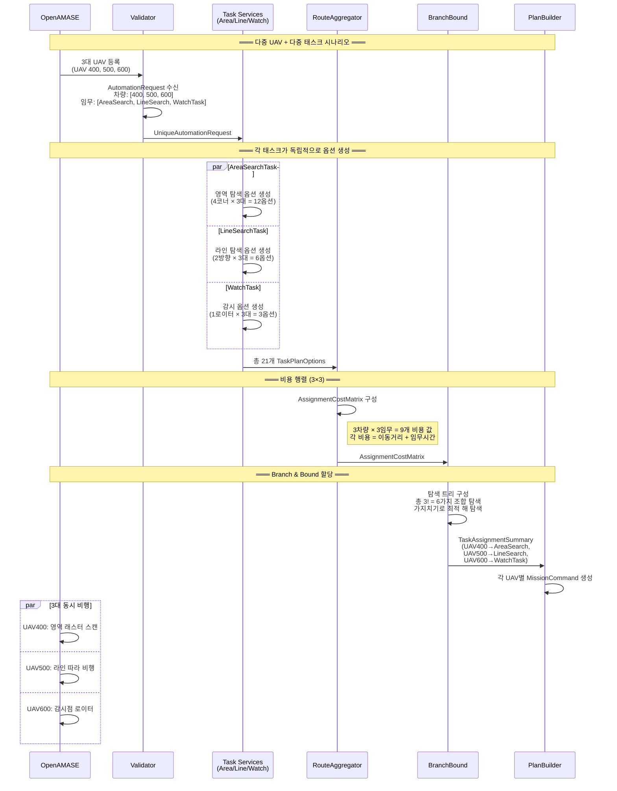
```mermaid
sequenceDiagram
    participant AMASE as OpenAMASE
    participant Validator as Validator
    participant Tasks as Task Services<br/>(Area/Line/Watch)
    participant RA as RouteAggregator
    participant BnB as BranchBound
    participant PB as PlanBuilder

    Note over AMASE, PB: ═══ 다중 UAV + 다중 태스크 시나리오 ═══

    AMASE->>Validator: 3대 UAV 등록<br/>(UAV 400, 500, 600)

    Validator->>Validator: AutomationRequest 수신<br/>차량: [400, 500, 600]<br/>임무: [AreaSearch, LineSearch, WatchTask]

    Validator->>Tasks: UniqueAutomationRequest

    Note over AMASE, PB: ═══ 각 태스크가 독립적으로 옵션 생성 ═══

    par AreaSearchTask
        Tasks->>Tasks: 영역 탐색 옵션 생성<br/>(4코너 × 3대 = 12옵션)
    and LineSearchTask
        Tasks->>Tasks: 라인 탐색 옵션 생성<br/>(2방향 × 3대 = 6옵션)
    and WatchTask
        Tasks->>Tasks: 감시 옵션 생성<br/>(1로이터 × 3대 = 3옵션)
    end

    Tasks->>RA: 총 21개 TaskPlanOptions

    Note over AMASE, PB: ═══ 비용 행렬 (3×3) ═══

    RA->>RA: AssignmentCostMatrix 구성
    Note right of RA: 3차량 × 3임무 = 9개 비용 값<br/>각 비용 = 이동거리 + 임무시간
    RA->>BnB: AssignmentCostMatrix

    Note over AMASE, PB: ═══ Branch & Bound 할당 ═══

    BnB->>BnB: 탐색 트리 구성<br/>총 3! = 6가지 조합 탐색<br/>가지치기로 최적 해 탐색

    BnB->>PB: TaskAssignmentSummary<br/>(UAV400→AreaSearch,<br/> UAV500→LineSearch,<br/> UAV600→WatchTask)

    PB->>PB: 각 UAV별 MissionCommand 생성

    par 3대 동시 비행
        AMASE->>AMASE: UAV400: 영역 래스터 스캔
    and
        AMASE->>AMASE: UAV500: 라인 따라 비행
    and
        AMASE->>AMASE: UAV600: 감시점 로이터
    end
```

## 7.6 개별 태스크 예제 (99_Tasks)

examples/99_Tasks/ 디렉토리에는 각 태스크 유형별 독립 예제가 있습니다:

| 디렉토리 | 내용 |
|---------|------|
| AngledAreaSearchTask/ | 각도 지정 영역 탐색 |
| CmasiAreaSearchTask/ | CMASI 영역 탐색 (원/다각형) |
| CmasiLineSearchTask/ | 라인 탐색 |
| CmasiPointSearchTask/ | 지점 탐색 |
| PatternSearchTask/ | 패턴 탐색 (나선형) |
| BlockadeTask/ | 영역 봉쇄 |
| CordonTask/ | 둘레 봉쇄 |
| EscortTask/ | 호위 임무 |
| CommRelayTask/ | 통신 중계 |
| MultiVehicleWatchTask/ | 다중 차량 감시 |

---

# 제8장 다중 비행체 운용

*Multi-Vehicle Operations*

## 8.1 다중 UAV 할당 원리

OpenUxAS의 핵심 기능 중 하나는 여러 대의 UAV에 임무를 최적으로 할당하는 것입니다.

```
다중 UAV 임무 할당 프로세스

AutomationRequest
  {Vehicles: [V1, V2, V3], Tasks: [T1, T2, T3]}
   |
   v
① 각 Task 서비스: TaskPlanOptions 생성
  T1: [V1용_옵션, V2용_옵션, V3용_옵션]
  T2: [V1용_옵션, V2용_옵션, V3용_옵션]
  T3: [V1용_옵션, V2용_옵션, V3용_옵션]
   |
   v
② RouteAggregator: 비용 행렬 생성
     T1    T2    T3
  V1 | 3200  4100  2800
  V2 | 2900  3500  4200
  V3 | 4500  2700  3100
   |
   v
③ BranchBound: 최적 할당 계산 (MINMAX)
  V1 -> T3 (cost=2800)
  V2 -> T1 (cost=2900)
  V3 -> T2 (cost=2700)
  Max cost = 2900 (최소화됨)
```

#### 다중 UAV 할당 세부 시퀀스 플로우 (신규 추가)

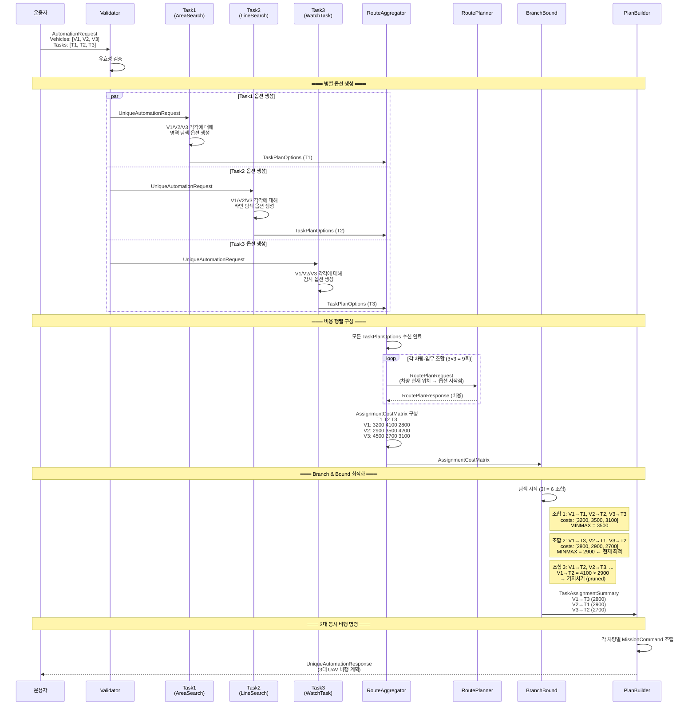
```mermaid
sequenceDiagram
    participant User as 운용자
    participant V as Validator
    participant T1 as Task1<br/>(AreaSearch)
    participant T2 as Task2<br/>(LineSearch)
    participant T3 as Task3<br/>(WatchTask)
    participant RA as RouteAggregator
    participant RP as RoutePlanner
    participant BnB as BranchBound
    participant PB as PlanBuilder

    User->>V: AutomationRequest<br/>Vehicles: [V1, V2, V3]<br/>Tasks: [T1, T2, T3]
    V->>V: 유효성 검증

    Note over User, PB: ═══ 병렬 옵션 생성 ═══

    par Task1 옵션 생성
        V->>T1: UniqueAutomationRequest
        T1->>T1: V1/V2/V3 각각에 대해<br/>영역 탐색 옵션 생성
        T1->>RA: TaskPlanOptions (T1)
    and Task2 옵션 생성
        V->>T2: UniqueAutomationRequest
        T2->>T2: V1/V2/V3 각각에 대해<br/>라인 탐색 옵션 생성
        T2->>RA: TaskPlanOptions (T2)
    and Task3 옵션 생성
        V->>T3: UniqueAutomationRequest
        T3->>T3: V1/V2/V3 각각에 대해<br/>감시 옵션 생성
        T3->>RA: TaskPlanOptions (T3)
    end

    Note over User, PB: ═══ 비용 행렬 구성 ═══

    RA->>RA: 모든 TaskPlanOptions 수신 완료

    loop 각 차량-임무 조합 (3×3 = 9회)
        RA->>RP: RoutePlanRequest<br/>(차량 현재 위치 → 옵션 시작점)
        RP-->>RA: RoutePlanResponse (비용)
    end

    RA->>RA: AssignmentCostMatrix 구성<br/>     T1    T2    T3<br/>V1: 3200  4100  2800<br/>V2: 2900  3500  4200<br/>V3: 4500  2700  3100

    RA->>BnB: AssignmentCostMatrix

    Note over User, PB: ═══ Branch & Bound 최적화 ═══

    BnB->>BnB: 탐색 시작 (3! = 6 조합)

    Note right of BnB: 조합 1: V1→T1, V2→T2, V3→T3<br/>costs: [3200, 3500, 3100]<br/>MINMAX = 3500

    Note right of BnB: 조합 2: V1→T3, V2→T1, V3→T2<br/>costs: [2800, 2900, 2700]<br/>MINMAX = 2900 ← 현재 최적

    Note right of BnB: 조합 3: V1→T2, V2→T3, ...<br/>V1→T2 = 4100 > 2900<br/>→ 가지치기 (pruned)

    BnB->>PB: TaskAssignmentSummary<br/>V1→T3 (2800)<br/>V2→T1 (2900)<br/>V3→T2 (2700)

    Note over User, PB: ═══ 3대 동시 비행 명령 ═══

    PB->>PB: 각 차량별 MissionCommand 조립
    PB-->>User: UniqueAutomationResponse<br/>(3대 UAV 비행 계획)
```

## 8.2 영역 분할 전략

넓은 영역을 여러 UAV로 나누어 감시하려면, 영역을 미리 분할하여 별도의 태스크로 정의하는 방법이 효과적입니다.

```
영역 분할 전략

전체 영역:          분할 후:
+------------------+    +--------+--------+
|                  |    | Task1  | Task2  |
| 넓은 감시  | => | (UAV1) | (UAV2) |
| 영역      |    |        |        |
+------------------+    +--------+--------+

방법:
1. 영역을 UAV 수만큼 AreaOfInterest로 분할
2. 각 영역에 대해 AngledAreaSearchTask 생성
3. AutomationRequest에 모든 Task와 Vehicle 포함
4. BranchBound가 최적 할당 자동 계산
```

### 8.2.1 영역 분할 XML 예시

```xml
<!-- 영역 1: 서쪽 반 -->
<AreaOfInterest><AreaID>1</AreaID>
  <Area><Polygon><BoundaryPoints>
    <!-- 서쪽 영역 좌표 -->
  </BoundaryPoints></Polygon></Area>
</AreaOfInterest>

<!-- 영역 2: 동쪽 반 -->
<AreaOfInterest><AreaID>2</AreaID>
  <Area><Polygon><BoundaryPoints>
    <!-- 동쪽 영역 좌표 -->
  </BoundaryPoints></Polygon></Area>
</AreaOfInterest>

<!-- 태스크 1: 서쪽 영역 탐색 -->
<AngledAreaSearchTask>
  <TaskID>1001</TaskID>
  <SearchAreaID>1</SearchAreaID>
</AngledAreaSearchTask>

<!-- 태스크 2: 동쪽 영역 탐색 -->
<AngledAreaSearchTask>
  <TaskID>1002</TaskID>
  <SearchAreaID>2</SearchAreaID>
</AngledAreaSearchTask>

<!-- 자동화 요청: 2대 UAV, 2개 태스크 -->
<AutomationRequest>
  <EntityList><int64>400</int64><int64>500</int64></EntityList>
  <TaskList><int64>1001</int64><int64>1002</int64></TaskList>
  <OperatingRegion>100</OperatingRegion>
</AutomationRequest>
```

## 8.3 카메라 기반 레인 계산

UAV의 카메라 센서에 따라 탐색 레인 간격이 자동으로 계산됩니다:

```
카메라 센서 풋프린트 기반 레인 계산

입력:
  - UAV 고도: 700m
  - 카메라 FOV: 45 degree
  - GSD 요구: 0.5m/pixel
  - 조사각: -60 degree
     |
     v
계산:
  SensorManagerService → SensorFootprint
  widthCenter = 2 * 700 * tan(45/2) = ~580m
  laneSpacing = 580 * 0.9 = ~522m  (10% 오버랩)
     |
     v
결과:
  522m 간격으로 평행 레인 생성
  영역폭 5km -> 레인 수 = ceil(5000/522) = 10개 레인
```

---

# 제9장 결과 분석

*Understanding Results*

## 9.1 출력 디렉토리 구조

예제를 실행하면 RUNDIR_* 디렉토리에 결과가 저장됩니다:

```
RUNDIR_WaterwaySearch/
├── datawork/
│   └── SavedMessages/    # 시간순 메시지 로그
├── log/
│   └── uxas_log.csv      # 서비스 로그
└── output/
    └── *.xml             # 출력 메시지
```

## 9.2 메시지 로그 분석

SavedMessages 디렉토리에는 시스템에서 교환된 모든 LMCP 메시지가 시간순으로 저장됩니다. 이를 분석하면 시스템의 동작을 상세히 이해할 수 있습니다.

주요 확인 항목:

| 메시지 | 확인 내용 |
|--------|----------|
| UniqueAutomationRequest | 요청이 정상 생성되었는지 |
| TaskPlanOptions | 각 태스크의 옵션과 비용 |
| AssignmentCostMatrix | 비용 행렬 내용 |
| TaskAssignmentSummary | 최종 할당 결과 |
| MissionCommand | 생성된 웨이포인트 수 |
| AirVehicleState | UAV 위치/속도 변화 |

#### 결과 분석 시퀀스 플로우 (신규 추가)

> SavedMessages를 시간순으로 분석하는 흐름입니다.

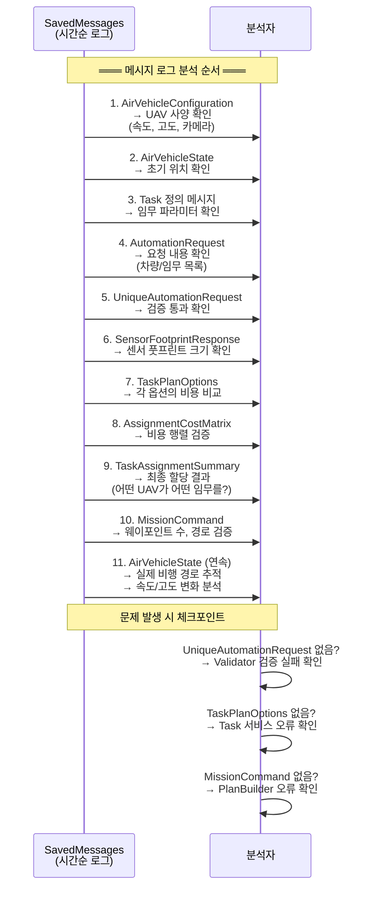
```mermaid
sequenceDiagram
    participant Log as SavedMessages<br/>(시간순 로그)
    participant Analyst as 분석자

    Note over Log, Analyst: ═══ 메시지 로그 분석 순서 ═══

    Log->>Analyst: 1. AirVehicleConfiguration<br/>→ UAV 사양 확인<br/>(속도, 고도, 카메라)

    Log->>Analyst: 2. AirVehicleState<br/>→ 초기 위치 확인

    Log->>Analyst: 3. Task 정의 메시지<br/>→ 임무 파라미터 확인

    Log->>Analyst: 4. AutomationRequest<br/>→ 요청 내용 확인<br/>(차량/임무 목록)

    Log->>Analyst: 5. UniqueAutomationRequest<br/>→ 검증 통과 확인

    Log->>Analyst: 6. SensorFootprintResponse<br/>→ 센서 풋프린트 크기 확인

    Log->>Analyst: 7. TaskPlanOptions<br/>→ 각 옵션의 비용 비교

    Log->>Analyst: 8. AssignmentCostMatrix<br/>→ 비용 행렬 검증

    Log->>Analyst: 9. TaskAssignmentSummary<br/>→ 최종 할당 결과<br/>(어떤 UAV가 어떤 임무를?)

    Log->>Analyst: 10. MissionCommand<br/>→ 웨이포인트 수, 경로 검증

    Log->>Analyst: 11. AirVehicleState (연속)<br/>→ 실제 비행 경로 추적<br/>→ 속도/고도 변화 분석

    Note over Log, Analyst: 문제 발생 시 체크포인트
    Analyst->>Analyst: UniqueAutomationRequest 없음?<br/>→ Validator 검증 실패 확인
    Analyst->>Analyst: TaskPlanOptions 없음?<br/>→ Task 서비스 오류 확인
    Analyst->>Analyst: MissionCommand 없음?<br/>→ PlanBuilder 오류 확인
```

## 9.3 OpenAMASE 시각화

OpenAMASE는 Java 기반 시뮬레이터로, 다음을 시각적으로 확인할 수 있습니다:

- UAV의 실시간 위치와 비행 경로
- 웨이포인트 경로 (파란선)
- 카메라 짐벌의 조준점 (녹색 점)
- 탐색 영역 경계 (노란선)
- 비행 금지/허용 영역
- UAV 상태 정보 (속도, 고도, 방향)

## 9.4 성능 지표

임무 수행 성능을 평가하는 주요 지표:

| 지표 | 설명 | 측정 방법 |
|------|------|----------|
| 할당 시간 | Request~Assignment 소요시간 | 메시지 타임스탬프 |
| 임무 완료율 | 할당된 임무 중 완료 비율 | TaskComplete 메시지 |
| 경로 효율 | 실제경로/직선경로 비율 | 웨이포인트 분석 |
| 영역 커버리지 | 탐색된 면적/전체 면적 | 센서 풋프린트 누적 |
| 부하 균형 | 각 UAV 비행시간 편차 | MINMAX 비용 분석 |

## 9.5 디버깅 팁

문제 해결을 위한 디버깅 방법:

- **메시지 로그 확인**: SavedMessages 디렉토리의 시간순 메시지 확인
- **AutomationDiagram 서비스**: 메시지 흐름을 시각적으로 표시
- **uxas_log.csv**: 각 서비스의 동작 로그 확인
- **AMASE 시뮬레이터**: 실시간 비행 상태 확인

---

# 제10장 고급 주제

*Advanced Topics*

## 10.1 새 서비스 개발하기

새로운 서비스를 만들려면 ServiceBase를 상속받는 클래스를 작성합니다:

```cpp
// MyCustomService.h
#include "ServiceBase.h"

class MyCustomService : public ServiceBase {
public:
    // 자동 등록을 위한 매크로
    static ServiceBase::CreationRegistrar<MyCustomService>
        s_registrar;

    // 서비스 이름 (설정 XML에서 사용)
    static const std::string s_typeName() {
        return "MyCustomService";
    }

    // 생명주기 메서드
    bool configure(const pugi::xml_node& ndComponent) override;
    bool initialize() override;
    bool start() override;
    bool terminate() override;

    // 메시지 처리
    bool processReceivedLcmpMessage(
        std::unique_ptr<uxas::communications::data::LmcpMessage>
            receivedLcmpMessage) override;
};
```

핵심 단계:

- ServiceBase 상속 + CreationRegistrar로 자동 등록
- configure(): XML 설정 파싱
- initialize(): 초기화 + addSubscriptionAddress()로 관심 메시지 구독
- processReceivedLcmpMessage(): 수신 메시지 처리
- sendLmcpObjectBroadcastMessage(): 메시지 발송

#### 새 서비스 개발 시퀀스 플로우 (신규 추가)

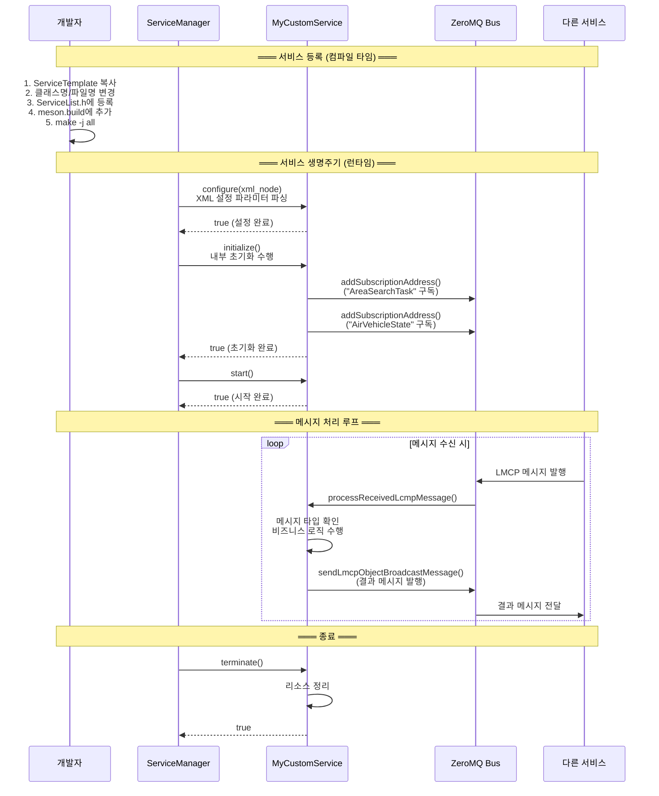
```mermaid
sequenceDiagram
    participant Dev as 개발자
    participant SM as ServiceManager
    participant Svc as MyCustomService
    participant Bus as ZeroMQ Bus
    participant Other as 다른 서비스

    Note over Dev, Other: ═══ 서비스 등록 (컴파일 타임) ═══

    Dev->>Dev: 1. ServiceTemplate 복사<br/>2. 클래스명/파일명 변경<br/>3. ServiceList.h에 등록<br/>4. meson.build에 추가<br/>5. make -j all

    Note over Dev, Other: ═══ 서비스 생명주기 (런타임) ═══

    SM->>Svc: configure(xml_node)<br/>XML 설정 파라미터 파싱
    Svc-->>SM: true (설정 완료)

    SM->>Svc: initialize()<br/>내부 초기화 수행
    Svc->>Bus: addSubscriptionAddress()<br/>("AreaSearchTask" 구독)
    Svc->>Bus: addSubscriptionAddress()<br/>("AirVehicleState" 구독)
    Svc-->>SM: true (초기화 완료)

    SM->>Svc: start()
    Svc-->>SM: true (시작 완료)

    Note over Dev, Other: ═══ 메시지 처리 루프 ═══

    loop 메시지 수신 시
        Other->>Bus: LMCP 메시지 발행
        Bus->>Svc: processReceivedLcmpMessage()
        Svc->>Svc: 메시지 타입 확인<br/>비즈니스 로직 수행
        Svc->>Bus: sendLmcpObjectBroadcastMessage()<br/>(결과 메시지 발행)
        Bus->>Other: 결과 메시지 전달
    end

    Note over Dev, Other: ═══ 종료 ═══

    SM->>Svc: terminate()
    Svc->>Svc: 리소스 정리
    Svc-->>SM: true
```

## 10.2 새 태스크 개발하기

새로운 태스크를 만들려면 TaskServiceBase를 상속받습니다. 핵심은 buildTaskPlanOptions() 메서드를 구현하는 것입니다:

- configureTask(): 태스크 파라미터 파싱
- buildTaskPlanOptions(): 각 차량에 대한 태스크 옵션 생성 (핵심!)
- processReceivedLcmpMessageTask(): 태스크 특화 메시지 처리
- activeEntityState(): 할당된 차량 상태 업데이트 시 호출

## 10.3 분산 시스템 구성

OpenUxAS는 여러 UxAS 인스턴스를 네트워크로 연결할 수 있습니다. LmcpObjectNetworkTcpBridge를 사용하여 TCP 연결을 설정합니다.

```xml
<!-- 서버 측 (EntityID=100) -->
<Bridge Type="LmcpObjectNetworkTcpBridge"
        TcpAddress="tcp://*:5555" Server="TRUE">
  <SubscribeToMessage
        MessageType="afrl.cmasi.AirVehicleState"/>
</Bridge>

<!-- 클라이언트 측 (EntityID=200) -->
<Bridge Type="LmcpObjectNetworkTcpBridge"
        TcpAddress="tcp://192.168.1.100:5555"
        Server="FALSE">
  <SubscribeToMessage
        MessageType="afrl.cmasi.MissionCommand"/>
</Bridge>
```

## 10.4 성능 튜닝

대규모 시나리오에서의 성능 최적화 팁:

- **NumberNodesMaximum**: Branch & Bound 탐색 노드 제한으로 속도 향상 (0=무제한)
- **MaxResponseTime_ms**: Validator 타임아웃 조정
- **태스크 영역 크기 최적화**: 너무 큰 영역은 웨이포인트가 많아져 느려짐
- **UAV 수 vs 태스크 수**: 조합이 많아지면 할당 시간 증가

## 10.5 용어 사전 (Glossary)

| 용어 | 영문 | 설명 |
|------|------|------|
| UAV | Unmanned Aerial Vehicle | 무인 항공기 |
| LMCP | Lightweight Message Control Protocol | 경량 메시지 프로토콜 |
| CMASI | Common Mission Automation Services Interface | 임무 자동화 표준 인터페이스 |
| MDM | Message Definition Model | 메시지 정의 모델 |
| FOV | Field of View | 시야각 |
| GSD | Ground Sample Distance | 지상 샘플 거리 |
| B&B | Branch and Bound | 분지한정 알고리즘 |
| DPSS | Dynamic Perimeter Surveillance | 동적 둘레 감시 시스템 |
| AMASE | Air Mobility Autonomy Sim Environment | UAV 시뮬레이터 |
| MAS | Multi-Agent System | 다중 에이전트 시스템 |
