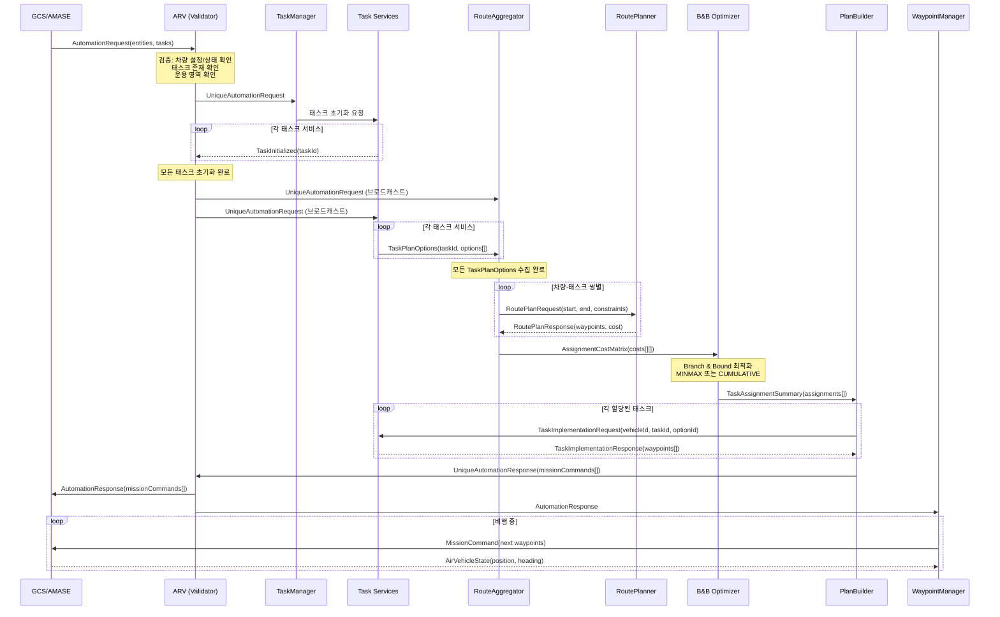

# OpenUxAS 기능별 상세 기술 레퍼런스

**Technical Reference: Service-by-Service Deep Dive**

다수 무인 비행체 자율 시스템 프레임워크
Multi-Vehicle Autonomous Systems Framework

서비스별 로직 | 입출력 분석 | 내부 알고리즘 | 데이터 구조

Air Force Research Laboratory (AFRL)
Aerospace Systems Directorate

---

## 목차 (Table of Contents)

- [제1장 시스템 아키텍처 개요](#제1장-시스템-아키텍처-개요)
- [제2장 LMCP 메시지 체계](#제2장-lmcp-메시지-체계)
- [제3장 임무 처리 파이프라인](#제3장-임무-처리-파이프라인)
- [제4장 핵심 서비스 상세 분석](#제4장-핵심-서비스-상세-분석)
- [제5장 태스크 서비스 상세 분석](#제5장-태스크-서비스-상세-분석)
- [제6장 핵심 알고리즘 상세](#제6장-핵심-알고리즘-상세)
- [제7장 통신 레이어](#제7장-통신-레이어)
- [제8장 시스템 시작 시퀀스와 설정](#제8장-시스템-시작-시퀀스와-설정)

---

# 제1장 시스템 아키텍처 개요

*System Architecture Overview*

## 1.1 서비스 기반 설계 철학

OpenUxAS는 모듈식 서비스 기반 아키텍처(Service-Oriented Architecture)로 설계되었습니다. 모든 기능은 독립적인 서비스(Service)로 구현되며, 각 서비스는 느슨하게 결합(loosely coupled)되어 LMCP 메시지를 통해 통신합니다.

이 설계의 핵심 원칙은 다음과 같습니다:

- **단일 책임**: 각 서비스는 하나의 명확한 기능만 수행합니다.
- **메시지 기반 통신**: 서비스 간 직접 호출 없이, 메시지를 발행(publish)하고 구독(subscribe)하는 방식으로 통신합니다.
- **독립 실행**: 각 서비스는 자체 스레드에서 실행되며, 다른 서비스의 상태에 직접 의존하지 않습니다.
- **자기 등록**: 서비스는 정적 팩토리 패턴으로 자동 등록되어, 설정 파일만으로 활성화/비활성화할 수 있습니다.

### 서비스 클래스 계층 구조

```
LmcpObjectNetworkClientBase (통신 기반 계층)
    |
    +-- ServiceBase (서비스 추상화 계층)
            |
            +-- ConcreteService (구체적 서비스 구현)
            |       예: AutomationRequestValidatorService
            |       예: RouteAggregatorService
            |       예: PlanBuilderService
            |
            +-- TaskServiceBase (태스크 서비스 기반 계층)
                    |
                    +-- ConcreteTaskService (구체적 태스크 구현)
                    |       예: CmasiAreaSearchTaskService
                    |       예: CmasiLineSearchTaskService
                    |
                    +-- DynamicTaskServiceBase (동적 태스크 기반)
                            |
                            +-- OverwatchTaskService
                            +-- EscortTaskService
                            +-- CommRelayTaskService
```

## 1.2 ZeroMQ 메시지 허브 (LmcpObjectNetworkServer)

시스템의 중심에는 LmcpObjectNetworkServer가 있습니다. 이것은 모든 메시지의 중앙 라우팅 허브(central routing hub)입니다.

**소스 파일**: `src/cpp/Communications/LmcpObjectNetworkServer.h/cpp`

### 동작 원리

LmcpObjectNetworkServer는 ZeroMQ의 PULL/PUB 소켓 패턴을 사용합니다:

- **PULL 소켓** (`inproc://to_message_hub`): 모든 서비스와 브릿지로부터 메시지를 수신합니다.
- **PUB 소켓** (`inproc://from_message_hub`): 수신된 메시지를 모든 구독자에게 방송합니다.

```
[서비스 A] --PUSH--> [PULL 소켓]    [PUB 소켓] ---> [구독 서비스 1]
[서비스 B] --PUSH-->  (수신)    -->  (방송)    ---> [구독 서비스 2]
[브릿지 C] --PUSH-->                           ---> [구독 서비스 3]
```

### 메시지 형식

각 메시지는 `AddressedAttributedMessage` 객체로 캡슐화되며, 다음 형식으로 직렬화됩니다:

```
주소(Address) $ 속성(Attributes) $ 페이로드(Payload)
```

속성 부분은 파이프(|)로 구분됩니다:

```
ContentType | Descriptor | SourceGroup | SourceEntityId | SourceServiceId
```

예시:

```
eid100.sid42 $ lmcp|afrl.cmasi.AirVehicleState|myapp|100|42 $ <바이너리 LMCP 데이터>
```

## 1.3 서비스 등록 패턴 (CreationRegistrar)

OpenUxAS는 정적 팩토리 패턴(Static Factory Pattern)을 사용하여 서비스를 자동 등록합니다. 이 패턴을 통해 새 서비스를 추가할 때 ServiceManager 코드를 수정할 필요가 없습니다.

**소스 파일**: `src/cpp/Services/ServiceBase.h`

### 등록 메커니즘

각 서비스는 다음 세 가지 정적 멤버를 정의합니다:

```cpp
// 1. 서비스 타입 이름 반환
static const std::vector<std::string> s_registryServiceTypeNames() {
    return {"AutomationRequestValidatorService"};
}

// 2. 팩토리 메서드
static ServiceBase* create() {
    return new AutomationRequestValidatorService;
}

// 3. 자동 등록자 (정적 초기화 시 레지스트리에 등록)
static ServiceBase::CreationRegistrar<AutomationRequestValidatorService> s_registrar;
```

프로그램이 시작될 때 `s_registrar`의 정적 초기화가 실행되면서, 서비스 타입 이름과 팩토리 함수가 전역 레지스트리에 등록됩니다. 이후 XML 설정 파일에서 `Type="AutomationRequestValidatorService"`를 만나면, 레지스트리에서 해당 팩토리를 찾아 인스턴스를 생성합니다.

## 1.4 스레딩 모델

OpenUxAS는 다중 스레드 아키텍처를 사용합니다:

| 스레드 | 역할 | 설명 |
|--------|------|------|
| Main Thread | 설정 로딩, 시작 | UxAS_Main.cpp에서 설정 파일을 읽고 서비스를 생성 |
| Network Server Thread | 중앙 메시지 라우팅 | LmcpObjectNetworkServer가 PULL/PUB 루프 실행 |
| ServiceManager Thread | 서비스 수명주기 감시 | 서비스 상태 모니터링 및 종료 감지 |
| Per-Service Thread | 서비스별 독립 실행 | 각 서비스가 자체 메시지 수신/처리 루프 실행 |
| Bridge Thread(s) | 외부 통신 | TCP, 시리얼, Zyre 등 외부 인터페이스별 스레드 |

### 서비스 실행 루프

각 서비스의 실행 루프는 `LmcpObjectNetworkClientBase`에서 구현됩니다:

```
서비스 시작
    |
    v
configure() 호출 → 메시지 구독 등록
    |
    v
initialize() 호출 → 서비스별 초기화
    |
    v
[메시지 수신 루프 시작]
    |
    v
메시지 수신 대기 (ZeroMQ SUB 소켓)
    |
    v
메시지 도착 → processReceivedLmcpMessage() 호출
    |
    v
메시지 처리 → 결과 메시지 발행 (sendSharedLmcpObjectBroadcastMessage)
    |
    v
[루프 계속]
```

## 1.5 메시지 주소 체계

메시지 라우팅은 주소 기반으로 이루어집니다. 서비스는 `addSubscriptionAddress()` 메서드로 관심 있는 메시지 주소를 구독합니다.

### 주소 유형

| 주소 형식 | 설명 | 예시 |
|-----------|------|------|
| 메시지 타입 주소 | 특정 LMCP 메시지 타입에 대한 구독 | `afrl.cmasi.AutomationRequest` |
| 엔티티 캐스트 | 특정 엔티티의 모든 서비스에게 전달 | `eid100` |
| 서비스 유니캐스트 | 특정 엔티티의 특정 서비스에게 전달 | `eid100.sid42` |
| 엔티티 전체 캐스트 | 엔티티의 모든 서비스에게 전달 | `eid100.sidall` |

### 구독 예시

AutomationRequestValidatorService의 configure() 메서드에서:

```cpp
addSubscriptionAddress("afrl.cmasi.AutomationRequest");
addSubscriptionAddress("afrl.impact.ImpactAutomationRequest");
addSubscriptionAddress("afrl.cmasi.AirVehicleConfiguration");
addSubscriptionAddress("afrl.cmasi.AirVehicleState");
addSubscriptionAddress("uxas.messages.task.TaskInitialized");
```

서비스가 메시지를 발행할 때는 주소를 지정하지 않으면 해당 메시지의 전체 타입 이름(Full Type Name)이 주소로 사용됩니다. 이를 통해 해당 타입을 구독한 모든 서비스가 메시지를 수신합니다.

---

# 제2장 LMCP 메시지 체계

*LMCP Message System*

LMCP(Lightweight Message Control Protocol)는 OpenUxAS에서 사용하는 메시지 직렬화 프로토콜입니다. 메시지 정의는 XML 파일(MDM, Message Definition Model)로 작성되며, `LmcpGen` 도구가 이를 읽어 C++/Java/Python 코드를 자동 생성합니다.

## 2.1 CMASI (Core Mission Automation Services Interface)

**정의 파일**: `mdms/CMASI.xml` (버전 3)

CMASI는 OpenUxAS의 핵심 메시지를 정의합니다. 차량 설정, 차량 상태, 임무 요청, 경로 명령 등 기본적인 자율 시스템 통신에 필요한 모든 메시지가 포함됩니다.

### 차량 설정 메시지

#### AirVehicleConfiguration

UAV의 물리적 특성과 능력을 정의합니다.

| 필드 | 타입 | 설명 |
|------|------|------|
| ID | int64 | 차량 고유 식별자 |
| Label | string | 차량 이름 (예: "UAV_1") |
| NominalSpeed | float | 기본 순항 속도 (m/s) |
| NominalAltitude | float | 기본 비행 고도 (m) |
| MinimumSpeed | float | 최소 비행 속도 (m/s) |
| MaximumSpeed | float | 최대 비행 속도 (m/s) |
| NominalFlightProfile | FlightProfile | 기본 비행 프로파일 |
| AlternateFlightProfiles | FlightProfile[] | 대체 비행 프로파일 목록 |
| PayloadConfigurationList | PayloadConfiguration[] | 센서/페이로드 설정 목록 |
| MinimumAltitude | float | 최소 비행 고도 (m) |
| MaximumAltitude | float | 최대 비행 고도 (m) |

#### AirVehicleState

UAV의 현재 상태 정보입니다. 실시간으로 갱신됩니다.

| 필드 | 타입 | 설명 |
|------|------|------|
| ID | int64 | 차량 식별자 |
| Location | Location3D | 현재 위치 (위도, 경도, 고도) |
| u, v, w | float | 속도 벡터 (m/s) - 기체 좌표계 |
| Heading | float | 기수 방향 (도, 북쪽=0, 시계방향 증가) |
| Pitch | float | 피치 각도 (도) |
| Roll | float | 롤 각도 (도) |
| Airspeed | float | 대기 속도 (m/s) |
| VerticalSpeed | float | 수직 속도 (m/s) |
| EnergyAvailable | float | 잔여 에너지 (%) |
| CurrentWaypoint | int64 | 현재 향하고 있는 웨이포인트 번호 |
| CurrentCommand | int64 | 현재 실행 중인 명령 ID |
| Mode | NavigationMode | 비행 모드 (Waypoint/Loiter/...) |
| AssociatedTasks | int64[] | 현재 수행 중인 태스크 ID 목록 |

### 임무 요청/응답 메시지

#### AutomationRequest

외부 시스템(GCS 또는 시뮬레이터)이 OpenUxAS에 임무를 요청할 때 사용합니다.

| 필드 | 타입 | 설명 |
|------|------|------|
| EntityList | int64[] | 임무에 참여할 차량 ID 목록 |
| TaskList | int64[] | 수행할 태스크 ID 목록 |
| TaskRelationships | string | 태스크 간 관계식 (예: "+(p1 p2)") |
| OperatingRegion | int64 | 운용 영역 ID |
| RedoAllTasks | bool | 모든 태스크 재실행 여부 |

#### AutomationResponse

임무 계획 결과를 반환합니다.

| 필드 | 타입 | 설명 |
|------|------|------|
| MissionCommandList | MissionCommand[] | 차량별 비행 명령 |
| VehicleCommandList | VehicleActionCommand[] | 차량 액션 명령 |
| Info | KeyValuePair[] | 추가 정보 |

### 경로 명령 메시지

#### MissionCommand

차량에 전달되는 구체적인 비행 명령입니다.

| 필드 | 타입 | 설명 |
|------|------|------|
| CommandID | int64 | 명령 고유 ID |
| VehicleID | int64 | 대상 차량 ID |
| WaypointList | Waypoint[] | 웨이포인트 시퀀스 |
| FirstWaypoint | int64 | 시작 웨이포인트 번호 |
| Status | CommandStatusType | 명령 상태 (Pending/Approved/Executed) |

#### Waypoint

개별 경유점 정보입니다.

| 필드 | 타입 | 설명 |
|------|------|------|
| Number | int64 | 웨이포인트 번호 |
| NextWaypoint | int64 | 다음 웨이포인트 번호 |
| Speed | float | 목표 속도 (m/s) |
| SpeedType | SpeedType | 속도 유형 (Airspeed/Groundspeed) |
| ClimbRate | float | 상승률 (m/s) |
| TurnType | TurnType | 선회 유형 (FlyOver/TurnShort) |
| VehicleActionList | VehicleAction[] | 해당 위치에서 수행할 액션 |
| ContingencyWaypointA | int64 | 비상 시 이동할 웨이포인트 A |
| ContingencyWaypointB | int64 | 비상 시 이동할 웨이포인트 B |
| Latitude | double | 위도 (도) |
| Longitude | double | 경도 (도) |
| Altitude | float | 고도 (m) |
| AltitudeType | AltitudeType | 고도 유형 (AGL/MSL) |

### 태스크 메시지

#### Task (기반 메시지)

모든 태스크의 기본 구조입니다.

| 필드 | 타입 | 설명 |
|------|------|------|
| TaskID | int64 | 태스크 고유 ID |
| Label | string | 태스크 이름 |
| EligibleEntities | int64[] | 수행 가능한 차량 목록 (빈 경우 모두 가능) |
| RevisitRate | float | 재방문 주기 (Hz) |
| Priority | byte | 우선순위 (0=최저, 255=최고) |
| Required | bool | 필수 수행 여부 |
| Parameters | KeyValuePair[] | 추가 파라미터 |

#### SearchTask (검색 태스크 기반)

Task를 확장하여 센서 관련 필드를 추가합니다.

| 필드 | 타입 | 설명 |
|------|------|------|
| DesiredWavelengthBands | WavelengthBand[] | 원하는 파장대 (EO/IR 등) |
| DwellTime | int64 | 체류 시간 (ms) |
| GroundSampleDistance | float | 지면 해상도 (m/pixel) |

#### AreaSearchTask

다각형 영역을 탐색하는 태스크입니다.

| 필드 | 타입 | 설명 |
|------|------|------|
| SearchArea | AbstractGeometry | 탐색 영역 (Polygon/Circle/Rectangle) |
| ViewAngleList | Wedge[] | 허용 시야각 목록 |

#### LineSearchTask

경로를 따라 탐색하는 태스크입니다.

| 필드 | 타입 | 설명 |
|------|------|------|
| PointList | Location3D[] | 탐색 경로 좌표 목록 |
| ViewAngleList | Wedge[] | 허용 시야각 목록 |
| UseInertialViewAngles | bool | 관성 좌표계 시야각 사용 여부 |

#### PointSearchTask

단일 지점을 탐색하는 태스크입니다.

| 필드 | 타입 | 설명 |
|------|------|------|
| SearchLocation | Location3D | 탐색 대상 위치 |
| StandoffDistance | float | 대기 거리 (m) |
| ViewAngleList | Wedge[] | 허용 시야각 목록 |

### 공간 제약 메시지

#### KeepInZone / KeepOutZone

비행 가능/금지 구역을 정의합니다.

| 필드 | 타입 | 설명 |
|------|------|------|
| ZoneID | int64 | 구역 고유 ID |
| Boundary | AbstractGeometry | 구역 경계 (Polygon/Circle/Rectangle) |
| MinAltitude | float | 최소 고도 |
| MaxAltitude | float | 최대 고도 |
| AffectedAircraft | int64[] | 영향받는 차량 목록 |

#### OperatingRegion

운용 영역을 KeepIn/KeepOut 존의 조합으로 정의합니다.

| 필드 | 타입 | 설명 |
|------|------|------|
| ID | int64 | 운용 영역 ID |
| KeepInAreas | int64[] | KeepIn 존 ID 목록 |
| KeepOutAreas | int64[] | KeepOut 존 ID 목록 |

### 센서/페이로드 메시지

#### CameraConfiguration

카메라 센서의 설정 정보입니다.

| 필드 | 타입 | 설명 |
|------|------|------|
| PayloadID | int64 | 페이로드 ID |
| SupportedWavelengths | WavelengthBand[] | 지원 파장대 |
| MinHorizontalFieldOfView | float | 최소 수평 시야각 (도) |
| MaxHorizontalFieldOfView | float | 최대 수평 시야각 (도) |
| VideoStreamHorizontalResolution | int32 | 수평 해상도 (픽셀) |
| VideoStreamVerticalResolution | int32 | 수직 해상도 (픽셀) |

#### GimbalConfiguration

짐벌(카메라 마운트)의 설정 정보입니다.

| 필드 | 타입 | 설명 |
|------|------|------|
| PayloadID | int64 | 페이로드 ID |
| MinAzimuth | float | 최소 방위각 (도) |
| MaxAzimuth | float | 최대 방위각 (도) |
| MinElevation | float | 최소 고도각 (도) |
| MaxElevation | float | 최대 고도각 (도) |
| ContainedPayloadList | int64[] | 탑재된 센서 ID 목록 |

#### GimbalStareAction

짐벌이 특정 지점을 주시하도록 하는 액션입니다.

| 필드 | 타입 | 설명 |
|------|------|------|
| Starepoint | Location3D | 주시 대상 위치 |
| Duration | int64 | 주시 지속 시간 (ms) |

### 열거형 (Enumerations)

| 열거형 | 값 | 설명 |
|--------|----|----|
| NavigationMode | Waypoint, Loiter, FlightDirector, TargetTrack, FollowLeader, LostComm | 비행 모드 |
| LoiterType | VehicleDefault, Circular, Racetrack, FigureEight, Hover | 로이터 유형 |
| TurnType | TurnShort, FlyOver | 선회 유형 |
| AltitudeType | AGL, MSL | 고도 기준 |
| CommandStatusType | Pending, Approved, InProcess, Executed, Cancelled | 명령 상태 |
| WavelengthBand | AllAny, EO, LWIR, SWIR, MWIR | 센서 파장대 |

## 2.2 IMPACT (Impact Analysis Messages)

**정의 파일**: `mdms/IMPACT.xml` (버전 14)

IMPACT 메시지는 영향 분석과 고급 임무 유형을 위한 확장 메시지입니다.

### 주요 메시지

#### ImpactAutomationRequest / ImpactAutomationResponse

표준 AutomationRequest의 확장 버전으로, 샌드박스(시뮬레이션) 모드를 지원합니다.

| 필드 | 타입 | 설명 |
|------|------|------|
| RequestID | int64 | 요청 ID |
| TrialRequest | AutomationRequest | 내부 자동화 요청 |
| PlayID | int64 | 플레이(시나리오) ID |
| SolutionID | int64 | 솔루션 ID |
| OverridePlanningConditions | bool | 계획 조건 재정의 |

#### PointOfInterest / LineOfInterest / AreaOfInterest

관심 지점/선/영역을 정의합니다.

| 메시지 | 핵심 필드 | 용도 |
|--------|-----------|------|
| PointOfInterest | PointID, Location | 관심 지점 위치 정의 |
| LineOfInterest | LineID, Line (Location3D[]) | 관심 선형 경로 정의 |
| AreaOfInterest | AreaID, Area (AbstractGeometry) | 관심 영역 정의 |

#### 특수 태스크 메시지

| 메시지 | 용도 |
|--------|------|
| WatchTask | 특정 엔티티를 감시 (OverwatchTaskService에서 사용) |
| EscortTask | 다른 엔티티를 호위 |
| CommRelayTask | 통신 중계 위치 유지 |
| BlockadeTask | 영역 봉쇄 |
| CordonTask | 포위 |
| MultiVehicleWatchTask | 다수 차량으로 감시 |
| PatternSearchTask | 패턴 기반 탐색 (나선형/부채꼴/스윕) |
| AngledAreaSearchTask | 각도 지정 영역 탐색 |

#### BatchSummaryRequest / BatchSummaryResponse

다수의 임무 시나리오를 배치로 실행하고 결과를 요약합니다.

| 필드 | 타입 | 설명 |
|------|------|------|
| Vehicles | VehicleSummary[] | 차량 요약 정보 |
| TaskList | Task[] | 수행할 태스크 목록 |
| OperatingRegion | int64 | 운용 영역 |

#### VehicleSummary

차량 능력 요약 정보입니다.

| 필드 | 타입 | 설명 |
|------|------|------|
| VehicleID | int64 | 차량 ID |
| MaximumSpeed | float | 최대 속도 |
| EnergyRate | float | 에너지 소비율 |
| TimeOnStation | int64 | 작전 체류 가능 시간 |

## 2.3 UXTASK (UxAS Task Coordination Messages)

**정의 파일**: `mdms/UXTASK.xml` (버전 8)

UxAS 내부 태스크 조정에 사용되는 메시지입니다.

### 주요 메시지

#### UniqueAutomationRequest / UniqueAutomationResponse

ARV 서비스가 내부적으로 사용하는 고유 ID가 부여된 자동화 요청/응답입니다.

| 필드 | 타입 | 설명 |
|------|------|------|
| RequestID | int64 | 고유 요청 ID (ARV가 부여) |
| OriginalRequest | AutomationRequest | 원본 요청 |
| PlanningStates | PlanningState[] | 계획 상태 목록 |

#### TaskPlanOptions

태스크 서비스가 생성한 수행 옵션 목록입니다.

| 필드 | 타입 | 설명 |
|------|------|------|
| CorrespondingAutomationRequestID | int64 | 관련 요청 ID |
| TaskID | int64 | 태스크 ID |
| Options | TaskOption[] | 수행 옵션 목록 |
| Composition | string | 옵션 합성식 (예: "+(p1 p2 p3)") |

#### TaskOption

개별 태스크 수행 옵션입니다.

| 필드 | 타입 | 설명 |
|------|------|------|
| TaskID | int64 | 태스크 ID |
| OptionID | int64 | 옵션 ID |
| EligibleEntities | int64[] | 수행 가능 차량 |
| Cost | int64 | 예상 비용 (ms) |
| StartLocation | Location3D | 시작 위치 |
| StartHeading | float | 시작 방향 |
| EndLocation | Location3D | 종료 위치 |
| EndHeading | float | 종료 방향 |

#### AssignmentCostMatrix

차량-태스크 쌍의 비용 행렬입니다. RouteAggregatorService가 생성합니다.

| 필드 | 타입 | 설명 |
|------|------|------|
| CorrespondingAutomationRequestID | int64 | 관련 요청 ID |
| TaskList | TaskOptionCost[] | 태스크 옵션별 비용 목록 |
| OperatingRegion | int64 | 운용 영역 |

#### TaskAssignmentSummary

최적화 결과로 생성된 차량-태스크 할당 요약입니다.

| 필드 | 타입 | 설명 |
|------|------|------|
| CorrespondingAutomationRequestID | int64 | 관련 요청 ID |
| OperatingRegion | int64 | 운용 영역 |
| TaskList | TaskAssignment[] | 할당 결과 목록 |

#### TaskAssignment

개별 할당 항목입니다.

| 필드 | 타입 | 설명 |
|------|------|------|
| TaskID | int64 | 태스크 ID |
| OptionID | int64 | 선택된 옵션 ID |
| AssignedVehicle | int64 | 할당된 차량 ID |
| TimeThreshold | int64 | 시간 제한 (ms) |
| TimeTaskCompleted | int64 | 태스크 완료 예상 시간 (ms) |

#### TaskImplementationRequest / TaskImplementationResponse

PlanBuilderService가 태스크 서비스에 구체적 구현을 요청하고 받는 메시지입니다.

| 필드(Request) | 타입 | 설명 |
|---------------|------|------|
| RequestID | int64 | 구현 요청 ID |
| CorrespondingAutomationRequestID | int64 | 관련 자동화 요청 ID |
| VehicleID | int64 | 차량 ID |
| StartPosition | Location3D | 시작 위치 |
| StartHeading | float | 시작 방향 |
| TaskID | int64 | 태스크 ID |
| OptionID | int64 | 선택된 옵션 ID |

| 필드(Response) | 타입 | 설명 |
|----------------|------|------|
| ResponseID | int64 | 응답 ID |
| TaskWaypoints | Waypoint[] | 태스크 웨이포인트 시퀀스 |
| FinalLocation | Location3D | 종료 위치 |
| FinalHeading | float | 종료 방향 |
| FinalTime | int64 | 종료 예상 시간 |

#### TaskInitialized

태스크 서비스가 초기화 완료를 알리는 메시지입니다.

| 필드 | 타입 | 설명 |
|------|------|------|
| TaskID | int64 | 초기화 완료된 태스크 ID |

#### SensorFootprintRequests / SensorFootprintResponse

센서 풋프린트 계산 요청/응답입니다.

| 필드(Request) | 타입 | 설명 |
|---------------|------|------|
| RequestID | int64 | 요청 ID |
| Footprints | SensorFootprint[] | 풋프린트 계산 요청 목록 |

| 필드(Response) | 타입 | 설명 |
|----------------|------|------|
| ResponseID | int64 | 응답 ID |
| Footprints | FootprintResult[] | 풋프린트 계산 결과 |

## 2.4 ROUTE (Route Planning Messages)

**정의 파일**: `mdms/ROUTE.xml` (버전 4)

경로 계획에 사용되는 메시지입니다.

### 주요 메시지

#### RoutePlanRequest / RoutePlanResponse

경로 계획 요청/응답입니다.

| 필드(Request) | 타입 | 설명 |
|---------------|------|------|
| RequestID | int64 | 요청 ID |
| AssociatedTaskID | int64 | 관련 태스크 ID |
| VehicleID | int64 | 차량 ID |
| OperatingRegion | int64 | 운용 영역 |
| RouteRequests | RouteConstraints[] | 경로 제약 조건 목록 |
| IsCostOnlyRequest | bool | 비용만 계산 (경로 불필요) |

| 필드(Response) | 타입 | 설명 |
|----------------|------|------|
| ResponseID | int64 | 응답 ID |
| AssociatedTaskID | int64 | 관련 태스크 ID |
| VehicleID | int64 | 차량 ID |
| OperatingRegion | int64 | 운용 영역 |
| RouteResponses | RoutePlan[] | 계산된 경로 목록 |

#### RouteConstraints

경로 제약 조건입니다.

| 필드 | 타입 | 설명 |
|------|------|------|
| RouteID | int64 | 경로 ID |
| StartLocation | Location3D | 시작 위치 |
| StartHeading | float | 시작 방향 |
| UseStartHeading | bool | 시작 방향 사용 여부 |
| EndLocation | Location3D | 종료 위치 |
| EndHeading | float | 종료 방향 |
| UseEndHeading | bool | 종료 방향 사용 여부 |

#### RoutePlan

계산된 경로 결과입니다.

| 필드 | 타입 | 설명 |
|------|------|------|
| RouteID | int64 | 경로 ID |
| Waypoints | Waypoint[] | 경로 웨이포인트 |
| RouteCost | int64 | 경로 비용 (ms) |
| RouteError | RouteError[] | 경로 오류 목록 |

#### GraphRegion / GraphNode / GraphEdge

지상 차량을 위한 도로 네트워크 그래프입니다.

| 메시지 | 핵심 필드 | 용도 |
|--------|-----------|------|
| GraphRegion | NodeList, EdgeList | 전체 도로 네트워크 |
| GraphNode | NodeID, Latitude, Longitude, AssociatedEdges | 도로 교차점 |
| GraphEdge | EdgeID, StartNode, EndNode, Waypoints | 도로 구간 |

## 2.5 UXNATIVE (UxAS Internal Messages)

**정의 파일**: `mdms/UXNATIVE.xml` (버전 9)

UxAS 내부 제어에 사용되는 메시지입니다.

### 주요 메시지

| 메시지 | 용도 | 핵심 필드 |
|--------|------|-----------|
| StartupComplete | 모든 서비스 시작 완료 신호 | - |
| CreateNewService | 런타임에 새 서비스 생성 | ServiceID, XmlConfig, EntityConfigurations |
| KillService | 서비스 종료 (ID=-1: 전체 종료) | ServiceID |
| IncrementWaypoint | 차량 다음 웨이포인트 이동 | VehicleID |
| VideoRecord | 비디오 녹화 시작/중지 | Record (bool) |
| SafeHeadingAction | 안전 비행 방향 설정 | VehicleID, DesiredHeading, LoiterRadius |
| EntityLocation | 엔티티 위치 정보 | EntityID, Position |

## 2.6 PERCEIVE (Perception Messages)

**정의 파일**: `mdms/PERCEIVE.xml` (버전 1)

센서 인지와 관련된 메시지입니다.

### 주요 메시지

#### EntityPerception

감지된 엔티티의 인지 정보입니다.

| 필드 | 타입 | 설명 |
|------|------|------|
| PerceivedEntityID | int64 | 감지된 엔티티 ID |
| PerceiverID | int64 | 감지한 센서/차량 ID |
| PerceiverPayloads | int64[] | 감지에 사용된 페이로드 ID |
| Velocity | Location3D | 속도 벡터 (3D) |
| VelocityError | Location3D | 속도 오차 |
| Attitude | Location3D | 자세 (오일러 각) |
| Location | Location3D | 위치 |
| LocationError | float | 위치 오차 (m) |
| TimeLastSeen | int64 | 마지막 감지 시각 |

#### TrackEntityAction / TrackEntityTask

엔티티 추적 액션/태스크입니다.

| 필드 | 타입 | 설명 |
|------|------|------|
| EntityID | int64 | 추적 대상 ID |
| SensorID | int64 | 사용할 센서 ID |
| ReturnWaypoint | int64 | 추적 후 복귀 웨이포인트 |

## 2.7 VEHICLES (Vehicle Type Messages)

**정의 파일**: `mdms/VEHICLES.xml` (버전 1)

공중 이외의 차량 유형을 정의합니다.

### 주요 메시지

| 메시지 | 용도 | 확장 필드 |
|--------|------|-----------|
| GroundVehicleConfiguration | 지상 차량 설정 | RoadGraphID, MinSpeed, MaxSpeed, EnergyRate |
| GroundVehicleState | 지상 차량 상태 | (EntityState 확장) |
| SurfaceVehicleConfiguration | 수상 차량 설정 | WaterAreaID, MaxBankAngle |
| SurfaceVehicleState | 수상 차량 상태 | BankAngle, ForwardSpeed |
| StationarySensorConfiguration | 고정 센서 설정 | (EntityConfiguration 확장) |
| StationarySensorState | 고정 센서 상태 | (EntityState 확장) |

---

# 제3장 임무 처리 파이프라인

*Mission Processing Pipeline (End-to-End)*

## 3.1 전체 파이프라인 흐름

AutomationRequest가 입력되면 MissionCommand가 출력되기까지, 메시지는 6개의 핵심 서비스를 순차적으로 거칩니다. 각 단계에서 이전 단계의 출력이 다음 단계의 입력이 됩니다.

```
[1단계] AutomationRequest 수신
    |
    v
[2단계] AutomationRequestValidatorService (ARV)
    - 요청 검증 (차량, 태스크, 영역 존재 확인)
    - 태스크 초기화 대기
    - UniqueAutomationRequest 생성 및 발행
    |
    v
[3단계] TaskManagerService + 태스크 서비스들
    - 각 태스크 서비스가 TaskPlanOptions 생성
    - 수행 가능한 옵션(경로, 비용)을 계산
    |
    v
[4단계] RouteAggregatorService
    - 모든 TaskPlanOptions를 수집
    - 차량-태스크 쌍별 경로 요청 생성
    - RoutePlannerVisibilityService에 경로 계산 요청
    - 결과를 AssignmentCostMatrix로 조립
    |
    v
[5단계] AssignmentTreeBranchBoundService
    - AssignmentCostMatrix를 입력으로 최적화 수행
    - Branch & Bound 알고리즘으로 최적 할당 탐색
    - TaskAssignmentSummary 출력
    |
    v
[6단계] PlanBuilderService
    - TaskAssignmentSummary를 기반으로 구체적 경로 생성
    - 각 태스크 서비스에 TaskImplementationRequest 전송
    - 응답의 웨이포인트를 축적하여 MissionCommand 조립
    - UniqueAutomationResponse 출력
    |
    v
[7단계] ARV가 UniqueAutomationResponse를 수신
    - AutomationResponse로 변환하여 외부에 전달
    |
    v
[8단계] WaypointPlanManagerService
    - MissionCommand를 수신하여 차량에 웨이포인트 서빙
```

## 3.2 Request ID 추적 메커니즘

전체 파이프라인에서 하나의 요청을 추적하기 위해 Request ID가 사용됩니다:

- **외부 RequestID**: AutomationRequest에 포함된 원본 요청 ID
- **내부 UniqueRequestID**: ARV가 부여한 고유 ID (CorrespondingAutomationRequestID)

ARV는 `m_sandboxMap`을 통해 내부 ID와 외부 ID의 매핑을 유지합니다:

```
m_sandboxMap[uniqueRequestId] = {
    requestType: CMASI / IMPACT / TASK,
    playId: (IMPACT용),
    solutionId: (IMPACT용)
}
```

각 하류 서비스(RouteAggregator, AssignmentOptimizer, PlanBuilder)는 `CorrespondingAutomationRequestID` 필드로 요청을 추적합니다. 응답이 ARV로 돌아오면, 원본 Request ID로 변환하여 외부에 전달합니다.

## 3.3 타이머 기반 상태 관리

ARV는 두 가지 타이머를 사용하여 파이프라인 중단을 방지합니다:

### 태스크 초기화 타이머 (m_taskInitTimerId)

- **목적**: 태스크 서비스가 TaskInitialized를 보낼 때까지 대기
- **트리거**: 새 요청이 들어왔을 때 시작
- **타임아웃 시**: 초기화되지 않은 태스크를 무시하고 다음 단계 진행
- **정상 완료**: 모든 태스크의 TaskInitialized 수신 시 자동 취소

### 응답 타이머 (m_responseTimerId)

- **목적**: 하류 파이프라인의 응답 대기
- **트리거**: UniqueAutomationRequest 발행 시 시작
- **기본값**: 5000ms (MaxResponseTime_ms로 설정 가능)
- **타임아웃 시**: 오류 상태의 AutomationResponse 생성 및 반환
- **정상 완료**: UniqueAutomationResponse 수신 시 자동 취소

## 3.4 전체 시퀀스 다이어그램



## 3.5 비용 계산 공식

파이프라인 전체에서 비용(Cost)은 밀리초(ms) 단위의 이동 시간으로 표현됩니다:

```
비용(ms) = (거리(m) / 차량 속도(m/s)) * 1000
```

RouteAggregatorService는 이 비용을 다음 세 가지 경우에 대해 계산합니다:

- **차량 현재 위치 → 태스크 시작점**: 차량이 태스크에 도착하는 비용
- **태스크 시작점 → 태스크 종료점**: 태스크 수행 비용
- **태스크 A 종료점 → 태스크 B 시작점**: 태스크 간 이동 비용

이 세 가지 비용을 조합하여 AssignmentCostMatrix를 구성하며, B&B 알고리즘이 이를 최적화합니다.

---

# 제4장 핵심 서비스 상세 분석

*Core Services Detailed Analysis*

## 4.1 AutomationRequestValidatorService (ARV)

**소스 파일**: `src/cpp/Services/AutomationRequestValidatorService.h/cpp`
**서비스 타입**: `"AutomationRequestValidatorService"`
**역할**: 자동화 요청의 게이트웨이이자 전체 파이프라인의 오케스트레이터

### 입력 메시지

| 메시지 | 목적 |
|--------|------|
| afrl::cmasi::AutomationRequest | 표준 자동화 요청 |
| afrl::impact::ImpactAutomationRequest | IMPACT 샌드박스 자동화 요청 |
| uxas::messages::task::TaskAutomationRequest | 태스크 자동화 요청 |
| afrl::cmasi::AirVehicleConfiguration | UAV 설정 등록 |
| afrl::cmasi::GroundVehicleConfiguration | 지상 차량 설정 등록 |
| afrl::cmasi::SurfaceVehicleConfiguration | 수상 차량 설정 등록 |
| afrl::cmasi::AirVehicleState | UAV 상태 업데이트 |
| afrl::cmasi::GroundVehicleState | 지상 차량 상태 업데이트 |
| afrl::cmasi::SurfaceVehicleState | 수상 차량 상태 업데이트 |
| uxas::messages::task::TaskInitialized | 태스크 초기화 완료 신호 |
| afrl::cmasi::Task | 태스크 정의 등록 |
| afrl::cmasi::OperatingRegion | 운용 영역 등록 |
| afrl::cmasi::KeepInZone | KeepIn 존 등록 |
| afrl::cmasi::KeepOutZone | KeepOut 존 등록 |
| afrl::impact::PointOfInterest | 관심 지점 등록 |
| afrl::impact::LineOfInterest | 관심 선 등록 |
| afrl::impact::AreaOfInterest | 관심 영역 등록 |
| afrl::cmasi::RemoveTasks | 태스크 제거 명령 |
| uxas::messages::task::UniqueAutomationResponse | 파이프라인 응답 |
| afrl::cmasi::ServiceStatus | 하류 서비스 오류 |

### 출력 메시지

| 메시지 | 목적 |
|--------|------|
| uxas::messages::task::UniqueAutomationRequest | 검증된 요청을 파이프라인에 전달 |
| afrl::cmasi::AutomationResponse | 표준 응답을 외부에 반환 |
| afrl::impact::ImpactAutomationResponse | IMPACT 응답 반환 |
| uxas::messages::task::TaskAutomationResponse | 태스크 응답 반환 |
| afrl::cmasi::ServiceStatus | 상태 업데이트 |

### 내부 알고리즘

#### 1단계: 데이터 수집 (configure/processReceivedLmcpMessage)

ARV는 지속적으로 다음 데이터를 수집하여 내부 상태를 유지합니다:

```
m_availableConfigurationEntityIds: 설정이 등록된 차량 ID 집합
m_availableStateEntityIds: 상태가 보고된 차량 ID 집합
m_availableTasks: 등록된 태스크 맵 (TaskID → Task 객체)
m_availableInitializedTasks: 초기화 완료된 태스크 ID 집합
m_availableOperatingRegions: 등록된 운용 영역 맵
m_availableKeepInZones: KeepIn 존 맵
m_availableKeepOutZones: KeepOut 존 맵
m_availablePointsOfInterest: 관심 지점 맵
m_availableLinesOfInterest: 관심 선 맵
m_availableAreasOfInterest: 관심 영역 맵
```

#### 2단계: 요청 검증 (isCheckAutomationRequestRequirements)

AutomationRequest 수신 시 다음 항목을 검증합니다:

```
입력: AutomationRequest (EntityList, TaskList, OperatingRegion)

검증 절차:
1. EntityList의 각 차량 ID에 대해:
   - m_availableConfigurationEntityIds에 존재하는가? → 없으면 실패
   - m_availableStateEntityIds에 존재하는가? → 없으면 실패

2. TaskList의 각 태스크 ID에 대해:
   - m_availableTasks에 존재하는가? → 없으면 실패

3. OperatingRegion이 지정된 경우:
   - m_availableOperatingRegions에 존재하는가? → 없으면 실패

4. 태스크에 AreaOfInterest/LineOfInterest/PointOfInterest가 참조된 경우:
   - 해당 관심 영역이 등록되어 있는가? → 없으면 실패

출력: 검증 성공 (true) 또는 실패 (false + ServiceStatus 오류 메시지)
```

#### 3단계: 태스크 초기화 대기

검증이 통과하면 요청은 `m_requestsWaitingForTasks` 큐에 추가됩니다:

```
m_requestsWaitingForTasks에 UniqueAutomationRequest 추가
태스크 초기화 타이머 시작 (m_taskInitTimerId)

대기 루프:
  TaskInitialized 메시지 수신 시:
    m_availableInitializedTasks에 추가
    요청의 모든 태스크가 초기화되었는지 확인
    → 모두 완료: m_requestsWaitingForTasks → m_pendingRequests로 이동
    → 미완료: 계속 대기

  타임아웃 시 (OnTasksReadyTimeout):
    초기화되지 않은 태스크를 무시하고 진행
```

#### 4단계: 요청 발행

`m_pendingRequests`에 요청이 있으면 순차적으로 발행합니다:

```
하나의 UniqueAutomationRequest를 m_pendingRequests에서 꺼냄
응답 타이머 시작 (m_responseTimerId, MaxResponseTime_ms)
sendSharedLmcpObjectBroadcastMessage(UniqueAutomationRequest)
```

**중요**: ARV는 한 번에 하나의 요청만 파이프라인에 전달합니다. 이전 요청의 응답이 오거나 타임아웃되어야 다음 요청을 전달합니다.

#### 5단계: 응답 처리

```
UniqueAutomationResponse 수신 시:
  응답 타이머 취소
  m_sandboxMap에서 원본 요청 타입 조회
  
  요청 타입에 따라:
    CMASI → AutomationResponse 생성 및 발행
    IMPACT → ImpactAutomationResponse 생성 및 발행 (PlayID, SolutionID 포함)
    TASK → TaskAutomationResponse 생성 및 발행
  
  m_pendingRequests에 다음 요청이 있으면 → 4단계로
```

### 설정 파라미터

```xml
<Service Type="AutomationRequestValidatorService"
         MaxResponseTime_ms="5000" />
```

| 파라미터 | 기본값 | 설명 |
|----------|--------|------|
| MaxResponseTime_ms | 5000 | 파이프라인 응답 최대 대기 시간 (ms) |

### 내부 데이터 구조 상세

```
m_pendingRequests: deque<UniqueAutomationRequest>
  - 검증/초기화 완료된 요청 큐
  - FIFO 방식으로 순차 처리

m_requestsWaitingForTasks: deque<UniqueAutomationRequest>
  - 태스크 초기화 대기 중인 요청 큐

m_sandboxMap: unordered_map<int64, RequestDetails>
  - 키: UniqueRequestID
  - 값: {requestType, playId, solutionId}
  - 응답 시 원본 타입으로 변환하는 데 사용

m_availableConfigurationEntityIds: unordered_set<int64>
m_availableStateEntityIds: unordered_set<int64>
m_availableInitializedTasks: unordered_set<int64>
m_availableTasks: unordered_map<int64, shared_ptr<Task>>
m_availableOperatingRegions: unordered_map<int64, shared_ptr<OperatingRegion>>
```

---

## 4.2 RouteAggregatorService

**소스 파일**: `src/cpp/Services/RouteAggregatorService.h/cpp`
**서비스 타입**: `"RouteAggregatorService"`
**역할**: 경로 계획 요청을 집계하고 비용 행렬을 구성

### 입력 메시지

| 메시지 | 목적 |
|--------|------|
| uxas::messages::task::UniqueAutomationRequest | 자동화 요청 (트리거) |
| uxas::messages::task::TaskPlanOptions | 태스크별 수행 옵션 |
| uxas::messages::route::RoutePlanResponse | 경로 계획 결과 |
| uxas::messages::route::RouteRequest | 직접 경로 요청 |
| 차량 설정/상태 메시지들 | 차량 정보 유지 |

### 출력 메시지

| 메시지 | 목적 |
|--------|------|
| uxas::messages::route::RoutePlanRequest | 경로 계획 요청 (RoutePlanner에 전달) |
| uxas::messages::task::AssignmentCostMatrix | 차량-태스크 비용 행렬 |
| uxas::messages::route::RouteResponse | 직접 경로 응답 |

### 내부 알고리즘

#### 1단계: 요청 및 옵션 수집

```
UniqueAutomationRequest 수신:
  m_uniqueAutomationRequests[requestId] = request
  필요한 태스크 목록 기록

TaskPlanOptions 수신:
  m_taskOptions[taskId] = options
  해당 요청의 모든 태스크 옵션이 수집되었는지 확인
  → 모두 수집: BuildMatrixRequests() 호출
```

#### 2단계: 비용 행렬 요청 생성 (BuildMatrixRequests)

이 단계에서는 모든 가능한 차량-태스크 조합에 대해 경로 비용을 계산해야 합니다.

```
입력:
  - 차량 목록: [V1, V2, ..., Vn]
  - 태스크 옵션 목록: [T1_opt1, T1_opt2, ..., Tm_optk]

생성하는 경로 요청:
  1. 차량 → 태스크 시작점:
     각 차량 Vi의 현재 위치에서 각 태스크 옵션 Tj_optk의 시작 위치까지
     
  2. 태스크 종료점 → 태스크 시작점:
     각 태스크 옵션 Ti_optj의 종료 위치에서 
     각 태스크 옵션 Tk_optl의 시작 위치까지

요청 수:
  N_vehicles * N_task_options + N_task_options^2 (최대)

각 경로 요청에 대해:
  routeId = 새 고유 ID 생성
  m_routeTaskPairing[routeId] = {fromEntity, fromTask, toTask}
  RoutePlanRequest 생성 및 전송
  m_pendingAutoReq[requestId].insert(routeId)
```

#### 3단계: 경로 응답 수집 및 행렬 조립

```
RoutePlanResponse 수신:
  m_routePlans[routeId] = {vehicleId, routePlan}
  m_pendingAutoReq[requestId].erase(routeId)
  
  m_pendingAutoReq[requestId]가 비었으면:
    → 모든 경로 계산 완료
    → AssignmentCostMatrix 조립
    → 행렬 발행
```

AssignmentCostMatrix는 다음 구조를 가집니다:

```
행: 출발점 (차량 현재 위치 또는 이전 태스크 종료점)
열: 도착점 (태스크 옵션 시작점)
값: 이동 비용 (ms)
```

### 설정 파라미터

```xml
<Service Type="RouteAggregatorService" FastPlan="FALSE" />
```

| 파라미터 | 기본값 | 설명 |
|----------|--------|------|
| FastPlan | FALSE | TRUE면 유클리드 거리만 사용 (빠르지만 부정확) |

### 내부 데이터 구조

```
m_uniqueAutomationRequests: map<int64, UniqueAutomationRequest>
  - 현재 처리 중인 요청들

m_taskOptions: map<int64, TaskPlanOptions>
  - 태스크별 수행 옵션

m_routePlans: map<int64, pair<int64, RoutePlan>>
  - 경로 ID → (차량 ID, 경로 계획)

m_routeTaskPairing: map<int64, AggregatorTaskOptionPair>
  - 경로 ID → 출발/도착 태스크 쌍 정보

m_pendingAutoReq: map<int64, set<int64>>
  - 요청 ID → 미완료 경로 ID 집합
```

---

## 4.3 RoutePlannerVisibilityService

**소스 파일**: `src/cpp/Services/RoutePlannerVisibilityService.h/cpp`
**서비스 타입**: `"RoutePlannerVisibilityService"`
**역할**: 공간 제약(KeepIn/KeepOut 존)을 고려한 경로 계획

### 입력 메시지

| 메시지 | 목적 |
|--------|------|
| uxas::messages::route::RoutePlanRequest | 경로 계획 요청 |
| uxas::messages::route::RouteRequest | 직접 경로 요청 |
| afrl::cmasi::KeepInZone | KeepIn 존 등록 |
| afrl::cmasi::KeepOutZone | KeepOut 존 등록 |
| afrl::cmasi::OperatingRegion | 운용 영역 등록 |
| 차량 설정 메시지 | 차량 턴 반경, 속도 정보 |

### 출력 메시지

| 메시지 | 목적 |
|--------|------|
| uxas::messages::route::RoutePlanResponse | 계산된 경로 (웨이포인트 + 비용) |
| uxas::messages::route::RouteResponse | 직접 경로 응답 |

### 내부 알고리즘

#### 1단계: Visibility Graph 구성

KeepIn/KeepOut 존이 등록되면 운용 영역별로 Visibility Graph를 구성합니다:

```
입력: OperatingRegion (KeepIn 존 목록, KeepOut 존 목록)

처리:
  1. KeepIn 존 → 비행 가능 경계 폴리곤으로 변환
  2. KeepOut 존 → 장애물 폴리곤으로 변환
     - 폴리곤 확장: 안전 여유 거리 추가
  
  3. Visibility Graph 생성:
     a) 정점(Vertex) 생성:
        - KeepIn 존 경계의 꼭짓점들
        - KeepOut 존 경계의 꼭짓점들
     
     b) 간선(Edge) 생성:
        - 모든 정점 쌍에 대해 가시선(Line-of-Sight) 검사
        - 장애물과 교차하지 않는 쌍만 간선으로 연결
        - 간선 가중치 = 유클리드 거리
  
  4. 결과를 m_operatingIdVsBaseVisibilityGraph에 저장

출력: 운용 영역별 기반 Visibility Graph
```

#### 2단계: 경로 계산 (bProcessRoutePlanRequest)

경로 요청이 오면 기반 그래프에 시작/종료 점을 추가하고 최단 경로를 계산합니다:

```
입력: RoutePlanRequest (시작 위치, 종료 위치, 차량 ID, 운용 영역)

처리:
  1. 기반 Visibility Graph 복사
  
  2. 시작점/종료점을 임시 정점으로 추가
     - 기존 모든 정점과 가시선 검사
     - 보이는 정점과 간선 연결
  
  3. Dijkstra 최단 경로 알고리즘 실행
     - 시작 정점에서 종료 정점까지
     - Boost graph library의 dijkstra_shortest_paths() 사용
  
  4. 경로 스무딩
     - 차량의 최소 턴 반경 적용
     - 웨이포인트 간 최소 거리(m_minimumWaypointSeparation_m) 보장
  
  5. 비용 계산
     - 총 거리 / 차량 순항 속도 = 이동 시간 (ms)

출력: RoutePlanResponse (웨이포인트 리스트 + 비용)
```

#### 알고리즘 세부: Dijkstra on Visibility Graph

```
그래프: G = (V, E)
  V = {KeepIn 존 꼭짓점} ∪ {KeepOut 존 꼭짓점} ∪ {시작점, 종료점}
  E = {(u,v) | u,v ∈ V, 직선 u→v가 장애물과 교차하지 않음}
  w(e) = ||u - v|| (유클리드 거리)

Dijkstra(G, start):
  dist[start] = 0
  dist[v] = ∞, ∀v ≠ start
  prev[v] = null
  Q = priority_queue(모든 정점)
  
  while Q is not empty:
    u = Q.extract_min()
    for each neighbor v of u:
      alt = dist[u] + w(u,v)
      if alt < dist[v]:
        dist[v] = alt
        prev[v] = u
        Q.decrease_key(v, alt)
  
  path = reconstruct_path(prev, start, end)
  cost = dist[end]
```

### 설정 파라미터

```xml
<Service Type="RoutePlannerVisibilityService"
         TurnRadiusOffset_m="0.0"
         MinimumWaypointSeparation_m="50.0" />
```

| 파라미터 | 기본값 | 설명 |
|----------|--------|------|
| TurnRadiusOffset_m | 0.0 | 턴 반경에 추가하는 오프셋 (m) |
| MinimumWaypointSeparation_m | 50.0 | 웨이포인트 간 최소 거리 (m) |

### 내부 데이터 구조

```
m_operatingIdVsBaseVisibilityGraph: map<int64, PTR_VISIBILITYGRAPH_t>
  - 운용 영역 ID → 기반 Visibility Graph

m_idVsPlannerParameters: map<uint64, s_PlannerParameters>
  - 차량 ID → 계획 파라미터 (턴 반경, 속도 등)
```

---

## 4.4 AssignmentTreeBranchBoundService

**소스 파일**: `src/cpp/Services/AssignmentTreeBranchBoundService.h/cpp`, `AssignmentTreeBranchBoundBase.h/cpp`
**서비스 타입**: `"AssignmentTreeBranchBoundService"`
**역할**: 차량-태스크 최적 할당 (조합 최적화)

### 입력 메시지

| 메시지 | 목적 |
|--------|------|
| uxas::messages::task::UniqueAutomationRequest | 자동화 요청 (차량/태스크 목록) |
| uxas::messages::task::TaskPlanOptions | 태스크별 수행 옵션 |
| uxas::messages::task::AssignmentCostMatrix | 비용 행렬 |

### 출력 메시지

| 메시지 | 목적 |
|--------|------|
| uxas::messages::task::TaskAssignmentSummary | 최적 할당 결과 |
| afrl::cmasi::ServiceStatus | 상태 업데이트 |

### 내부 알고리즘: Branch & Bound

#### 문제 정의

```
주어진 것:
  - N대의 차량: {V1, V2, ..., Vn}
  - M개의 태스크: {T1, T2, ..., Tm}
  - 각 태스크의 옵션: Ti = {opt1, opt2, ..., optk}
  - 비용 행렬: C[Vi, Tj_optk] = 차량 Vi가 옵션 Tj_optk를 수행하는 비용

목표:
  - 모든 필수 태스크를 수행하는 할당을 찾되
  - 비용 함수를 최소화

비용 함수:
  MINMAX: minimize( max(Vi의 총 비용) )  → 가장 늦게 끝나는 차량의 시간 최소화
  CUMULATIVE: minimize( sum(Vi의 총 비용) ) → 전체 시간 합계 최소화
```

#### 트리 탐색 구조

```
루트 노드: 아무 태스크도 할당되지 않은 상태

레벨 k: k번째 태스크 할당을 결정

각 노드에서의 분기:
  - 현재 미할당 태스크 중 하나를 선택
  - 해당 태스크의 각 옵션에 대해
  - 각 적격 차량에 대해
  → 분기 생성

예시 (2대 차량, 3개 태스크):

                         [루트: 할당 없음]
                    /            |           \
            [T1→V1]          [T1→V2]        ...
           /       \        /       \
      [T2→V1]  [T2→V2]  [T2→V1]  [T2→V2]
       /   \    /   \    /   \    /   \
    [T3] [T3] [T3] [T3] [T3] [T3] [T3] [T3]
```

#### 가지치기 (Pruning)

```
현재 최선 비용: best_cost (초기값 = INT64_MAX)

노드 확장 시:
  현재까지 비용 current_cost 계산
  
  if current_cost >= best_cost:
    → 이 분기를 가지치기 (더 탐색하지 않음)
    → 현재 비용이 이미 최선보다 나쁘므로 하위 노드도 나쁠 수밖에 없음
  
  if 모든 태스크가 할당됨 (리프 노드):
    if current_cost < best_cost:
      best_cost = current_cost
      best_assignment = current_assignment
```

#### MINMAX vs CUMULATIVE 비용 함수

```
MINMAX 모드:
  current_cost = max(각 차량의 누적 이동 시간)
  
  예: V1=500ms, V2=300ms → current_cost = 500ms
  목표: 가장 늦게 끝나는 차량의 시간을 최소화
  효과: 임무 전체 완료 시간 최소화 (균형 있는 부하 분산)

CUMULATIVE 모드:
  current_cost = sum(각 차량의 누적 이동 시간)
  
  예: V1=500ms, V2=300ms → current_cost = 800ms
  목표: 모든 차량의 시간 합계 최소화
  효과: 전체 자원 사용 최소화 (에너지 효율)
```

#### 탐색 제한 (NumberNodesMaximum)

```
NumberNodesMaximum = 0 (기본값):
  → Best-First Search: 전체 트리를 탐색하되
    가장 유망한 노드부터 확장
    가지치기로 불필요한 분기 제거
  
NumberNodesMaximum > 0:
  → 최대 노드 수에 도달하면 탐색 중단
  → 현재까지의 최선 해 반환
  → 대규모 문제에서 시간 제한을 위해 사용
```

### 내부 데이터 구조

```
c_VehicleAssignmentState:
  - m_vehicleId: int64 (차량 ID)
  - m_taskAssignments: vector<TaskAssignment> (할당된 태스크 목록)
  - m_travelTimeTotal_ms: int64 (누적 이동 시간)

c_TaskInformationStatic:
  - m_VehicleIdVsTaskTravelTime: map<int64, int64>
    (차량별 태스크 수행 비용)

c_StaticAssignmentParameters:
  - m_costFunction: CostFunction (MINMAX 또는 CUMULATIVE)
  - m_vehicleIdVsInformation: map<int64, VehicleInformationStatic>
  - m_taskOptionIdVsInformation: map<int64, TaskInformationStatic>
  - m_numberNodesMaximum: int64 (최대 노드 수)
  - m_minimumAssignmentCostCandidate: int64 (현재 최선 비용)
```

### 설정 파라미터

```xml
<Service Type="AssignmentTreeBranchBoundService"
         NumberNodesMaximum="0"
         CostFunction="MINMAX" />
```

| 파라미터 | 기본값 | 설명 |
|----------|--------|------|
| NumberNodesMaximum | 0 | 최대 탐색 노드 수 (0=무제한) |
| CostFunction | MINMAX | 비용 함수 (MINMAX/CUMULATIVE) |

---

## 4.5 PlanBuilderService

**소스 파일**: `src/cpp/Services/PlanBuilderService.h/cpp`
**서비스 타입**: `"PlanBuilderService"`
**역할**: 태스크 할당 결과를 구체적인 비행 계획(MissionCommand)으로 변환

### 입력 메시지

| 메시지 | 목적 |
|--------|------|
| uxas::messages::task::UniqueAutomationRequest | 원본 요청 (참조용) |
| uxas::messages::task::TaskAssignmentSummary | 최적 할당 결과 |
| uxas::messages::task::TaskImplementationResponse | 태스크 구현 결과 (웨이포인트) |
| 차량 상태 메시지 | 현재 차량 위치/방향 |

### 출력 메시지

| 메시지 | 목적 |
|--------|------|
| uxas::messages::task::TaskImplementationRequest | 태스크 구현 요청 |
| uxas::messages::task::UniqueAutomationResponse | 최종 응답 (MissionCommand 포함) |

### 내부 알고리즘

#### 1단계: 할당 요약 수신

```
TaskAssignmentSummary 수신:
  m_assignmentSummaries[requestId] = summary
  
  각 차량별로 할당된 태스크 목록을 큐에 저장:
  for assignment in summary.TaskList:
    m_remainingAssignments[assignment.AssignedVehicle].push_back(assignment)
  
  각 차량의 초기 ProjectedState 설정:
    - 현재 위치에서 AssignmentStartPointLead_m만큼 전방으로 투사
    - 이것이 첫 번째 태스크의 시작점이 됨
```

#### 2단계: 순차적 태스크 구현 요청

```
while 미처리 할당이 남아있는 차량이 있음:
  for each vehicle with remaining assignments:
    assignment = m_remainingAssignments[vehicleId].front()
    
    TaskImplementationRequest 생성:
      - VehicleID = vehicleId
      - TaskID = assignment.TaskID
      - OptionID = assignment.OptionID
      - StartPosition = 해당 차량의 ProjectedState 위치
      - StartHeading = 해당 차량의 ProjectedState 방향
    
    요청 전송
    응답 대기 (비동기)
```

#### 3단계: 구현 응답 처리

```
TaskImplementationResponse 수신:
  해당 차량의 MissionCommand에 웨이포인트 추가
  
  ProjectedState 업데이트:
    - 위치 = 응답의 FinalLocation
    - 방향 = 응답의 FinalHeading
    - 시간 = 응답의 FinalTime
    - 최종 웨이포인트 ID = 추가된 마지막 웨이포인트 번호
  
  m_remainingAssignments[vehicleId].pop_front()
  
  남은 할당이 있으면:
    → 다음 태스크에 대해 2단계 반복
  
  모든 차량의 모든 할당이 완료되면:
    → 4단계로
```

#### 4단계: 최종 응답 조립

```
UniqueAutomationResponse 생성:
  for each vehicle:
    MissionCommand 완성:
      - 웨이포인트 번호 연결 (NextWaypoint 설정)
      - FirstWaypoint = 첫 번째 웨이포인트 번호
      
      if AddLoiterToEndOfMission:
        마지막 웨이포인트에 LoiterAction 추가
        - 반경 = DefaultLoiterRadius_m
        - 지속 시간 = 무한
      
      TurnType 적용 (FlyOver 또는 TurnShort)
    
    response.MissionCommandList.add(missionCommand)
  
  UniqueAutomationResponse 발행
```

#### ProjectedState 개념

PlanBuilder는 차량의 "예측 상태(Projected State)"를 유지합니다. 이것은 차량이 현재까지 할당된 태스크를 모두 수행한 후의 예상 위치/방향/시간입니다.

```
ProjectedState:
  - position: Location3D (예상 위치)
  - heading: float (예상 방향)
  - time: int64 (예상 시각 - ms since epoch)
  - finalWaypointID: int64 (마지막 웨이포인트 ID)
```

첫 번째 태스크의 시작점은 차량의 현재 위치에서 `AssignmentStartPointLead_m`만큼 전방 투사한 점입니다. 이후 태스크의 시작점은 이전 태스크 종료 후의 ProjectedState입니다.

### 설정 파라미터

```xml
<Service Type="PlanBuilderService"
         AssignmentStartPointLead_m="50.0"
         AddLoiterToEndOfMission="true"
         DefaultLoiterRadius_m="300.0"
         TurnType="TurnShort" />
```

| 파라미터 | 기본값 | 설명 |
|----------|--------|------|
| AssignmentStartPointLead_m | 50.0 | 차량 전방 투사 거리 (m) |
| AddLoiterToEndOfMission | false | 임무 종료 시 로이터 추가 |
| DefaultLoiterRadius_m | 300.0 | 기본 로이터 반경 (m) |
| TurnType | TurnShort | 선회 유형 (TurnShort/FlyOver) |

---

## 4.6 WaypointPlanManagerService

**소스 파일**: `src/cpp/Services/WaypointPlanManagerService.h/cpp`
**서비스 타입**: `"WaypointPlanManagerService"`
**역할**: 완성된 임무 계획의 웨이포인트를 차량에 점진적으로 서빙

### 입력 메시지

| 메시지 | 목적 |
|--------|------|
| afrl::cmasi::AutomationResponse | 완성된 임무 계획 |
| afrl::cmasi::AirVehicleState | 차량 현재 상태 |
| uxas::messages::uxnative::IncrementWaypoint | 웨이포인트 전진 신호 |

### 출력 메시지

| 메시지 | 목적 |
|--------|------|
| afrl::cmasi::MissionCommand | 차량에 전달할 웨이포인트 명령 |

### 내부 알고리즘

#### 웨이포인트 서빙 로직

```
AutomationResponse 수신:
  자신의 VehicleID에 해당하는 MissionCommand 추출
  m_missionSegments에 세그먼트 저장
  m_idMissionSegmentCurrent = 0 (첫 세그먼트부터 시작)

AirVehicleState 수신:
  현재 세그먼트의 웨이포인트 중 차량이 도달한 것 확인
  
  다음 N개 웨이포인트를 포함하는 MissionCommand 생성:
    - 현재 웨이포인트부터 NumberWaypointsToServe개
    - NumberWaypointOverlap만큼 겹치게 (원활한 전환)
  
  MissionCommand 발행

IncrementWaypoint 수신:
  다음 세그먼트로 전환 (m_idMissionSegmentCurrent++)
```

### 설정 파라미터

```xml
<Service Type="WaypointPlanManagerService"
         NumberWaypointsToServe="100000"
         NumberWaypointOverlap="3"
         DefaultLoiterRadius_m="200.0"
         AddLoiterToEndOfSegments="false"
         AddLoiterToEndOfMission="false" />
```

| 파라미터 | 기본값 | 설명 |
|----------|--------|------|
| NumberWaypointsToServe | 100000 | 한 번에 서빙할 최대 웨이포인트 수 |
| NumberWaypointOverlap | 3 | 세그먼트 간 겹침 웨이포인트 수 |
| DefaultLoiterRadius_m | 200.0 | 기본 로이터 반경 |
| AddLoiterToEndOfSegments | false | 세그먼트 종료 시 로이터 추가 |
| AddLoiterToEndOfMission | false | 임무 종료 시 로이터 추가 |

---

## 4.7 SensorManagerService

**소스 파일**: `src/cpp/Services/SensorManagerService.h/cpp`
**서비스 타입**: `"SensorManagerService"`
**역할**: 센서 풋프린트와 GSD(Ground Sample Distance) 계산

### 입력 메시지

| 메시지 | 목적 |
|--------|------|
| uxas::messages::task::SensorFootprintRequests | 풋프린트 계산 요청 |
| afrl::cmasi::AirVehicleConfiguration | 차량 센서 설정 |
| afrl::cmasi::GimbalConfiguration | 짐벌 설정 |
| afrl::cmasi::CameraConfiguration | 카메라 설정 |

### 출력 메시지

| 메시지 | 목적 |
|--------|------|
| uxas::messages::task::SensorFootprintResponse | 풋프린트 계산 결과 |

### 내부 알고리즘: 센서 풋프린트 계산

```
입력:
  - 비행 고도 (h): m
  - 짐벌 고도각 (elevation): 도 (아래 방향이 음수)
  - 짐벌 방위각 (azimuth): 도
  - 카메라 수평 FOV (hfov): 도
  - 카메라 수직 FOV (vfov): 도
  - 카메라 해상도: 수평 × 수직 픽셀

계산:
  1. 주시 거리 (Slant Range):
     R = h / cos(elevation)
  
  2. 지면 풋프린트 폭 (Ground Width):
     W = 2 * R * tan(hfov / 2)
  
  3. 지면 풋프린트 높이 (Ground Height):
     H = 2 * R * tan(vfov / 2)
  
  4. GSD (Ground Sample Distance):
     GSD_h = W / horizontal_resolution  (m/pixel)
     GSD_v = H / vertical_resolution    (m/pixel)
     GSD = max(GSD_h, GSD_v)
  
  5. 풋프린트 폴리곤:
     카메라 FOV의 네 모서리를 지면에 투사하여
     사다리꼴 형태의 지면 영역 계산

출력:
  - 풋프린트 폴리곤 (4개 꼭짓점)
  - GSD 값
  - 센서 수평 폭 (래스터 스캔의 레인 간격 계산에 사용)
```

### 풋프린트와 래스터 스캔의 관계

SensorManagerService의 풋프린트 결과는 검색 태스크(CmasiAreaSearchTaskService 등)에서 래스터 스캔 패턴의 레인 간격을 결정하는 데 사용됩니다:

```
레인 간격 = 센서 풋프린트 수평 폭 × 0.9

0.9 계수의 의미:
  - 10% 오버랩으로 센서 커버리지 빈틈 방지
  - 차량 위치 오차, 바람 등의 외란을 보상
```

---

## 4.8 BatchSummaryService

**소스 파일**: `src/cpp/Services/BatchSummaryService.h/cpp`
**서비스 타입**: `"BatchSummaryService"`
**역할**: 다수의 임무 시나리오를 배치로 실행하고 결과를 집계

### 입력 메시지

| 메시지 | 목적 |
|--------|------|
| afrl::impact::BatchSummaryRequest | 배치 요청 (여러 시나리오) |
| uxas::messages::task::TaskAutomationResponse | 개별 시나리오 응답 |
| uxas::messages::route::EgressRouteResponse | 탈출 경로 응답 |

### 출력 메시지

| 메시지 | 목적 |
|--------|------|
| afrl::impact::BatchSummaryResponse | 배치 결과 요약 |
| uxas::messages::task::TaskAutomationRequest | 개별 시나리오 요청 |

### 내부 알고리즘

```
BatchSummaryRequest 수신:
  배치 항목 목록 순회:
    for each batch_item in request:
      TaskAutomationRequest 생성:
        - 해당 시나리오의 차량/태스크 정보 설정
      요청 발행
      응답 대기 (비동기)

  모든 응답 수집 후:
    BatchSummaryResponse 조립:
      - 차량별 요약 (총 비행 거리, 시간, 에너지)
      - 태스크별 요약 (완료 여부, 소요 시간)
      - 기하학적 분석 (커버리지 영역 등)
    응답 발행
```

---

## 4.9 TaskManagerService

**소스 파일**: `src/cpp/Services/TaskManagerService.h/cpp`
**서비스 타입**: `"TaskManagerService"`
**역할**: 태스크 수명주기 관리 및 태스크 서비스 생성

### 주요 기능

TaskManagerService는 태스크 정의(Task 메시지)가 수신되면 해당 태스크 유형에 맞는 태스크 서비스 인스턴스를 런타임에 생성합니다.

```
Task 메시지 수신 (예: AreaSearchTask):
  1. 태스크 타입에 해당하는 서비스 타입 결정
     AreaSearchTask → CmasiAreaSearchTaskService
  
  2. CreateNewService 메시지 생성:
     - ServiceType = "CmasiAreaSearchTaskService"
     - XML 설정에 태스크 파라미터 포함
     - 현재 차량 설정/상태 정보 포함
  
  3. CreateNewService 발행
     → ServiceManager가 새 서비스 인스턴스 생성

RemoveTasks 메시지 수신:
  KillService 메시지 발행
  → 해당 태스크 서비스 종료
```

---

# 제5장 태스크 서비스 상세 분석

*Task Services Detailed Analysis*

## 5.1 TaskServiceBase (기반 클래스)

**소스 파일**: `src/cpp/Tasks/TaskServiceBase.h/cpp`
**역할**: 모든 태스크 서비스의 공통 기능을 제공하는 기반 클래스

### 태스크 수명주기

```
[1] configure()
    |-- XML 설정 파싱
    |-- 차량 설정/상태 로드
    |-- 관심 영역/선/점 로드
    |-- LMCP 메시지 구독 등록
    |-- 적격 차량을 속도/고도 쌍으로 그룹화
    |
[2] initialize()
    |-- initializeTask() 가상 함수 호출 (서브클래스에서 구현)
    |
[3] start()
    |-- TaskInitialized 메시지 발행
    |-- startTask() 가상 함수 호출
    |
[4] processReceivedLmcpMessage() [반복]
    |-- UniqueAutomationRequest → buildTaskPlanOptions() 호출
    |-- RoutePlanResponse → 경로 비용 갱신
    |-- TaskImplementationRequest → 웨이포인트 생성
    |-- EntityState → 차량 상태 추적
    |-- MissionCommand → 활성 태스크 감지
    |
[5] terminate()
    |-- 정리
```

### 메시지 구독 (모든 태스크 공통)

```
afrl::cmasi::EntityState (및 하위 타입들)
afrl::cmasi::EntityConfiguration (및 하위 타입들)
uxas::messages::task::UniqueAutomationRequest
uxas::messages::task::UniqueAutomationResponse
uxas::messages::route::RoutePlanResponse
uxas::messages::task::TaskImplementationRequest
afrl::cmasi::MissionCommand
afrl::cmasi::AutomationResponse
```

### TaskPlanOptions 생성 패턴

모든 태스크 서비스는 다음 패턴으로 옵션을 생성합니다:

```
buildTaskPlanOptions():
  optionId = 시작 ID

  for each (speed, altitude) pair in m_speedAltitudeVsEligibleEntityIdsRequested:
    for each variation (각도, 패턴, 방향 등):
      TaskOption 생성:
        - TaskID = m_task->getTaskID()
        - OptionID = optionId++
        - EligibleEntities = 해당 속도/고도의 적격 차량
        - Cost = 예상 비용 (ms)
        - StartLocation = 태스크 시작 위치
        - EndLocation = 태스크 종료 위치
      
      TaskOptionClass에 메타데이터 저장:
        - altitude, speed, 각도 등
      
      m_optionIdVsTaskOptionClass[optionId] = taskOptionClass
      m_taskPlanOptions.Options.add(taskOption)

  Composition 문자열 생성:
    "+(p1 p2 p3 ...)"  → 옵션 중 하나를 선택
    
  TaskPlanOptions 발행
```

### Composition 문자열 문법

Composition 문자열은 태스크 옵션 간의 논리적 관계를 표현합니다:

```
+(p1 p2 p3)         → p1 OR p2 OR p3 (하나만 선택)
.(p1 p2 p3)         → p1 AND p2 AND p3 (모두 수행)
+(p1 .(p2 p3))      → p1 또는 (p2와 p3 동시) 선택
```

### 핵심 데이터 구조

```
m_task: shared_ptr<Task>
  - 태스크 정의 객체

m_speedAltitudeVsEligibleEntityIdsRequested: map<pair<float,float>, set<int64>>
  - (속도, 고도) 쌍 → 적격 차량 ID 집합
  
m_optionIdVsTaskOptionClass: map<int64, shared_ptr<TaskOptionClass>>
  - 옵션 ID → 옵션 메타데이터

m_taskPlanOptions: shared_ptr<TaskPlanOptions>
  - 최종 태스크 옵션 메시지

m_activeEntities: set<int64>
  - 현재 이 태스크를 수행 중인 차량 ID

m_assignedVehicleIds: map<int64, int64>
  - 할당된 차량 ID → 옵션 ID
```

---

## 5.2 CmasiAreaSearchTaskService (영역 탐색)

**소스 파일**: `src/cpp/Tasks/CmasiAreaSearchTaskService.h/cpp`
**태스크 타입**: `afrl::cmasi::AreaSearchTask`
**역할**: 다각형/원형 영역을 래스터 스캔 패턴으로 탐색

### 입력

| 항목 | 출처 | 설명 |
|------|------|------|
| SearchArea | AreaSearchTask 정의 | 탐색 대상 영역 (Polygon/Circle/Rectangle) |
| ViewAngleList | AreaSearchTask 정의 | 허용 시야각 목록 |
| GroundSampleDistance | SearchTask 정의 | 원하는 지면 해상도 (m/pixel) |
| AirVehicleConfiguration | 차량 설정 | 카메라 FOV, 고도, 속도 |

### 출력

| 항목 | 수신자 | 설명 |
|------|--------|------|
| TaskPlanOptions | RouteAggregatorService | 래스터 스캔 경로 옵션들 |
| SensorFootprintRequests | SensorManagerService | 센서 풋프린트 계산 요청 |
| TaskImplementationResponse | PlanBuilderService | 구체적 웨이포인트 |

### 내부 알고리즘: 래스터 스캔 패턴 생성

#### 단계 1: 시야각 열거

```
if ViewAngleList가 비어있으면:
  기본값 사용:
    - 고도각(Elevation) = -60도 (아래 60도)
    - 방위각(Azimuth) = 0, 22.5, 45, 67.5, ..., 337.5도 (16방향)
else:
  ViewAngleList의 각 Wedge에 대해:
    - AzimuthCenterline 중심으로 22.5도(pi/8) 간격 열거
    - ElevationCenterline 중심으로 22.5도 간격 열거
```

#### 단계 2: SensorFootprint 요청

```
각 (elevation, azimuth, speed, altitude) 조합에 대해:
  SensorFootprintRequest 생성:
    - ElevationAngle = elevation
    - GroundSampleDistance = 태스크의 GSD
    - VehicleID 목록
  
  SensorManagerService에 전송
  → 응답으로 풋프린트 폭(SensorWidth)과 GSD 수신
```

#### 단계 3: 래스터 스캔 경로 계산

SensorFootprintResponse를 수신하면:

```
입력:
  - SearchArea: 탐색 영역 폴리곤
  - SensorWidth: 센서 풋프린트의 수평 폭 (m)
  - SearchAxisHeading: 탐색 축 방향 (도)

래스터 스캔 생성:
  1. 영역을 탐색 축 방향으로 회전
     - 바운딩 박스 계산
     
  2. 레인 간격 계산:
     lane_spacing = SensorWidth * 0.9  (10% 오버랩)
     
  3. 평행 레인 생성:
     y = bbox.y_min + lane_spacing / 2
     direction = +1 (오른쪽)
     
     while y < bbox.y_max:
       if direction == +1:
         레인: (bbox.x_min, y) → (bbox.x_max, y)
       else:
         레인: (bbox.x_max, y) → (bbox.x_min, y)
       
       y += lane_spacing
       direction *= -1  (방향 반전 - 지그재그)
  
  4. 레인을 영역 경계로 클리핑
     - 영역 외부의 레인 부분 제거
  
  5. 역변환 (회전 복원)
     - 웨이포인트를 원래 좌표계로 변환
  
  6. 센서 조향 계산:
     - 각 레인에서 카메라가 주시할 지점 설정
     - 수평 리딩/트레일링 엣지 고려

출력: 래스터 스캔 웨이포인트 시퀀스
```

#### 래스터 스캔 시각화

```
탐색 영역 (다각형)
+------------------+
|  ←←←←←←←←←←←←  |  레인 1 (오른쪽→왼쪽)
|                  |
|  →→→→→→→→→→→→  |  레인 2 (왼쪽→오른쪽)
|                  |
|  ←←←←←←←←←←←←  |  레인 3 (오른쪽→왼쪽)
|                  |
|  →→→→→→→→→→→→  |  레인 4 (왼쪽→오른쪽)
+------------------+

레인 간격 = 센서 폭 × 0.9

센서 커버리지:
[===센서폭===]
      [===센서폭===]    ← 10% 오버랩
```

---

## 5.3 CmasiLineSearchTaskService (선형 탐색)

**소스 파일**: `src/cpp/Tasks/CmasiLineSearchTaskService.h/cpp`
**태스크 타입**: `afrl::cmasi::LineSearchTask`
**역할**: 경로(선)를 따라 카메라로 탐색

### 입력

| 항목 | 출처 | 설명 |
|------|------|------|
| PointList | LineSearchTask 정의 | 경로 좌표점 목록 |
| ViewAngleList | LineSearchTask 정의 | 허용 시야각 |
| AirVehicleConfiguration | 차량 설정 | 속도, 고도, 카메라 |

### 출력

| 항목 | 수신자 | 설명 |
|------|--------|------|
| TaskPlanOptions | RouteAggregatorService | DPSS 처리된 경로 옵션 |

### 내부 알고리즘: DPSS 기반 경로 생성

#### 단계 1: 좌표 변환

```
경로점 목록 (위도, 경도) → 로컬 좌표 (x, y) 변환
  - Flat Earth 근사 사용
  - 경로의 첫 번째 점을 원점으로 설정
```

#### 단계 2: DPSS 초기화

```
DPSS 객체 생성:
  - 도로(Road) = 변환된 경로점 목록
  - 카메라 고도각 = 시야각의 Elevation
  - 비행 고도 = 차량 순항 고도

DPSS.PreProcessPath():
  - 공선점(collinear points) 제거
  - 중복 세그먼트 제거
  - 경로 단순화
```

#### 단계 3: 경로 계획

```
DPSS.PlanQuickly():
  입력: 도로 점 목록, 최대 웨이포인트 수
  
  알고리즘 (탐욕적 선택):
    1. 첫 번째 점을 선택
    2. 현재 선택된 점에서 가장 먼 미선택 점을 선택
    3. 웨이포인트 예산 소진까지 반복
  
  출력: 최대 N개의 웨이포인트
  복잡도: O(n^2)
```

#### 단계 4: 카메라 오프셋

```
DPSS.OffsetPlanForward():
  입력: 계획된 웨이포인트, 카메라 고도각, 비행 고도
  
  각 웨이포인트에 대해:
    offset = altitude * tan(elevation_angle)
    
    경로에 수직인 방향으로 offset만큼 이동:
      - 카메라가 경로 위의 대상을 볼 수 있도록
      - 비행 경로를 대상에서 옆으로 오프셋
  
  출력: 오프셋된 웨이포인트

DPSS.OffsetPlanReverse() [양방향 계획 시]:
  경로를 반대로 뒤집고 동일한 오프셋 적용
  반대 방향 비행 옵션 생성
```

#### 단계 5: 비용 계산

```
각 옵션의 비용:
  총 거리 = sum(각 웨이포인트 간 거리)
  비용(ms) = (총 거리 / 차량 속도) * 1000
```

#### 양방향 계획 (m_isPlanBothDirections)

```
if m_isPlanBothDirections:
  옵션 A: 순방향 비행 (첫 점 → 마지막 점)
    - OffsetPlanForward 적용
  
  옵션 B: 역방향 비행 (마지막 점 → 첫 점)
    - 경로 반전 후 OffsetPlanForward 적용
  
  두 옵션 모두 TaskPlanOptions에 추가
```

---

## 5.4 CmasiPointSearchTaskService (점 탐색)

**소스 파일**: `src/cpp/Tasks/CmasiPointSearchTaskService.h/cpp`
**태스크 타입**: `afrl::cmasi::PointSearchTask`
**역할**: 단일 지점을 다양한 각도에서 탐색

### 입력

| 항목 | 출처 | 설명 |
|------|------|------|
| SearchLocation | PointSearchTask 정의 | 탐색 대상 위치 |
| StandoffDistance | PointSearchTask 정의 | 대기 거리 (m) |
| ViewAngleList | PointSearchTask 정의 | 허용 시야각 |

### 출력

| 항목 | 수신자 | 설명 |
|------|--------|------|
| TaskPlanOptions | RouteAggregatorService | 다각도 접근 옵션 |

### 내부 알고리즘

```
buildTaskPlanOptions():
  for each (speed, altitude) pair:
    for heading in [0, 45, 90, 135, 180, 225, 270, 315]:
      접근 위치 계산:
        approach_lat = SearchLocation.lat + StandoffDistance * cos(heading)
        approach_lon = SearchLocation.lon + StandoffDistance * sin(heading)
      
      TaskOption 생성:
        StartLocation = 접근 위치
        EndLocation = 접근 위치 (같은 점 - 로이터)
        Cost = 경로 비용
      
      짐벌 조향 액션 추가:
        GimbalStareAction: 대상 위치를 주시

출력: 8방향 × (speed, altitude) 쌍 수만큼의 옵션
```

---

## 5.5 PatternSearchTaskService (패턴 탐색)

**소스 파일**: `src/cpp/Tasks/PatternSearchTaskService.h/cpp`
**태스크 타입**: `afrl::impact::PatternSearchTask`
**역할**: 나선형/부채꼴/스윕 패턴으로 영역 탐색

### 입력

| 항목 | 출처 | 설명 |
|------|------|------|
| SearchLocation | PatternSearchTask 정의 | 탐색 중심점 |
| Pattern | PatternSearchTask 정의 | 패턴 유형 (Spiral/Sector/Sweep) |
| Extent | PatternSearchTask 정의 | 탐색 범위 |

### 출력

| 항목 | 수신자 | 설명 |
|------|--------|------|
| TaskPlanOptions | RouteAggregatorService | 패턴 비행 경로 |
| SensorFootprintRequests | SensorManagerService | 센서 풋프린트 요청 |

### 내부 알고리즘: 패턴별

#### Spiral (나선형) 패턴

```
isCalculatePatternScanRoute_Spiral():
  입력: 중심점, 반경, 레인 간격
  
  나선형 웨이포인트 생성:
    theta = 0
    r = 0
    while r < max_radius:
      x = center.x + r * cos(theta)
      y = center.y + r * sin(theta)
      waypoints.add(x, y)
      theta += delta_theta
      r += delta_r  (레인 간격 / 2pi * delta_theta)
  
  시각화:
        ___
      /     \
     | /---\ |
     | | * | |  ← 중심점
     | \---/ |
      \_____/
```

#### Sector (부채꼴) 패턴

```
isCalculatePatternScanRoute_Sector():
  입력: 중심점, 방위각 범위, 반경
  
  부채꼴 웨이포인트 생성:
    for r from 0 to max_radius step lane_spacing:
      for theta from start_azimuth to end_azimuth:
        x = center.x + r * cos(theta)
        y = center.y + r * sin(theta)
        waypoints.add(x, y)
      방향 반전 (지그재그)

  시각화:
        . . .
       . . . .
      . . * . .
        |   |
        +---+  ← 부채꼴 시작
```

#### Sweep (스윕) 패턴

```
isCalculatePatternScanRoute_Sweep():
  입력: 중심점, 스윕 방향, 범위
  
  평행 스윕 라인 생성:
    AreaSearchTask와 유사한 래스터 스캔
    단, 영역이 중심점 기준 직사각형
```

#### DPSS 통합

```
if m_isUseDpss:
  생성된 패턴 웨이포인트에 DPSS 스무딩 적용:
    - 카메라 고도각 보정
    - 경로 최적화
    - 센서 조향 포인트 생성
```

---

## 5.6 AngledAreaSearchTaskService (각도 영역 탐색)

**소스 파일**: `src/cpp/Tasks/AngledAreaSearchTaskService.h/cpp`
**태스크 타입**: `afrl::impact::AngledAreaSearchTask`
**역할**: 레인 간격을 직접 지정하는 영역 탐색

### CmasiAreaSearchTaskService와의 차이점

```
CmasiAreaSearchTaskService:
  레인 간격 = 센서 풋프린트 폭 × 0.9 (자동 계산)

AngledAreaSearchTaskService:
  레인 간격 = m_lane_spacing_min_m ~ m_lane_spacing_max_m (설정값)
  
  → 다양한 레인 간격 옵션 생성 가능
  → 커버리지(좁은 간격, 높은 비용) vs 효율(넓은 간격, 낮은 비용) 트레이드오프
```

### 추가 파라미터

| 파라미터 | 설명 |
|----------|------|
| m_lane_spacing_min_m | 최소 레인 간격 (m) |
| m_lane_spacing_max_m | 최대 레인 간격 (m) |
| SearchAngle | 탐색 축 각도 (도) |

---

## 5.7 ImpactPointSearchTaskService / ImpactLineSearchTaskService

### ImpactPointSearchTaskService

**소스 파일**: `src/cpp/Tasks/ImpactPointSearchTaskService.h/cpp`
**태스크 타입**: `afrl::impact::ImpactPointSearchTask`

CmasiPointSearchTaskService와 유사하지만 다음이 추가됩니다:

- **Visibility 인식**: KeepOut 존 폴리곤을 고려한 접근 경로 계산
- **VisiLibity 라이브러리** 사용: 장애물을 우회하는 가시선 계산
- `m_KeepOutZoneIDVsPolygon`: KeepOut 존의 폴리곤 맵

```
접근 위치 계산 시:
  1. 후보 접근 위치 생성 (8방향)
  2. 각 위치에서 대상까지 가시선 검사
  3. KeepOut 존으로 차단되는 위치는 제외
  4. 가시성이 확보된 위치만 옵션으로 선택
```

### ImpactLineSearchTaskService

**소스 파일**: `src/cpp/Tasks/ImpactLineSearchTaskService.h/cpp`
**태스크 타입**: `afrl::impact::ImpactLineSearchTask`

CmasiLineSearchTaskService와 동일한 DPSS 알고리즘을 사용하지만:

- IMPACT 메시지 타입의 `LineOfInterest`를 참조
- `m_lineOfInterest`에서 경로점을 가져옴 (태스크 자체에 임베디드되지 않음)

---

## 5.8 OverwatchTaskService (감시 태스크)

**소스 파일**: `src/cpp/Tasks/OverwatchTaskService.h/cpp`
**태스크 타입**: `afrl::impact::WatchTask`
**기반 클래스**: `DynamicTaskServiceBase`
**역할**: 이동하는 대상을 실시간으로 추적하며 감시

### 입력

| 항목 | 출처 | 설명 |
|------|------|------|
| WatchedEntityID | WatchTask 정의 | 감시 대상 엔티티 ID |
| EntityState (대상) | 실시간 텔레메트리 | 대상의 현재 위치/속도 |
| EntityState (자신) | 실시간 텔레메트리 | 자신의 현재 위치/속도 |
| KeepOutZone | 운용 제약 | 비행 금지 구역 |

### 출력

| 항목 | 수신자 | 설명 |
|------|--------|------|
| MissionCommand | 차량 | 실시간 갱신되는 비행 명령 |

### 내부 알고리즘: 동적 타겟 추적

#### 위치 예측 (지수 평활법)

```
calculateTargetLocation():
  입력: 감시 대상의 최근 N개 상태 (m_watchedEntityWindow, N=4)

  지수 평활법 (Exponential Smoothing):
    alpha = 0.3  (평활 계수)
    
    predicted_x = 0
    predicted_y = 0
    weight = 1
    
    for i from 최신 to 가장 오래된 상태:
      predicted_x += weight * state[i].x
      predicted_y += weight * state[i].y
      weight *= (1 - alpha)
    
    predicted_x /= sum_weights
    predicted_y /= sum_weights
  
  목표 위치:
    target = predicted_position + 속도 방향으로 lead_time만큼 전방 투사

  KeepOut 존 검사:
    if target이 KeepOut 존 내부:
      AttemptMoveOutsideKoz(target):
        - 가장 가까운 존 경계로 이동
        - 안전 여유 거리 추가
```

#### 로이터 비행 명령 생성

```
MissionCommand 생성:
  로이터 위치 = target
  로이터 반경 = m_loiterRadius_m (기본 305m = 1000피트)
  로이터 유형 = Circular
  
  짐벌 조향:
    GimbalStareAction: target 위치를 주시

스로틀링:
  m_throttle_ms = 3000 (3초)
  → 3초 미만 간격의 업데이트는 무시 (진동 방지)
```

### DynamicTaskServiceBase 공통 로직

모든 동적 태스크(Overwatch, Escort, CommRelay)는 DynamicTaskServiceBase를 상속합니다:

```
activeEntityState(entityState):
  if 직선 거리 < m_straightLineThreshold_m (400m):
    직선 이동 명령 생성
  else:
    RoutePlanRequest로 장애물 회피 경로 요청

  MissionCommand 발행 (갱신된 목표)

핵심 파라미터:
  m_straightLineThreshold_m = 400   (직선 이동 임계값)
  m_startPointLead_m = 50.0         (전방 투사 거리)
  m_throttle_ms = 3000              (업데이트 최소 간격)
```

---

## 5.9 EscortTaskService (호위 태스크)

**소스 파일**: `src/cpp/Tasks/EscortTaskService.h/cpp`
**태스크 타입**: `afrl::impact::EscortTask`
**기반 클래스**: `DynamicTaskServiceBase`
**역할**: 이동하는 대상을 지정된 경로를 따라 호위

### 입력

| 항목 | 출처 | 설명 |
|------|------|------|
| SupportedEntityID | EscortTask 정의 | 호위 대상 엔티티 ID |
| LineOfInterest | EscortTask 정의 | 호위 경로 |
| EntityState (대상) | 실시간 텔레메트리 | 대상의 현재 위치 |

### 출력

| 항목 | 수신자 | 설명 |
|------|--------|------|
| MissionCommand | 차량 | 실시간 갱신되는 호위 위치 명령 |

### 내부 알고리즘: 경로 기반 호위 위치 계산

```
calculateTargetLocation():
  입력: 호위 대상 위치, 호위 경로 (LineOfInterest)

  1. 대상의 경로상 위치 찾기:
     - DistanceToLine(): 대상에서 경로까지의 수직 거리 계산
     - 경로의 가장 가까운 점(투사점) 찾기
  
  2. 호위 위치 계산:
     - 대상의 투사점에서 경로에 수직인 방향으로
     - 지정된 간격(StandoffDistance)만큼 이격된 위치
     - 대상의 이동 방향 앞쪽에 위치
  
  3. 경로 방향 결정:
     - FlipLine(): 대상이 경로를 따라 이동하는 방향 감지
     - 호위 차량이 대상 앞에 위치하도록 조정

  시각화:
  
  호위 경로 (LineOfInterest):
  ───────────────────────→
       ↑                
       | StandoffDistance
       ↓                
       [호위 차량]        
                         
  ─── * 호위 대상 ─────→  대상 이동 방향
```

---

## 5.10 CommRelayTaskService (통신 중계 태스크)

**소스 파일**: `src/cpp/Tasks/CommRelayTaskService.h/cpp`
**태스크 타입**: `afrl::impact::CommRelayTask`
**기반 클래스**: `DynamicTaskServiceBase`
**역할**: 원격 자산과 기지국 사이의 통신 중계 위치 유지

### 입력

| 항목 | 출처 | 설명 |
|------|------|------|
| SupportedEntityID | CommRelayTask 정의 | 지원 대상 엔티티 ID |
| DestinationLocation | CommRelayTask 정의 | 기지국/지상국 위치 |
| EntityState (대상) | 실시간 텔레메트리 | 원격 자산의 현재 위치 |

### 출력

| 항목 | 수신자 | 설명 |
|------|--------|------|
| MissionCommand | 차량 | 실시간 갱신되는 중계 위치 명령 |

### 내부 알고리즘: 이등분 위치 계산

```
calculateTargetLocation():
  입력: 원격 자산 위치 (A), 기지국 위치 (B)

  중계 위치 계산:
    relay_position = (A + B) / 2  (두 점의 중간점)
  
  시각화:
  
  [기지국 B] ←───── [[UAV] 중계 차량] ─────→ [원격 자산 A]
            통신 거리/2        통신 거리/2
  
  원격 자산이 이동하면:
    [기지국 B] ←── [[UAV] 재배치] ──────→ [원격 자산 A']
                중간점 자동 갱신

진동 방지:
  m_throttle_ms = 3000
  마지막 위치 저장하여 급격한 이동 방지
```

---

## 5.11 BlockadeTaskService (봉쇄 태스크)

**소스 파일**: `src/cpp/Tasks/BlockadeTaskService.h/cpp`
**태스크 타입**: `afrl::impact::BlockadeTask`
**역할**: 대상의 이동 경로를 차단하는 위치에 차량 배치

### 입력

| 항목 | 출처 | 설명 |
|------|------|------|
| BlockedEntityID | BlockadeTask 정의 | 봉쇄 대상 엔티티 ID |
| BlockArea | BlockadeTask 정의 | 봉쇄 영역 |
| NumberVehicles | BlockadeTask 정의 | 필요 차량 수 |

### 내부 알고리즘

```
buildTaskPlanOptions():
  for each eligible entity:
    for each target:
      CalculateCenterBlockingPosition():
        - 대상의 예상 이동 경로 계산
        - 경로의 차단점(interception point) 계산
        - 차량이 차단점에 도착하는 최적 위치 결정

      CalculateGimbalActions():
        - 대상을 향해 카메라 조향 설정
        - GimbalStareAction 생성
```

---

## 5.12 CordonTaskService (포위 태스크)

**소스 파일**: `src/cpp/Tasks/CordonTaskService.h/cpp`
**태스크 타입**: `afrl::impact::CordonTask`
**역할**: 대상 위치를 다수 차량으로 포위

### 내부 알고리즘

```
buildTaskPlanOptions():
  대상 위치 주변에 N개의 포위 지점 생성:
    for i from 0 to N-1:
      angle = i * (360 / N)
      position = target + radius * (cos(angle), sin(angle))
      
      각 차량-위치 조합에 대해 옵션 생성

  m_vehicleIdNodeIdVsOptionId: 차량-위치 매핑

  calculateCompositionString():
    논리 합성식으로 "어느 차량이 어느 위치" 제약 표현
```

---

## 5.13 MultiVehicleWatchTaskService (다중 차량 감시)

**소스 파일**: `src/cpp/Tasks/MultiVehicleWatchTaskService.h/cpp`
**태스크 타입**: `afrl::impact::MultiVehicleWatchTask`
**역할**: 다수 차량이 동일 대상을 감시

### 알고리즘

```
buildTaskPlanOptions():
  for each eligible entity:
    단일 대상에 대한 감시 옵션 생성
    모든 차량이 동일 대상을 주시하되
    각각 다른 방향에서 접근
  
  Composition: 모든 차량이 동시에 수행
```

---

## 5.14 MustFlyTaskService / LoiterTaskService

### MustFlyTaskService

**소스 파일**: `src/cpp/Tasks/MustFlyTaskService.h/cpp`
**태스크 타입**: `afrl::cmasi::MustFlyTask`

```
buildTaskPlanOptions():
  태스크에 정의된 웨이포인트를 그대로 옵션으로 사용
  알고리즘 계산 없음 - 고정 경로
  비용 = (총 거리 / 속도) * 1000
```

### LoiterTaskService

**소스 파일**: `src/cpp/Tasks/LoiterTaskService.h/cpp`
**태스크 타입**: `afrl::cmasi::LoiterTask`

```
buildTaskPlanOptions():
  MustFlyTask와 유사하지만 웨이포인트 대신 LoiterAction 사용
  
  LoiterAction:
    - 유형: Circular (기본)
    - 반경: 짐벌 설정에서 계산 또는 기본값
    - 위치: 태스크에 정의된 위치
    - 지속 시간: 태스크에 정의된 시간
```

---

# 제6장 핵심 알고리즘 상세

*Core Algorithms Deep Dive*

## 6.1 DPSS (Dynamic Path Search & Smooth)

**소스 파일**: `src/cpp/DPSS/Dpss.h/cpp`, `src/cpp/DPSS/DpssDataTypes.h`
**역할**: 경로 평활화 및 센서 조향 최적화

### 개요

DPSS는 "도로(Road)"로 표현된 관찰 대상 경로와 "계획(Plan)"으로 표현된 차량 비행 경로를 최적화합니다. 핵심 목표는 차량이 비행하면서 카메라로 도로를 빈틈없이 관찰할 수 있는 최적 비행 경로를 생성하는 것입니다.

### SmoothPath() - 전체 파이프라인

```
입력:
  pathPoints: 도로 좌표 목록 (위도/경도)
  spi: SmoothPathInput (카메라 각도, 고도, 최대 웨이포인트 등)

처리:
  1. 좌표 변환: 위도/경도 → 로컬 x/y
  
  2. PreProcessPath():
     - 공선점(collinear points) 제거
     - 매우 가까운 점 병합
     - 중복 세그먼트 제거
  
  3. PlanQuickly():
     - 탐욕 알고리즘으로 웨이포인트 선택
     - 경로 복잡도 감소
  
  4. OffsetPlanForward():
     - 카메라 고도각에 따라 비행 경로를 도로에서 오프셋
     - offset = altitude * tan(elevation_angle)
  
  5. OffsetPlanReverse() [양방향 시]:
     - 반대 방향 오프셋
  
  6. CombinePlans() [양방향 시]:
     - 순방향/역방향 계획 병합
  
  7. PostProcessPlan():
     - 너무 가까운 웨이포인트 제거 (50m 미만)
     - 최종 정리
  
  8. 역좌표 변환: 로컬 x/y → 위도/경도

출력: 최적화된 웨이포인트 목록
```

### PreProcessPath() - 경로 전처리

```
입력: 원본 경로점 목록

알고리즘:
  for i from 1 to N-1:
    현재 점 P[i]
    이전 점 P[i-1]
    다음 점 P[i+1]
    
    벡터 A = P[i] - P[i-1]
    벡터 B = P[i+1] - P[i]
    
    cos(angle) = (A · B) / (|A| * |B|)
    
    if cos(angle) > threshold (거의 직선):
      P[i]를 제거 (공선점)

출력: 단순화된 경로점 목록
```

### PlanQuickly() - 탐욕적 웨이포인트 선택

```
입력: 도로점 목록, 최대 웨이포인트 수 N

알고리즘:
  selected = [road[0]]  (첫 번째 점 선택)
  remaining = road[1:]
  
  while |selected| < N and |remaining| > 0:
    best_point = null
    best_distance = 0
    
    for point in remaining:
      d = distance(point, selected의 가장 가까운 점)
      if d > best_distance:
        best_distance = d
        best_point = point
    
    selected.add(best_point)
    remaining.remove(best_point)
  
  순서대로 정렬하여 반환

복잡도: O(N * |road|) ≈ O(n^2)
```

### OffsetPlanForward() - 카메라 오프셋 계산

```
입력: 계획된 웨이포인트, 카메라 고도각, 비행 고도

각 웨이포인트에 대해:
  1. 경로의 접선 방향 계산 (이동 방향)
  2. 접선에 수직인 방향 계산 (왼쪽/오른쪽)
  3. 오프셋 거리 계산:
     offset_distance = altitude * tan(|elevation_angle|)
  4. 수직 방향으로 offset_distance만큼 이동

시각화:
  도로(관찰 대상):  ─── A ─── B ─── C ───
                            |
                            | offset = h * tan(θ)
                            |
  비행 경로:        ─── A' ── B' ── C' ──
                            ↑
                        카메라 주시 방향

여기서:
  h = 비행 고도
  θ = 카메라 고도각 (음수, 아래 방향)
  offset = h * tan(|θ|)
```

### SetObjective() - 센서 조향 최적화

```
입력: 비행 경로 웨이포인트, 도로 점

처리:
  CalculateWpToRdIndexMap():
    각 웨이포인트에 가장 가까운 도로점 매핑
    → 카메라가 어느 도로 구간을 주시할지 결정
  
  센서 조향 포인트 생성:
    각 비행 구간에서 카메라가 도로 위의 대응 점을 추시
    급격한 주시 각도 변화 방지 (스무딩)

출력: m_optionIdVsSensorSteeringSegments
```

### DPSS 데이터 타입

```
xyPoint:
  x, y, z: double (좌표)
  attributes: PointAttributes (Station, Loiter 등)
  id: unsigned int
  
  연산: +, -, *, / (벡터 연산)
  메서드: dist() (다른 점까지 거리), len() (원점까지 거리)
          heading2d() (2D 방향), angle2d() (2D 각도)

Segment:
  a, b: xyPoint (양 끝점)
  
  메서드: distToPoint() (점까지 거리)
          side() (점이 어느 쪽에 있는지)
          intersect() (다른 세그먼트와 교차 검사)
          closestPoint() (가장 가까운 점)
```

---

## 6.2 Visibility Graph (가시성 그래프)

**소스 파일**: `src/cpp/Plans/VisibilityGraph.h/cpp`, `src/cpp/VisilibityLib/`
**역할**: 장애물을 회피하는 최단 경로 계획

### 그래프 구성: errBuildVisibilityGraph()

```
입력:
  - KeepIn 존 폴리곤 (비행 가능 영역)
  - KeepOut 존 폴리곤 (장애물)
  - 안전 확장 거리

처리:
  1. 폴리곤 확장:
     각 KeepOut 존의 폴리곤을 안전 거리만큼 확대
     (차량이 장애물 경계에 너무 가까이 접근하지 않도록)
  
  2. 정점(Vertex) 수집:
     V = {}
     for each KeepIn 존:
       V += 존 폴리곤의 꼭짓점들
     for each KeepOut 존:
       V += 존 폴리곤의 꼭짓점들
  
  3. 간선(Edge) 구성:
     E = {}
     for each pair (u, v) in V × V:
       line = LineSegment(u, v)
       
       visible = true
       for each 장애물 폴리곤 P:
         if line이 P의 내부를 관통:
           visible = false
           break
       
       if line이 KeepIn 존 외부를 지남:
         visible = false
       
       if visible:
         E += (u, v, weight=|u-v|)  (유클리드 거리)
  
  4. 그래프 저장:
     Boost adjacency_list<listS, vecS, undirectedS, ..., edge_weight>

출력: Visibility Graph G = (V, E)
```

### 최단 경로: errFindShortestPathLinear()

```
입력: 시작점 S, 종료점 G, Visibility Graph G

처리:
  1. S와 G를 그래프에 임시 추가
     - S에서 보이는 모든 정점과 간선 연결
     - G에서 보이는 모든 정점과 간선 연결
  
  2. Dijkstra 최단 경로:
     Boost dijkstra_shortest_paths(G, S)
     → dist[] 배열과 prev[] 배열 생성
  
  3. 경로 역추적:
     path = []
     current = G
     while current != S:
       path.prepend(current)
       current = prev[current]
     path.prepend(S)
  
  4. 임시 정점/간선 제거

출력: 최단 경로 [S → v1 → v2 → ... → G], 비용
```

### 경로 스무딩: errSmoothPath()

```
입력: 최단 경로 (꺾인 점 포함), 차량 턴 반경

처리:
  각 꺾는 점에서:
    1. 선회 원호(arc) 계산
       - 입사 방향과 출사 방향의 이등분선
       - 턴 반경 R의 원
       - 원호 시작/끝점 계산
    
    2. 직선 구간과 원호 구간 연결
       - 직선: 이전 원호 끝 → 다음 원호 시작
       - 원호: 방향 전환 (반시계/시계 자동 결정)
    
    3. 원호를 이산 웨이포인트로 변환
       - 원호를 5-10도 간격으로 분할
       - 각 분할점이 웨이포인트

출력: 스무딩된 웨이포인트 시퀀스
```

### Boost Graph 구현

```cpp
// 그래프 타입 정의
typedef boost::adjacency_list<
    boost::listS,          // 간선 저장: 연결 리스트
    boost::vecS,           // 정점 저장: 벡터
    boost::undirectedS,    // 무방향 그래프
    boost::no_property,    // 정점 속성: 없음
    boost::property<boost::edge_weight_t, int>  // 간선 가중치: 정수
> GRAPH_LIST_VEC_t;

// Dijkstra 최단 경로
std::vector<vertex_descriptor> predecessors(num_vertices(graph));
std::vector<int> distances(num_vertices(graph));

boost::dijkstra_shortest_paths(
    graph,
    source_vertex,
    boost::predecessor_map(&predecessors[0])
        .distance_map(&distances[0])
);
```

---

## 6.3 Branch & Bound (분기한정법)

**소스 파일**: `src/cpp/Services/AssignmentTreeBranchBoundBase.h/cpp`
**역할**: 차량-태스크 할당 문제의 조합 최적화

### 알고리즘 상세 의사 코드

```
BranchAndBound(vehicles, tasks, costMatrix):
  입력:
    vehicles: 차량 목록 [V1, V2, ..., Vn]
    tasks: 태스크 목록 [T1, T2, ..., Tm], 각 태스크에 옵션 목록
    costMatrix: 비용 행렬 C[Vi][Tj_optk]

  초기화:
    bestCost = INT64_MAX
    bestAssignment = null
    root = Node(assignments=[], cost=0)
    openList = PriorityQueue()  // 비용 오름차순
    openList.push(root)
    nodesExplored = 0

  while openList is not empty:
    // NumberNodesMaximum 확인
    if NumberNodesMaximum > 0 and nodesExplored >= NumberNodesMaximum:
      break
    
    node = openList.pop()  // 가장 비용이 낮은 노드
    nodesExplored++
    
    // 가지치기
    if node.cost >= bestCost:
      continue  // 이 분기는 더 좋을 수 없음
    
    // 리프 노드 (모든 필수 태스크 할당됨)
    if all required tasks assigned in node:
      if node.cost < bestCost:
        bestCost = node.cost
        bestAssignment = node.assignments
      continue
    
    // 다음 할당할 태스크 선택
    nextTask = 미할당 태스크 중 첫 번째
    
    // 분기 생성
    for each option in nextTask.options:
      for each vehicle in option.eligibleEntities:
        // 비용 계산
        vehicleState = node에서 vehicle의 현재 상태
        travelCost = costMatrix에서 vehicle의 현재 위치 → option.startLocation
        taskCost = option.cost
        totalVehicleCost = vehicleState.totalCost + travelCost + taskCost
        
        // 노드 비용 계산 (비용 함수에 따라)
        if CostFunction == MINMAX:
          childCost = max(각 차량의 totalCost)
        else:  // CUMULATIVE
          childCost = sum(각 차량의 totalCost)
        
        // 가지치기
        if childCost >= bestCost:
          continue
        
        // 자식 노드 생성
        child = Node(
          assignments = node.assignments + {nextTask → vehicle, option},
          cost = childCost,
          vehicleStates = updated states
        )
        openList.push(child)

  return bestAssignment, bestCost
```

### 비용 함수 비교 예시

```
시나리오: 2대 차량, 3개 태스크
  V1 → T1: 100ms, V1 → T2: 200ms, V1 → T3: 150ms
  V2 → T1: 150ms, V2 → T2: 100ms, V2 → T3: 200ms

MINMAX 최적 할당:
  V1: T1(100) + T3(150) = 250ms
  V2: T2(100)           = 100ms
  비용 = max(250, 100) = 250ms  ← 임무 완료 시간

CUMULATIVE 최적 할당:
  V1: T1(100)           = 100ms
  V2: T2(100) + T3(200) = 300ms
  비용 = 100 + 300 = 400ms      ← 총 자원 사용

다른 할당:
  V1: T1(100) + T2(200) = 300ms
  V2: T3(200)           = 200ms
  MINMAX = 300ms (나쁨), CUMULATIVE = 500ms (나쁨)
```

### 탐색 공간 크기

```
최악 경우 탐색 노드 수:
  N대 차량, M개 태스크, 각 태스크에 K개 옵션

  탐색 공간 = (N * K)^M (지수적)

예시:
  3대 차량, 5개 태스크, 각 2개 옵션
  = (3 * 2)^5 = 6^5 = 7,776 노드

  가지치기로 실제 탐색 노드는 훨씬 적음 (보통 10-20%)
```

---

# 제7장 통신 레이어

*Communication Layer*

## 7.1 LmcpObjectNetworkServer (중앙 허브)

**소스 파일**: `src/cpp/Communications/LmcpObjectNetworkServer.h/cpp`

### 아키텍처

```
                    LmcpObjectNetworkServer
                    ┌─────────────────────┐
[서비스 A] ──PUSH──▶│  PULL 소켓          │
[서비스 B] ──PUSH──▶│  (inproc://to_hub)  │
[브릿지 C] ──PUSH──▶│                     │
                    │      ↓  라우팅       │
                    │                     │
                    │  PUB 소켓           │──SUB──▶ [서비스 A]
                    │  (inproc://from_hub)│──SUB──▶ [서비스 B]
                    │                     │──SUB──▶ [브릿지 C]
                    └─────────────────────┘
```

### 실행 루프

```
executeNetworkServer():
  while not m_isTerminate:
    // PULL 소켓에서 다음 메시지 수신
    message = m_lmcpObjectMessageReceiverPipe.getNextSerializedMessage()
    
    if message != null:
      // PUB 소켓으로 즉시 방송
      m_lmcpObjectMessageSenderPipe.sendSerializedMessage(message)
```

### 메시지 포맷 상세

```
전체 메시지:
  Address $ ContentType|Descriptor|SourceGroup|SourceEntityId|SourceServiceId $ Payload

예시:
  "afrl.cmasi.AirVehicleState$lmcp|afrl.cmasi.AirVehicleState||100|42$\x00\x01..."

Address (주소):
  - 메시지 타입 전체 이름 (기본 브로드캐스트)
  - "eid100" (엔티티 캐스트)
  - "eid100.sid42" (유니캐스트)

ContentType:
  - "lmcp" (LMCP 직렬화)

Descriptor:
  - 메시지의 전체 타입 이름 (예: "afrl.cmasi.AirVehicleState")

Payload:
  - LMCP 바이너리 직렬화 데이터
```

## 7.2 브릿지 유형

OpenUxAS는 5가지 브릿지 유형을 통해 외부 시스템과 통신합니다.

### TCP 브릿지 (LmcpObjectNetworkTcpBridge)

```
설정:
  <Bridge Type="LmcpObjectNetworkTcpBridge"
          TcpAddress="tcp://*:5555"
          Server="true">
    <SubscribeToMessage MessageType="afrl.cmasi.MissionCommand"/>
  </Bridge>

동작:
  Server=true: TCP 서버로 작동, 클라이언트 연결 대기
  Server=false: TCP 클라이언트로 작동, 서버에 연결
  
  양방향 통신:
    외부 → 내부: TCP에서 LMCP 메시지 수신 → 내부 허브에 전달
    내부 → 외부: 구독된 메시지를 TCP로 전송
  
  소켓: ZMQ_STREAM
  기본 주소: tcp://*:5555
```

### 시리얼 브릿지 (LmcpObjectNetworkSerialBridge)

```
설정:
  <Bridge Type="LmcpObjectNetworkSerialBridge"
          SerialPortAddress="/dev/ttyO2"
          BaudRate="57600"/>

동작:
  시리얼 포트를 통해 LMCP 메시지 송수신
  프레이밍: 센티널 버퍼 사용
  최대 메시지 크기: 300-500 바이트
  기본 타임아웃: 100ms
```

### Zyre 브릿지 (LmcpObjectNetworkZeroMqZyreBridge)

```
설정:
  <Bridge Type="LmcpObjectNetworkZeroMqZyreBridge"/>

동작:
  Zyre 프로토콜을 통한 P2P 자동 탐색
  같은 네트워크의 다른 UxAS 인스턴스를 자동으로 발견
  스웜(swarm) 통신에 사용
```

### Publish/Pull 브릿지

```
설정:
  <Bridge Type="LmcpObjectNetworkPublishPullBridge"
          AddressPUB="tcp://*:5560"
          AddressPULL="tcp://*:5561">
    <SubscribeToMessage MessageType="afrl.cmasi.AirVehicleState"/>
  </Bridge>

동작:
  PUB 소켓: 구독된 메시지를 외부에 발행
  PULL 소켓: 외부에서 메시지 수신
  단방향: PUB은 송신, PULL은 수신 (분리)
```

### Subscribe/Push 브릿지

```
설정:
  <Bridge Type="LmcpObjectNetworkSubscribePushBridge"
          AddressSUB="tcp://192.168.1.100:5560"
          AddressPUSH="tcp://192.168.1.100:5561"/>

동작:
  Publish/Pull의 역방향
  SUB 소켓: 외부 PUB에서 메시지 수신
  PUSH 소켓: 메시지를 외부 PULL에 전송
```

## 7.3 통신 구성 예시

### 2개 UxAS 인스턴스 연결

```xml
<!-- UxAS 인스턴스 1 (서버) -->
<UxAS EntityID="100">
  <Bridge Type="LmcpObjectNetworkPublishPullBridge"
          AddressPUB="tcp://*:5560"
          AddressPULL="tcp://*:5561">
    <SubscribeToMessage MessageType="afrl.cmasi.AirVehicleState"/>
    <SubscribeToMessage MessageType="afrl.cmasi.MissionCommand"/>
  </Bridge>
</UxAS>

<!-- UxAS 인스턴스 2 (클라이언트) -->
<UxAS EntityID="200">
  <Bridge Type="LmcpObjectNetworkSubscribePushBridge"
          AddressSUB="tcp://192.168.1.100:5560"
          AddressPUSH="tcp://192.168.1.100:5561">
    <SubscribeToExternalMessage MessageType="afrl.cmasi.AirVehicleState"/>
  </Bridge>
</UxAS>
```

### OpenAMASE 시뮬레이터 연결

```xml
<UxAS EntityID="100">
  <Bridge Type="LmcpObjectNetworkTcpBridge"
          TcpAddress="tcp://*:5555"
          Server="true">
    <SubscribeToMessage MessageType="afrl.cmasi.MissionCommand"/>
    <SubscribeToMessage MessageType="afrl.cmasi.VehicleActionCommand"/>
  </Bridge>
</UxAS>
```

---

# 제8장 시스템 시작 시퀀스와 설정

*System Startup Sequence and Configuration*

## 8.1 시작 시퀀스 (UxAS_Main.cpp)

**소스 파일**: `src/cpp/UxAS_Main.cpp`

```
프로그램 시작
    |
    v
[1] 로깅 초기화
    - 콘솔 로거 생성
    - 파일 로거 생성 (메인 로그 파일)
    |
    v
[2] 설정 파일 로드
    - 명령줄 인수 파싱: -cfgPath, -runUntil, -version
    - XML 설정 파일 읽기 (기본: cfg.xml)
    - <UxAS> 루트 요소 파싱:
      - EntityID: 엔티티 고유 ID
      - RunDuration_s: 실행 시간
    |
    v
[3] 네트워크 서버 생성
    - LmcpObjectNetworkServer 인스턴스 생성
    - configure(): EntityID 설정
    - initializeAndStart(): 메시지 라우팅 스레드 시작
    |
    v
[4] 서비스 매니저 초기화
    - ServiceManager.configureServiceManager():
      - XML의 <Service> 요소들 읽기
      - 각 서비스 타입에 대해 레지스트리에서 팩토리 함수 조회
      - 서비스 인스턴스 생성
    - ServiceManager.initializeAndStartService():
      - 각 서비스의 configure() 호출
      - 각 서비스의 initialize() 호출
      - 각 서비스의 스레드 시작
    |
    v
[5] 브릿지 매니저 초기화
    - LmcpObjectNetworkBridgeManager.initialize():
      - XML의 <Bridge> 요소들 읽기
      - 브릿지 인스턴스 생성 및 시작
    |
    v
[6] 메인 루프
    - ServiceManager.runUntil(duration):
      - 지정된 시간 동안 또는 종료 신호까지 실행
      - 서비스 상태 모니터링
    |
    v
[7] 종료
    - 서비스 종료
    - 네트워크 서버 종료
    - ZeroMQ 정리
```

## 8.2 XML 설정 파일 구조

### 기본 설정

```xml
<?xml version="1.0" encoding="UTF-8"?>
<UxAS EntityID="100" FormatVersion="1.0" RunDuration_s="30.0">
  
  <!-- 핵심 서비스 -->
  <Service Type="AutomationRequestValidatorService"
           MaxResponseTime_ms="5000"/>
  
  <Service Type="RouteAggregatorService"
           FastPlan="FALSE"/>
  
  <Service Type="RoutePlannerVisibilityService"
           TurnRadiusOffset_m="0.0"
           MinimumWaypointSeparation_m="50.0"/>
  
  <Service Type="AssignmentTreeBranchBoundService"
           NumberNodesMaximum="0"
           CostFunction="MINMAX"/>
  
  <Service Type="PlanBuilderService"
           AssignmentStartPointLead_m="50.0"
           AddLoiterToEndOfMission="true"
           DefaultLoiterRadius_m="300.0"/>
  
  <Service Type="WaypointPlanManagerService"
           NumberWaypointsToServe="100000"/>
  
  <Service Type="SensorManagerService"/>
  <Service Type="TaskManagerService"/>
  
  <!-- 유틸리티 서비스 -->
  <Service Type="StatusReportService"/>
  <Service Type="MessageLoggerDataService"/>
  
  <!-- 외부 통신 브릿지 -->
  <Bridge Type="LmcpObjectNetworkTcpBridge"
          TcpAddress="tcp://*:5555"
          Server="true">
    <SubscribeToMessage MessageType="afrl.cmasi.MissionCommand"/>
    <SubscribeToMessage MessageType="afrl.cmasi.VehicleActionCommand"/>
  </Bridge>
  
  <!-- 초기 메시지 (차량 설정, 상태, 태스크 등) -->
  <Service Type="SendMessagesService" PathToMessageFiles="MessagesToSend/"
           SendPeriod_ms="100">
    <Message MessageFileName="AirVehicleConfiguration_V1.xml"/>
    <Message MessageFileName="AirVehicleState_V1.xml"/>
    <Message MessageFileName="AreaSearchTask_T1.xml"/>
    <Message MessageFileName="OperatingRegion.xml"/>
    <Message MessageFileName="KeepInZone.xml"/>
    <Message MessageFileName="AutomationRequest.xml"/>
  </Service>

</UxAS>
```

## 8.3 명령줄 인수

```
./obj/cpp/uxas [옵션]

옵션:
  -cfgPath <path>     설정 파일 경로 (기본: cfg.xml)
  -runUntil <seconds>  실행 시간 제한 (초)
  -version            버전 정보 출력
```

## 8.4 전체 서비스 목록

### 핵심 서비스

| 서비스 타입 | 소스 파일 | 역할 |
|-------------|-----------|------|
| AutomationRequestValidatorService | Services/AutomationRequestValidatorService | 요청 검증 및 오케스트레이션 |
| AssignmentTreeBranchBoundService | Services/AssignmentTreeBranchBoundService | B&B 최적 할당 |
| RouteAggregatorService | Services/RouteAggregatorService | 경로 비용 행렬 구성 |
| RoutePlannerVisibilityService | Services/RoutePlannerVisibilityService | Visibility Graph 경로 계획 |
| PlanBuilderService | Services/PlanBuilderService | 임무 계획 조립 |
| WaypointPlanManagerService | Services/WaypointPlanManagerService | 웨이포인트 서빙 |
| SensorManagerService | Services/SensorManagerService | 센서 풋프린트 계산 |
| TaskManagerService | Services/TaskManagerService | 태스크 수명주기 관리 |
| BatchSummaryService | Services/BatchSummaryService | 배치 처리 |

### 태스크 서비스

| 서비스 타입 | 소스 파일 | 역할 |
|-------------|-----------|------|
| CmasiAreaSearchTaskService | Tasks/CmasiAreaSearchTaskService | 영역 래스터 스캔 탐색 |
| CmasiLineSearchTaskService | Tasks/CmasiLineSearchTaskService | 선형 DPSS 탐색 |
| CmasiPointSearchTaskService | Tasks/CmasiPointSearchTaskService | 점 다각도 탐색 |
| PatternSearchTaskService | Tasks/PatternSearchTaskService | 패턴 (나선/부채꼴/스윕) 탐색 |
| AngledAreaSearchTaskService | Tasks/AngledAreaSearchTaskService | 각도 지정 영역 탐색 |
| ImpactPointSearchTaskService | Tasks/ImpactPointSearchTaskService | 가시성 인식 점 탐색 |
| ImpactLineSearchTaskService | Tasks/ImpactLineSearchTaskService | IMPACT 선형 탐색 |
| OverwatchTaskService | Tasks/OverwatchTaskService | 동적 감시 |
| EscortTaskService | Tasks/EscortTaskService | 동적 호위 |
| CommRelayTaskService | Tasks/CommRelayTaskService | 통신 중계 |
| BlockadeTaskService | Tasks/BlockadeTaskService | 봉쇄 |
| CordonTaskService | Tasks/CordonTaskService | 포위 |
| MultiVehicleWatchTaskService | Tasks/MultiVehicleWatchTaskService | 다중 차량 감시 |
| MustFlyTaskService | Tasks/MustFlyTaskService | 고정 경유점 비행 |
| LoiterTaskService | Tasks/LoiterTaskService | 원형 로이터 |

### 유틸리티 서비스

| 서비스 타입 | 역할 |
|-------------|------|
| MessageLoggerDataService | LMCP 메시지를 SQLite DB에 로깅 |
| StatusReportService | 시스템 상태 보고 |
| OperatingRegionStateService | 운용 영역 상태 추적 |
| SteeringService | 차량 조향/유도 |
| OsmPlannerService | OpenStreetMap 기반 지상 경로 계획 |
| LoiterLeash | 로이터 반경 제약 관리 |
| HelloWorld | 테스트용 서비스 |
| SendMessagesService | 초기 메시지 발행 (파일 기반) |
| SimpleWaypointPlanManagerService | 간소화된 웨이포인트 관리 |
| AutomationDiagramDataService | 자동화 다이어그램 시각화 |

## 8.5 파라미터 영향도 요약

| 파라미터 | 서비스 | 영향 |
|----------|--------|------|
| MaxResponseTime_ms | ARV | 파이프라인 타임아웃 - 너무 짧으면 복잡한 임무 실패 |
| CostFunction | B&B | MINMAX=임무 시간 최적화, CUMULATIVE=에너지 최적화 |
| NumberNodesMaximum | B&B | 0=최적해 보장, >0=근사해 (시간 제한) |
| FastPlan | RouteAggregator | TRUE=빠르지만 장애물 무시, FALSE=정확한 경로 |
| TurnRadiusOffset_m | RoutePlanner | 양수=더 넓은 선회, 실제 차량과 매칭 |
| MinimumWaypointSeparation_m | RoutePlanner | 작을수록 정밀하지만 웨이포인트 수 증가 |
| AssignmentStartPointLead_m | PlanBuilder | 차량 응답 지연 보상, 클수록 안정적이지만 정확도 감소 |
| GSD (GroundSampleDistance) | 센서/태스크 | 작을수록 정밀하지만 레인 간격 좁아져 비용 증가 |
